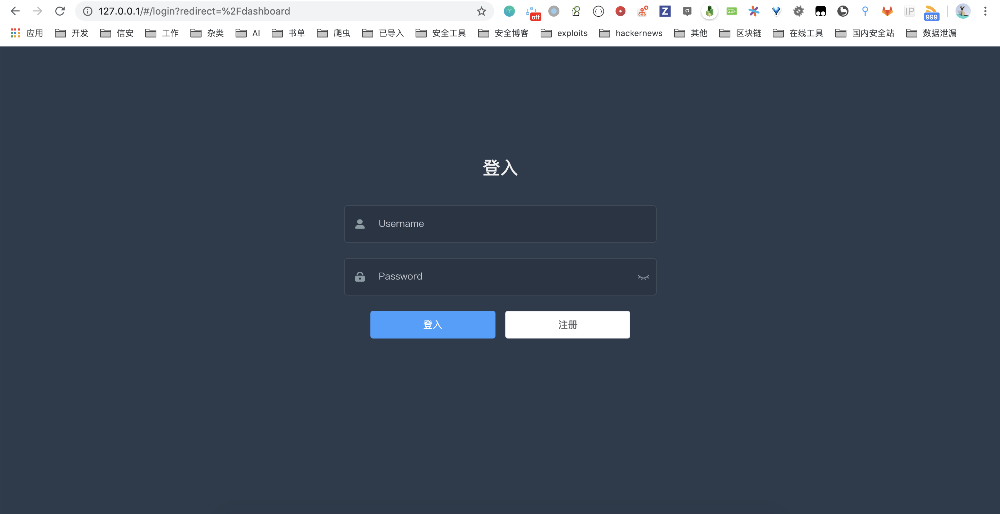

# 安装

系统为前后端分离项目，`vulfocus-api`  为后端项目、 `vulfocus-frontend`  为前端项目。

## 快速安装

拉取 Vulfocus 镜像：
```
docker pull vulfocus/vulfocus:latest
```
运行 Vulfocus
```
docker create -p 80:80 -v /var/run/docker.sock:/var/run/docker.sock  -e VUL_IP=xxx.xxx.xxx.xxx vulfocus/vulfocus
docker start container id
```
或者

```
docker run -d -p 80:80 -v /var/run/docker.sock:/var/run/docker.sock  -e VUL_IP=xxx.xxx.xxx.xxx vulfocus/vulfocus
```
- `-v /var/run/docker.sock:/var/run/docker.sock` 为 docker 交互连接。
- `-e DOCKER_URL` 为 Docker 连接方式，默认通过 `unix://var/run/docker.sock` 进行连接，也可以通过 `tcp://xxx.xxx.xxx.xxx:2375` 进行连接（必须开放 2375 端口）。
- `-v /vulfocus-api/db.sqlite3:db.sqlite3` 映射数据库为本地文件。
- `-e VUL_IP=xxx.xxx.xxx.xxx` 为 **Docker** 服务器 IP ，不能为 127.0.0.1。
- 默认账户密码为 `admin/admin`。



## 自定义安装

**以 Centos 7 为例主机已经关闭 `selinux`**

环境：

- 语言：python3
- 数据库：sqlite3、redis
- 框架：Django、Celery
- API：djangorestframework
- 系统：Centos 7 , Other

### 安装依赖

#### 安装需要的软件和开发环境
```
yum -y install epel-release
yum install gcc -y
yum install  nginx supervisor net-tools wget git -y
yum install redis -y
```

### 安装 docker

#### 安装 docker

[https://docs.docker.com/engine/install/](https://docs.docker.com/engine/install/)

```
yum install docker -y
```

#### Docker 配置

配置 Docker `2375` 端口（可根据实际情况进行修改），修改 docker 配置文件，加入以下信息：

**位置：**  `/usr/lib/systemd/system/docker.service`

```
ExecStart=/usr/bin/dockerd -H tcp://127.0.0.1:2375 -H unix://var/run/docker.sock \
```

或者

```
/usr/bin/dockerd-current -H tcp://127.0.0.1:2375 -H unix://var/run/docker.sock \
```

重载配置文件

```
systemctl daemon-reload
```


### 安装 Vulfocus API

#### 安装 Python3 (不想源码编译)

```shell
wget https://repo.anaconda.com/miniconda/Miniconda3-latest-Linux-x86_64.sh
chmod 755 Miniconda3-latest-Linux-x86_64.sh
./Miniconda3-latest-Linux-x86_64.sh  # 安装位置选  /opt/anaconda3/  
source ~/.bashrc
```

#### 更新 pip

```shell
/opt/anaconda3/bin/pip install -i https://pypi.tuna.tsinghua.edu.cn/simple pip -U
/opt/anaconda3/bin/pip install virtualenv -i https://pypi.tuna.tsinghua.edu.cn/simple
```

#### 安装虚拟环境

```
mkdir -p /data/{etc,log,tmp}
/opt/anaconda3/bin/virtualenv /data/venv_py --python=/opt/anaconda3/bin/python
echo "source /data/venv_py/bin/activate" >> ~/.bashrc
source ~/.bashrc
```

#### 拉取 vulfocus 和安装项目依赖

```shell
cd /data
git clone https://github.com/fofapro/vulfocus.git web
cd /data/web/vulfocus-api/
pip install -r requirements.txt -i https://pypi.tuna.tsinghua.edu.cn/simple
```
### 数据库配置

#### 如果使用mysql
```shell script
yum install mysql-devel 
pip3 install mysqlclient -i https://pypi.tuna.tsinghua.edu.cn/simple
```
修改setting文件
```shell script
DATABASES = {
    'default': {
        'ENGINE': 'django.db.backends.mysql',
        'NAME': 'vulfocus',
        'HOST':'127.0.0.1',
        'PORT':3306,
        'USER':'root',
        'PASSWORD':os.environ['MYSQLPWD']
    }
}

#bug MySQL does not allow unique CharFields to have a max_length > 255
SILENCED_SYSTEM_CHECKS = ['mysql.E001']
```

#### 初始化数据库

```shell
cd /data/web/vulfocus-api
python manage.py migrate
python manage.py createsuperuser
```

#### 靶场配置：

1. 配置 Docker URL（`vulfocus/settings.py`），默认为：`tcp://127.0.0.1:2375`，修改为 Docker 服务器的 IP。

2. 配置 VUL_IP（`vulfocus/settings.py`），修改为 Docker 服务器的 IP。

3. 修改 CELERY_BROKER_URL（`vulfocus/settings.py`），修改为 Redis 连接地址。

#### 启动 Celery(Celery不需要操做后面有自启)
在 `vulfocus-api` 中启动 Celery：
```
celery -A vulfocus worker -l info -E
```
后端启动：
```
celery multi start worker -A vulfocus -l info --logfile=celery.log
```

#### 安装uwsgi

```shell
pip install uwsgi -i https://pypi.tuna.tsinghua.edu.cn/simple
```

##### uwsgi 配置

**位置：** `/data/etc/vulfocus_uwsgi.ini`

```shell
[uwsgi]
uid=nginx
chdir = /data/web/vulfocus-api
;module = vulfocus.wsgi  
mount = /api=vulfocus.wsgi:application  # nginx配置子目录
manage-script-name = true
;route-run = fixpathinfo:  
home = /data/venv_py
socket = /data/tmp/vulfocus_uwsgi.sock
processes = 8
master = true
max-requests = 6000
chmod-socket = 777
vacuum = true
enable-threads = true
single-interpreter = true
```

### 安装 Vulfocus Frontend

vulfocus 前端项目，通过 Element-ui + VUE 构建。

环境：
- UI：Element UI
- 框架：vue
- node：v12.16.2
- npm：6.14.4

#### 项目构建

安装依赖：

```shell script
npm install 
```

构建项目：
```
npm run build:prod
```

错误处理:

**node sass error**

```
npm install -g yarn
yarn install node-sass
```

#### 发行版本

通过 [https://github.com/fofapro/vulfocus/releases](https://github.com/fofapro/vulfocus/releases) 下载最新发布的版本。


### nginx 配置

配置上传文件大小，修改 `nginx.conf` 文件，http 中加入：

```
client_max_body_size 4096M;
```

其中 4096M（4GB） 为上传文件最大限制，可根据实际进行修改，最小配置为 200M 。

#### 带证书多 vhost 的 nginx 配置文件

**位置：**`/etc/nginx/conf.d/vulfocus.xxx.net.conf`

```
server {
    listen 80;
     server_name vulfocus.xxx.net;
     rewrite ^(.*) https://$host$1 permanent;
}
server{
listen 443 ssl http2;
server_name vulfocus.xxx.net;
ssl_certificate /etc/nginx/ssl/1_vulfocus.xxx.net_bundle.crt;
ssl_certificate_key /etc/nginx/ssl/2_vulfocus.xxx.net.key;
ssl_protocols TLSv1 TLSv1.1 TLSv1.2;
ssl_ciphers EECDH+CHACHA20:EECDH+AES128:RSA+AES128:EECDH+AES256:RSA+AES256:EECDH+3DES:RSA+3DES:!MD5;
ssl_prefer_server_ciphers on;
ssl_session_timeout 10m;
ssl_session_cache builtin:1000 shared:SSL:10m;
ssl_stapling on;
ssl_stapling_verify on;
client_max_body_size 2048M;
location /{
root /data/vulfocus/vulfocus-frontend/dist;
 index index.html;
}
location /api {
	      uwsgi_pass  unix://////data/tmp/vulfocus_uwsgi.sock;
        uwsgi_read_timeout 600;
        uwsgi_param SCRIPT_NAME /api;
        # the uwsgi_params file you installed
        include     /etc/nginx/uwsgi_params;
}
    access_log  /data/log/vulfocus.xxx.net.log;
    error_log  /data/log/vulfocus.xxx.net.log;
}
```

#### 不带证书仅有一个项目配置文件

**位置：**`/etc/nginx/nginx.conf`

```
user nginx;
worker_processes auto;
error_log /var/log/nginx/error.log;
pid /run/nginx.pid;

include /usr/share/nginx/modules/*.conf;

events {
    worker_connections 1024;
}

http {
    log_format  main  '$remote_addr - $remote_user [$time_local] "$request" '
                      '$status $body_bytes_sent "$http_referer" '
                      '"$http_user_agent" "$http_x_forwarded_for"';

    access_log  /var/log/nginx/access.log  main;

    sendfile            on;
    tcp_nopush          on;
    tcp_nodelay         on;
    keepalive_timeout   65;
    types_hash_max_size 2048;

    include             /etc/nginx/mime.types;
    default_type        application/octet-stream;

    include /etc/nginx/conf.d/*.conf;

    server {
        listen       80 default_server;
        listen       [::]:80 default_server;
        server_name  _;

        # Load configuration files for the default server block.
        include /etc/nginx/default.d/*.conf;

       location /{
           root /data/web/vulfocus-frontend/dist;
       index index.html;
       }
       location /api {
              uwsgi_pass  unix:/data/tmp/vulfocus_uwsgi.sock;
              uwsgi_read_timeout 600;
              uwsgi_param SCRIPT_NAME /api;
              include     /etc/nginx/uwsgi_params;
}
    access_log  /data/log/vulfocus.xxx.net.log;
    error_log  /data/log/vulfocus.xxx.net.log;

    }


}
```

### 配置supervisor

**位置：**`/etc/supervisord.d/vulfoucs.ini`

```
[program:vulfocus]
directory=/data/venv_py
command=/data/venv_py/bin/uwsgi --ini /data/etc/vulfocus_uwsgi.ini
numprocs=1
user=nginx
startretries=3
startsecs=5
autostart=true
autorestart=true
stopsignal=INT
stopasgroup=true
killasgroup=true
redirect_stderr=true
stdout_logfile=/data/log/vulfoucs_uwsgi.log
```
**位置：**`/etc/supervisord.d/celery.ini`

```
[program:celeryworker]
command=/data/venv_py/bin/celery -A vulfocus worker -l info -E
directory=/data/web/vulfocus-api
user=nginx
numprocs=1
stdout_logfile=/data/log/worker_celery.log
redirect_stderr=true
autostart=true
autorestart=true
startsecs=10
stopasgroup=true
priority=999
```
### 权限以及自启

```
chown -R nginx. /data
```

使用 `unix://var/run/docker.sock` **连接 docker 需要配置** 使用 tcp 套接字无需修改

```
groupadd docker
usermod -aG docker nginx
systemctl restart docker
```

#### 开机自启动

```
systemctl enable nginx
systemctl enable supervisord
systemctl enable docker
systemctl enable redis
```

#### 启动

```
systemctl start supervisord
systemctl start nginx
systemctl start docker
systemctl start redis
```

#### 防火墙配置
```shell script
firewall-cmd --add-port=80/tcp --permanent
firewall-cmd --add-port=443/tcp --permanent
systemctl restart firewalld.service
```

### 问题

拉取镜像会报 500 错误这个是 `/var/run/docker.sock` 权限问题

三种解决方案

1. 修改 `/etc/supervisord.d/vulfoucs.ini` 配置文件

   ```
   # user=nginx # 改前
   user=root # 改后
   ```

2. 配置 Docker URL（`vulfocus/settings.py`），启用 `tcp://127.0.0.1:2375`

3. 添加 docker 用户组把 nginx 用户加进去

   ```
   groupadd docker
   usermod -aG docker nginx
   systemctl restart docker
   ```

   