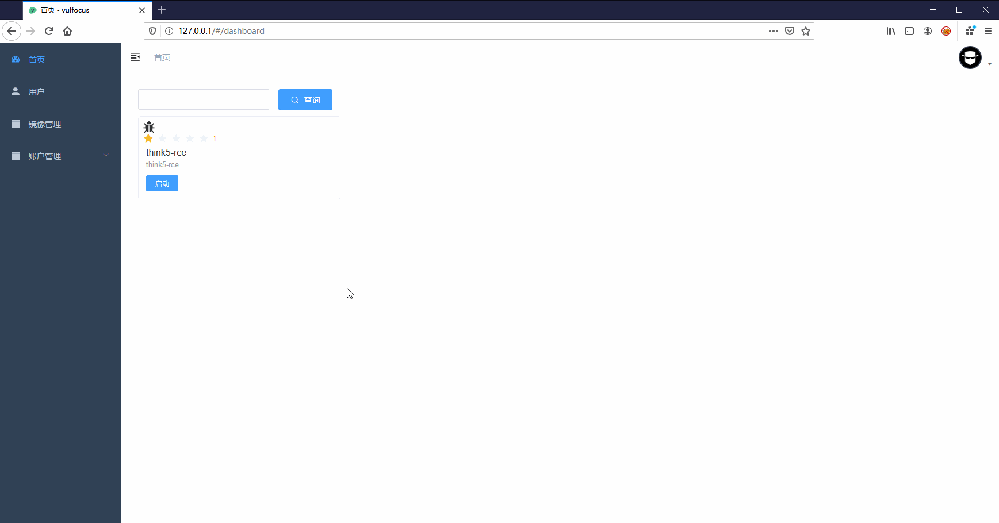

<h1 align="center"> Welcome to Vulfocus 🚀 </h1>

Vulfocus 是一个漏洞集成平台，将漏洞环境 docker 镜像，放入即可使用，开箱即用。

  
  
  
  

在线演示：[http://vulfocus.fofa.so/](http://vulfocus.fofa.so/)

## 背景

现在阶段网络靶场平台是遍地开花，让人看的眼花缭乱，但商业化产品居多，还有一些类似 dvwa、 sqli-labs这类的开源项目，但是漏洞环境比较固定，使用完一次后就失去其作用。当你需要某个环境的时候，你可能还需要去  https://hub.docker.com/ 官网上找，但每次启动的流程会比较繁琐，因为每个镜像的启动命令可能都不太一样，而且一但环境多了很不好管理，需要启动同一个框架两个不同版本的漏洞环境的时候，就需要修改一些端口、配置文件等等很麻烦，甚至很多场景是不满足的，之前关于漏洞环境镜像使用多的是vulhub，但是作为企业，高校等以及相关的培训，单纯的漏洞环境不一定能满足使用的需求，所以我们基于当下的一些靶场项目做出了小小的改进来符合我们一些需求，比如，增加flag的形式，积分的形式，来满足一些考核与验证的需求，于是 Vulfocus 就诞生了。

## 认识 Vulfocus

因为 Vulfocus 一个漏洞集成平台，所以可以无限向里添加漏洞环境没有限制，前提是你的内存足够大。因为漏洞环境是docker镜像的原因每次重新启动漏洞环境都会还原，不用出现你会对环境造成破坏下次无法启动的现象。

Vulfocus 的 docker 仓库 [https://hub.docker.com/u/vulfocus](https://hub.docker.com/u/vulfocus)

### Vulfocus的特性

1. 启动：一键漏洞环境启动，方便简单。
2. 自带 Flag 功能：每次启动 flag 都会自动更新，明确漏洞是否利用成功。
3. 带有计分功能也可适用于相关安全人员能力的考核。
4. 兼容 [Vulhub](https://vulhub.org/)、[Vulapps](http://vulapps.evalbug.com/) 中所有漏洞镜像。

##  ⬇️ 下载及安装

🏠 请参考 [INSTALL.md](./INSTALL.md) 进行安装。

⬇️ 发行版下载 [https://github.com/fofapro/vulfocus/releases](https://github.com/fofapro/vulfocus/releases)。

### ✨ 使用

1. 安装完成后，访问80端口

2. 用设置好的管理员账户登录

3. 首页为漏洞集成页面，刚开始是没有漏洞镜像的需要从 [https://hub.docker.com/](https://hub.docker.com/) 网站拉取镜像，或自己以tar包的形式上传。

   漏洞镜像的拉取和上传（**需管理员权限**）：

   (1)、在进行管理中，添加功能

   
       
   

   (2)、分别填入漏洞名称、镜像、rank、描述

   - 镜像又分为文件和文本
     - 文本：是从 [https://hub.docker.com/u/vulfocus](https://hub.docker.com/u/vulfocus) 官网拉取镜像。内容为如： `vulfocus/webmin-cve_2019_15107` 。 
     - 文件：本地漏洞镜像打成tar包的形式进行上传。

4. 下载完成后点击启动即可。

5. 镜像启动后，会在环境里写入一个 flag （默认 flag 会写入 **/tmp/** 下），读取到 flag 后填入 flag 窗口，镜像会自动关闭，如需重新启动，需强刷一下，然后再次点击启动即可。

## 🛠贡献漏洞镜像

初期 Vulfocus 的漏洞镜像会较少，可能无法满足你的需求，所以非常期望大家来一起维护 Vulfocus，当你发现你的一些漏洞环境在 Vulfocus 中找不到时，可以提交供大家使用。一个有问题的环境可能会影响到使用者的情绪。因此我们对社区提交的漏洞环境会进行审核。贡献者在提交漏洞环境的时候，可提供相应的复现工具或流程，加速环境的审核。

### 方式

- 提交 dockerfile
- 也可以上传到 [https://hub.docker.com](https://hub.docker.com) ，把镜像的名称提供给我们，镜像名称的命令规则如：框架（CMS、组件）-漏洞编号，例如：`vulfocus/spring-cve_2017_8046`

- 例：
    vulfocus/webmin-cve_2019_15107
    vulfocus/spring-cve_2017_8046

### 流程

- fork [vulfocus](https://github.com/fofapro/vulfocus) 至个人项目，然后 clone 项目。

- 提交 dockerfile 至 [images](./images/) 文件夹中创建漏洞名称，然后将 dockerfile 放置该目录下，最后将环境信息提交至 [`images/README.md`](./images/README.md)。
- 贡献者以 PR 的方式向 github Vulfocus 社区仓库内提交 漏洞环境， 提交位置: [https://github.com/fofapro/vulfocus/dockerfile/](https://github.com/fofapro/vulfocus/dockerfile/)
- 我们会根据提供的 dockerfile，确定镜像环境是否可用。
- 审核完成后镜像会放进 https://hub.docker.com/u/vulfocus 仓库供大家使用。

## 📝 讨论区

如有问题可以在 GitHub 提 issue, 也可在下方的讨论组里

GitHub issue: [https://github.com/fofapro/vulfocus/issues](https://github.com/fofapro/vulfocus/issues)

微信群: 通过扫描以下二维码加入并且备注 `申请 Vulfocus` 加入 Vulfocus 官方微信群。

## 致谢

- [Vue Element Admin](https://github.com/PanJiaChen/vue-element-admin)
- [Vulhub](https://vulhub.org/)

## 声明

该项目会收集了当下比较流行的漏洞环境，若有侵权，请联系我们！

## FAQ

镜像启动后立即访问地址失败？

1. 根据镜像的大小，启动时间会有不同的延迟，一般在几秒以内。

提交完 flag 后会有卡住？

1. 在提交完正确flag后，会进行镜像关闭的动作，所以会有几秒的延迟。

拉取镜像时一直卡在哪里

1. 由于网络延迟或镜像太大的原因时间会长一点。

2. 镜像名称填错，也会卡在哪里，建议强刷一下。