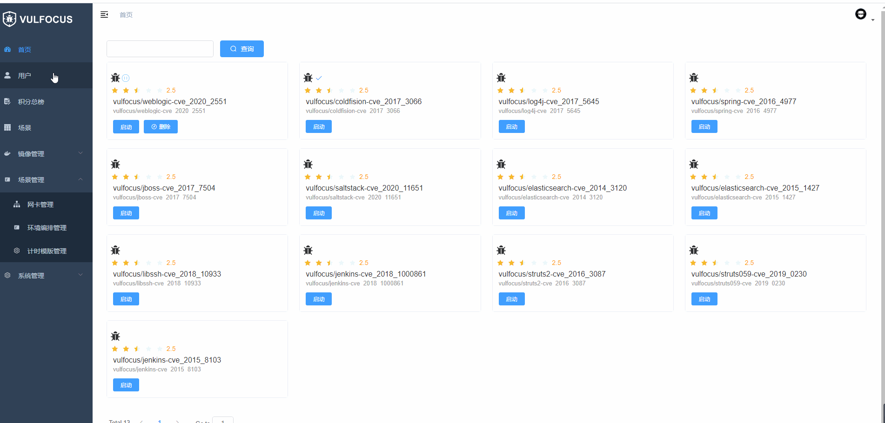

<h1 align="center"> Welcome to Vulfocus 🚀 </h1>

Vulfocus 是一个漏洞集成平台，将漏洞环境 docker 镜像，放入即可使用，开箱即用。

<p>
  
  
  
  
  <!-- ALL-CONTRIBUTORS-BADGE:START - Do not remove or modify this section -->

<!-- ALL-CONTRIBUTORS-BADGE:END -->
</p>

Vulfocus 官网：[https://fofapro.github.io/vulfocus/](https://fofapro.github.io/vulfocus/)

在线 Vulfocus：

[http://vulfocus.fofa.so/](http://vulfocus.fofa.so/)

[http://vulfocus.io/](http://vulfocus.io/)

[http://vulfocus.club/](http://vulfocus.club/)

## 背景

漏洞靶场是目前每个安全人员以及想学习信息安全的人必备的东西，但目前商业化产品居多，还有一些类似 dvwa、 sqli-labs 这类的开源项目，但是漏洞环境比较固定，使用完一次后就失去其作用。搭建的成本过高，每次启动的流程会比较繁琐，甚至很多场景是不满足的，之前关于漏洞环境镜像使用多的是 vulhub，但是作为企业、高校等以及相关的培训，单纯的漏洞环境不一定能满足使用的需求，所以我们基于当下的一些靶场项目做出了小小的改进来符合我们的一些需求，比如增加 flag 的形式，来满足一些考核与验证的需求，可以对我们内部人员能力进行考核，于是 Vulfocus 就诞生了。

## 认识 Vulfocus

因为 Vulfocus 一个漏洞集成平台，所以可以无限向里添加漏洞环境没有限制，前提是你的内存足够大。因为漏洞环境是docker镜像的原因每次重新启动漏洞环境都会还原，不用出现你会对环境造成破坏下次无法启动的现象。

Vulfocus 的 docker 仓库 [https://hub.docker.com/u/vulfocus](https://hub.docker.com/u/vulfocus)

### Vulfocus的特性


1. 启动：一键漏洞环境启动，方便简单。
2. 自带 Flag 功能：每次启动 flag 都会自动更新，明确漏洞是否利用成功。
3. 带有计分功能也可适用于相关安全人员能力的考核。
4. 兼容 [Vulhub](https://vulhub.org/)、[Vulapps](http://vulapps.evalbug.com/) 中所有漏洞镜像。
5. 支持可视化编排漏洞环境

## 使用


1. 安装完成后，访问80端口

2. 用设置好的管理员账户登录

3. 首页为漏洞集成页面，刚开始是没有漏洞镜像的需要从 [https://hub.docker.com/](https://hub.docker.com/) 网站拉取镜像，或自己以tar包的形式上传。

   漏洞镜像的拉取和上传（**需管理员权限**）：

   (1)、在进行管理中，添加功能

   

   (2)、分别填入漏洞名称、镜像、rank、描述

   - 镜像又分为文件和文本
  - 文本：是从 [https://hub.docker.com/u/vulfocus](https://hub.docker.com/u/vulfocus) 官网拉取镜像。内容为如： `vulfocus/webmin-cve_2019_15107` 。
     - 文件：本地漏洞镜像打成tar包的形式进行上传。

4. 下载完成后点击启动即可。

5. 镜像启动后，会在环境里写入一个 flag （默认 flag 会写入 **/tmp/** 下），读取到 flag 后填入 flag 窗口，镜像会自动关闭，如需重新启动，需强刷一下，然后再次点击启动即可。

6. 可视化编排（管理员权限）


7. 场景模式（普通用户权限）


8. 计时模式



## FAQ


**普通用户无法查看漏洞题目?**

  1.以管理员身份登录系统，进入镜像管理界面，选择某一个镜像进行修改（如果这里镜像显示为空可以先添加镜像）

  

   2.将镜像的分数设置为0

  

3.以普通用户身份登录进入vulfocus首页，这时可以看见自己刚才修改的镜像，启动镜像并且提交flag,通关后将显示所有镜像


**镜像启动后立即访问地址失败？**

1. 根据镜像的大小，启动时间会有不同的延迟，一般在几秒以内。


**提交完 flag 后会有卡住？**

1. 在提交完正确flag后，会进行镜像关闭的动作，所以会有几秒的延迟。


**拉取镜像时一直卡在哪里**

1. 由于网络延迟或镜像太大的原因时间会长一点。
2. 镜像名称填错，也会卡在哪里，建议强刷一下。


**通过docker运行vulfocus提示服务器内部错误**

   1.通过docker logs命令查看容器日志信息


   2.通过docker exec -it <container_id> /bin/sh命令进入容器（container_id为容器运行id）在容器内部执行tail -f celery.log查看后台日志信息


**Centos 无权限操作Docker**

[centos7 docker版本应用无法添加镜像](https://github.com/fofapro/vulfocus/issues/6)


**环境一直处于启动中**

1. 查看celery.log的日志文件输出，检查是否抛出异常信息
2. 检查服务器CPU和内存的使用情况，倘若内存和CPU不足也会导致镜像无法启动


**如何将容器内部数据保存到主机上**

```
docker create -p 80:80 -v /var/run/docker.sock:/var/run/docker.sock -v /xxx/db.sqlite3:/vulfocus-api/db.sqlite3 -e VUL_IP=xxx.xxx.xxx.xxx vulfocus/vulfocus:latest

docker start container_id
```

 注意：当第一次使用docker create  -p 80:80 -v /var/run/docker.sock:/var/run/docker.sock -v /xxx/db.sqlite3:/vulfocus-api/db.sqlite3 -e VUL_IP=xxx.xxx.xxx.xxx vulfocus/vulfocus:latest 时必须要保证/xxx/db.sqlite3是从GitHub上下载的最新数据库，否则容器运行将会抛出服务器内部错误


**自定义安装数据库迁移报错**

进入项目所在的目录的vulfocus-api文件夹目录下，执行下面命令

```
rm -rf $(find ./**/migrations/00*)
```


执行命令

```
python3 manage.py makemigrations
python3 manage.py migrate --fake
```

若经过上面步骤如果数据库迁移还是报错，请检查数据库是否与文件夹下的迁移记录产生冲突，可用数据库连接工具检查数据库的表结构


**场景无法下载**

目前官网的所有场景支持压缩包方式构建，构建步骤如下

1. 进入场景管理/环境编排管理，点击添加场景，选择创建编排模式


   2.点击上传，选中要构建的场景压缩包（压缩包暂不支持普通用户下载，可联系系统管理员下载）


​     3.上传成功后点击保存


​    4.这时可在环境编排管理界面看见新上传的场景，点击发布并且发布成功后即可使用（发布的过程会下载场景所需镜像，等待镜像下载完毕即可）


   5.发布成功后即可在场景处看见新的场景


**如何设置镜像运行时长**

在系统管理/系统配置处可修改镜像的运行时长


**镜像一键同步报错**


- 自定义安装

修改项目目录下的vulfocus-api/dockerapi/views.py文件，修改get_timing_imgs函数，将vulfocus.fofa.so替换成vulfocus.io


- docker镜像启动

  1.将容器内部的/vulfocus-api/dockerapi/views.py文件拷贝至主机当前目录


修改当前目录下拷贝出来的views.py文件，修改get_timing_imgs函数，将vulfocus.fofa.so替换成vulfocus.io


将修改好的views文件重新copy至容器内部


## Contributors

Thanks goes to these wonderful people :

<!-- ALL-CONTRIBUTORS-LIST:START - Do not remove or modify this section -->
<!-- prettier-ignore-start -->
<!-- markdownlint-disable -->
<table>
  <tr>
    <td align="center"><a href="https://github.com/anonymity3712"><br /><sub><b>anonymity3712</b></sub></a><br /><a href="https://github.com/fofapro/vulfocus/issues?q=author%3Aanonymity3712" title="Bug reports">🐛</a> <a href="#blog-anonymity3712" title="Blogposts">📝</a></td>
    <td align="center"><a href="https://github.com/TC130"><br /><sub><b>TC130</b></sub></a><br /><a href="https://github.com/fofapro/vulfocus/issues?q=author%3ATC130" title="Bug reports">🐛</a></td>
    <td align="center"><a href="https://github.com/hackwuli"><br /><sub><b>hackwuli</b></sub></a><br /><a href="#question-hackwuli" title="Answering Questions">💬</a></td>
    <td align="center"><a href="https://github.com/lxyevil"><br /><sub><b>lxyevil</b></sub></a><br /><a href="https://github.com/fofapro/vulfocus/commits?author=lxyevil" title="Tests">⚠️</a></td>
    <td align="center"><a href="https://github.com/littleheary"><br /><sub><b>littleheary</b></sub></a><br /><a href="https://github.com/fofapro/vulfocus/pulls?q=is%3Apr+reviewed-by%3Alittleheary" title="Reviewed Pull Requests">👀</a></td>
    <td align="center"><a href="https://github.com/q2118cs"><br /><sub><b>Rai Sun</b></sub></a><br /><a href="#ideas-q2118cs" title="Ideas, Planning, & Feedback">🤔</a></td>
    <td align="center"><a href="https://github.com/luobei-Dynamic"><br /><sub><b>luobei-Dynamic</b></sub></a><br /><a href="#ideas-luobei-Dynamic" title="Ideas, Planning, & Feedback">🤔</a></td>
  </tr>
  <tr>
    <td align="center"><a href="https://github.com/wanglaiqi"><br /><sub><b>wanglaiqi</b></sub></a><br /><a href="#ideas-wanglaiqi" title="Ideas, Planning, & Feedback">🤔</a></td>
    <td align="center"><a href="https://github.com/zhuhongchang1227"><br /><sub><b>zhuhongchang1227</b></sub></a><br /><a href="#ideas-zhuhongchang1227" title="Ideas, Planning, & Feedback">🤔</a></td>
    <td align="center"><a href="https://github.com/daibing125"><br /><sub><b>daibing</b></sub></a><br /><a href="#ideas-daibing125" title="Ideas, Planning, & Feedback">🤔</a></td>
    <td align="center"><a href="https://github.com/zhangfeitao"><br /><sub><b>zhangfeitao</b></sub></a><br /><a href="#ideas-zhangfeitao" title="Ideas, Planning, & Feedback">🤔</a></td>
    <td align="center"><a href="https://github.com/TORRYGUO"><br /><sub><b>TORRYGUO</b></sub></a><br /><a href="#ideas-TORRYGUO" title="Ideas, Planning, & Feedback">🤔</a></td>
    <td align="center"><a href="https://github.com/Becivells"><br /><sub><b>李大壮</b></sub></a><br /><a href="https://github.com/fofapro/vulfocus/commits?author=Becivells" title="Documentation">📖</a></td>
    <td align="center"><a href="https://github.com/Vdeem"><br /><sub><b>Vdeem</b></sub></a><br /><a href="#blog-Vdeem" title="Blogposts">📝</a></td>
  </tr>
  <tr>
    <td align="center"><a href="https://github.com/xiajibaxie"><br /><sub><b>xiajibaxie</b></sub></a><br /><a href="#blog-xiajibaxie" title="Blogposts">📝</a> <a href="https://github.com/fofapro/vulfocus/commits?author=xiajibaxie" title="Code">💻</a></td>
    <td align="center"><a href="https://github.com/Frivolous-scholar"><br /><sub><b>Frivolous-scholar</b></sub></a><br /><a href="https://github.com/fofapro/vulfocus/commits?author=Frivolous-scholar" title="Code">💻</a></td>
    <td align="center"><a href="https://github.com/D4ch1au"><br /><sub><b>D4ch1au</b></sub></a><br /><a href="https://github.com/fofapro/vulfocus/commits?author=D4ch1au" title="Code">💻</a></td>
    <td align="center"><a href="https://github.com/M2ayill"><br /><sub><b>M2ayill</b></sub></a><br /><a href="https://github.com/fofapro/vulfocus/commits?author=m2ayill" title="Code">💻</a></td>
    <td align="center"><a href="https://github.com/Whippet0"><br /><sub><b>Whippet</b></sub></a><br /><a href="https://github.com/fofapro/vulfocus/commits?author=Whippet0" title="Code">💻</a></td>
    <td align="center"><a href="https://github.com/Aa1141415869"><br /><sub><b>Aa1141415869</b></sub></a><br /><a href="https://github.com/fofapro/vulfocus/commits?author=Aa1141415869" title="Code">💻</a></td>
    <td align="center"><a href="https://github.com/fengyehack"><br /><sub><b>fengyehack</b></sub></a><br /><a href="https://github.com/fofapro/vulfocus/commits?author=fengyehack" title="Code">💻</a></td>
  </tr>
  <tr>
    <td align="center"><a href="https://github.com/wuli888"><br /><sub><b>wuli</b></sub></a><br /><a href="https://github.com/fofapro/vulfocus/commits?author=wuli888" title="Code">💻</a></td>
    <td align="center"><a href="https://github.com/Liiuliu"><br /><sub><b>Liiuliu</b></sub></a><br /><a href="https://github.com/fofapro/vulfocus/commits?author=Liiuliu" title="Code">💻</a></td>
    <td align="center"><a href="https://github.com/atdpa4sw0rd"><br /><sub><b>atdpa4sw0rd</b></sub></a><br /><a href="https://github.com/fofapro/vulfocus/commits?author=atdpa4sw0rd" title="Code">💻</a></td>
  </tr>
</table>

<!-- markdownlint-restore -->
<!-- prettier-ignore-end -->

<!-- ALL-CONTRIBUTORS-LIST:END -->

## 讨论区

如有问题可以在 GitHub 提 issue, 也可在下方的讨论组里

GitHub issue: [https://github.com/fofapro/vulfocus/issues](https://github.com/fofapro/vulfocus/issues)

微信群: 通过扫描以下二维码加入并且备注 `申请 Vulfocus` 加入 Vulfocus 官方微信群。


## 致谢

- [Vue Element Admin](https://github.com/PanJiaChen/vue-element-admin)
- [Vulhub](https://vulhub.org/)

## 声明

该项目会收集了当下比较流行的漏洞环境，若有侵权，请联系我们！
