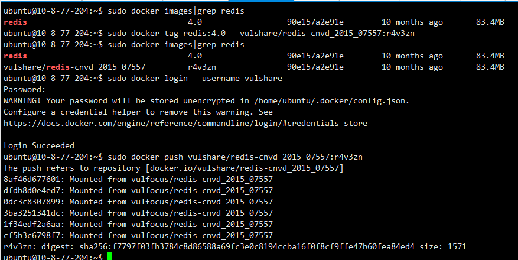
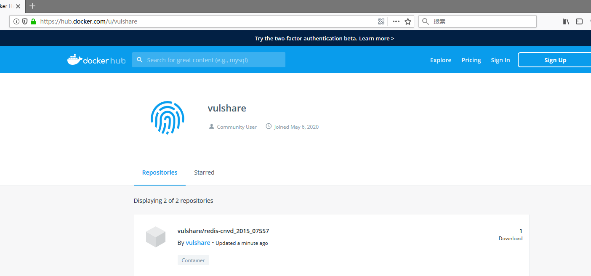

## 贡献漏洞

初期 Vulfocus 的漏洞镜像会较少，可能无法满足你的需求，所以非常期望大家来一起维护 Vulfocus，当你发现你的一些漏洞环境在 Vulfocus 中找不到时，可以提交供大家使用。一个有问题的环境可能会影响到使用者的情绪。因此我们对社区提交的漏洞环境会进行审核。贡献者在提交漏洞环境的时候，可提供相应的复现工具或流程，加速环境的审核。

## 更改镜像名称

将镜像名称更改为：vulshare/框架+cve编号:个人ID

例如：vulshare/weblogic-cve_2020_2883

docker tag 镜像名称 vulshare/xxx-cve_2020_xxx:r4v3zn

个人 ID 作为贡献来源

## 登录到hub.docker

使用命令：

1、登录 dockerhub：

`docker login --username vulshare`

接下来输入 token：

`2a295233-801b-4efb-9f78-916330b984f6`

出现Succeeded说明登录成功

## 上传到vulshare

`docker push vulshare/xxx-cve_2020_xxx:r4v3zn`

出现  sha256 说明上传成功

可直接到 https://hub.docker.com/u/vulshare , 进行查看。

