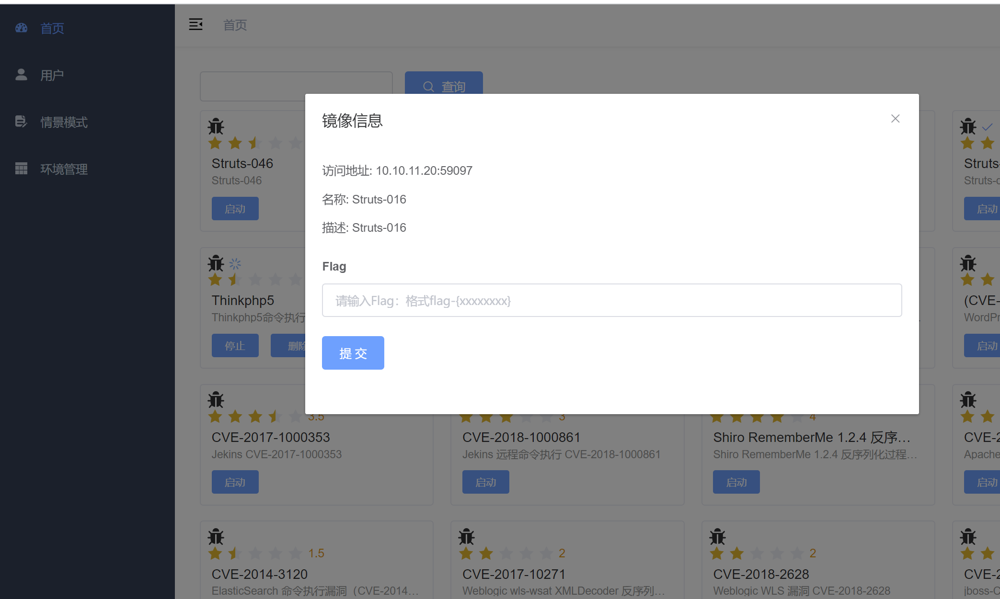
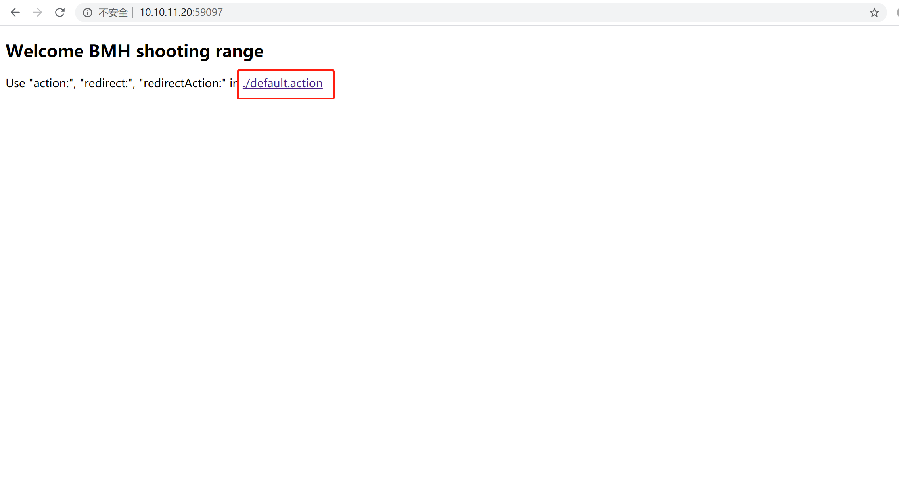
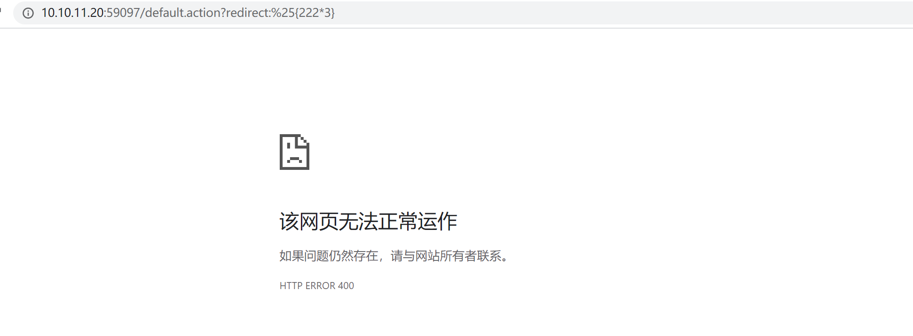
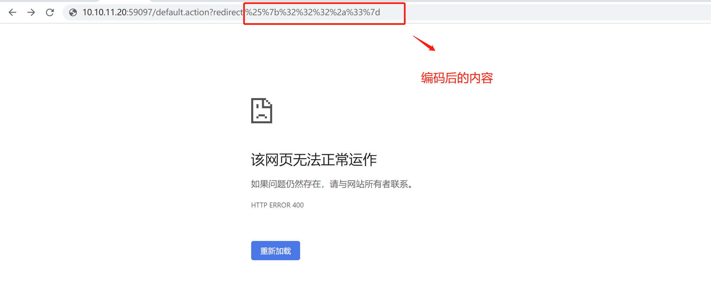
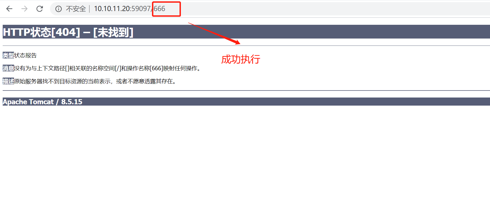
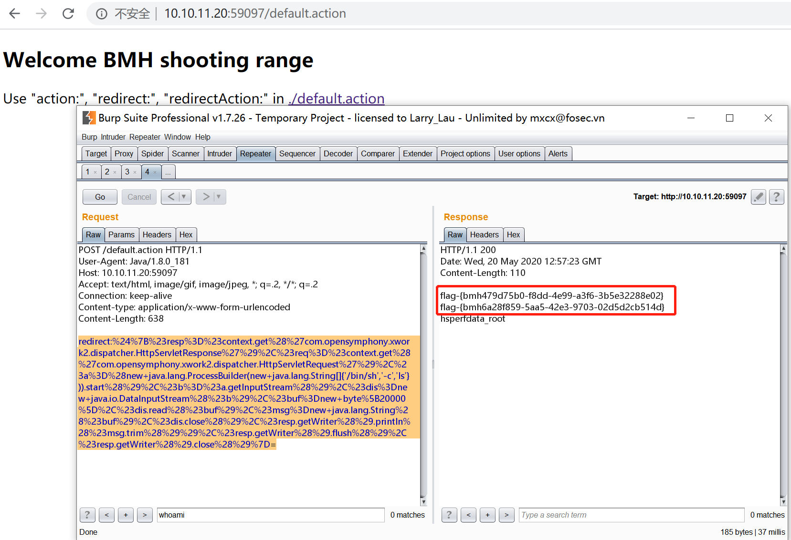
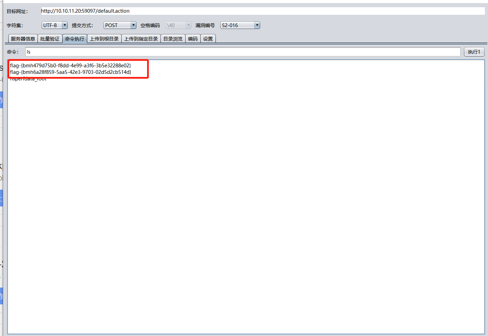

# Struts2-016 代码执行（CVE-2013-2251）by [Frivolous-scholar](https://github.com/Frivolous-scholar)

# 漏洞概述

Struts2 是第二代基于 Model-View-Controller (MVC) 模型的 java 企业级 web 应用框架。它是 WebWork 和 Struts 社区合并后的产物。 Apache Struts2 的 action: 、 redirect: 和 redirectAction: 前缀参数在实现其功能的过程中使用了 Ognl 表达式，并将用户通过 URL 提交的内容拼接入 Ognl 表达式中，从而造成攻击者可以通过构造恶意  URL 来执行任意 Java 代码，进而可执行任意命令。 redirect: 和 redirectAction: 此两项前缀为 Struts 默认开启功能，目前 Struts 2.3.15.1 以下版本均存在此漏洞。
影响版本：Struts 2.3.15 以下。

注：一般 struts2 漏洞有一个明显的特征就是 url 路径里有`*.action`或 `*.do`

## Write up

首先启动靶场环境，点击`./default.action`

首先先来进行手工验证，看是否存在漏洞，输入`?redirect:%25{222*3}`

页面没有响应内容，把执行的 OGNL 表达式`{222*3}`进行 url 编码再来一遍，结果如下

说明该网站存在 struts2-016 漏洞，然后去网上寻找 POC 来进行利用，然后执行 ls 命令查看 Flag

也可以用工具去执行直接拿到 Flag

