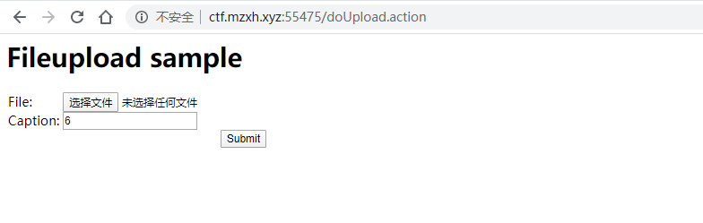
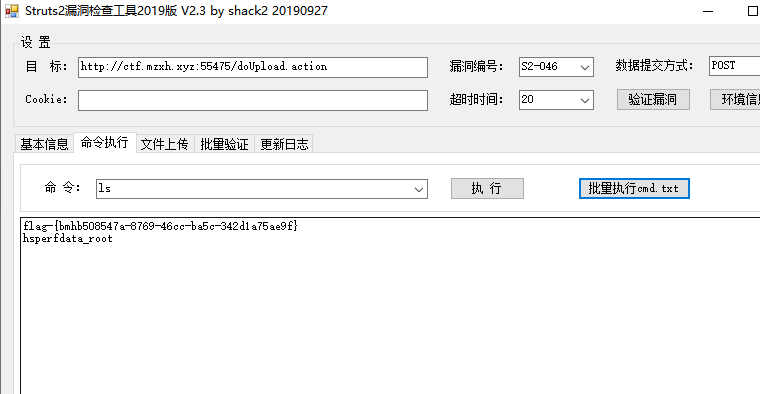

# st2-046远程命令执行（CVE-2017-5638）by [anonymity3712](https://github.com/anonymity3712)

## 漏洞描述

CVE-2017-5638即st2-045/st2-046漏洞，影响范围Struts 2.3.5-2.3.31,Struts 2.5-2.5.10

## writeup

启动靶场环境

直接使用工具去打

