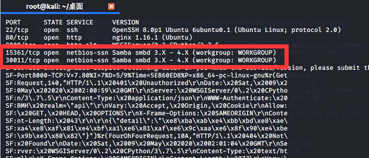
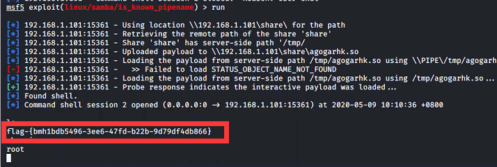

# Samba 远程命令执行（CVE-2017-7494）by [anonymity3712](https://github.com/anonymity3712)

## 漏洞描述

Samba 允许连接一个远程的命名管道，并且在连接前会调用 `is_known_pipename()` 函数验证管道名称是否合法。Samba 远程命令执行漏洞形成的原因：在 `is_known_pipename()` 函数中，并没有检查管道名称中的特殊字符，加载了使用该名称的动态链接库。导致攻击者可以构造一个恶意的动态链接库文件，执行任意代码。

## writeup

直接利用msf里的模块

`search cve-2017-7494`

msf一把梭

获取到flag