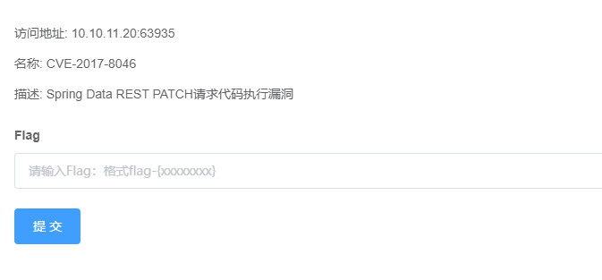
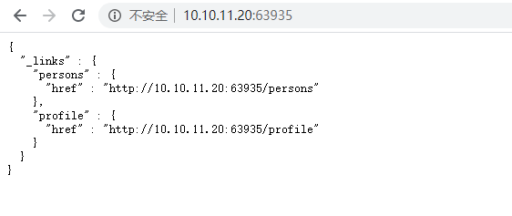
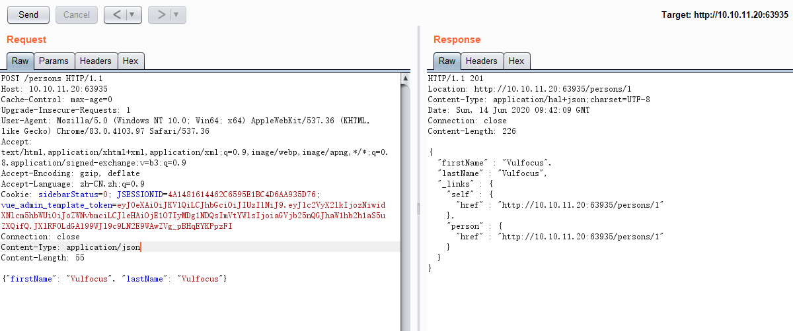
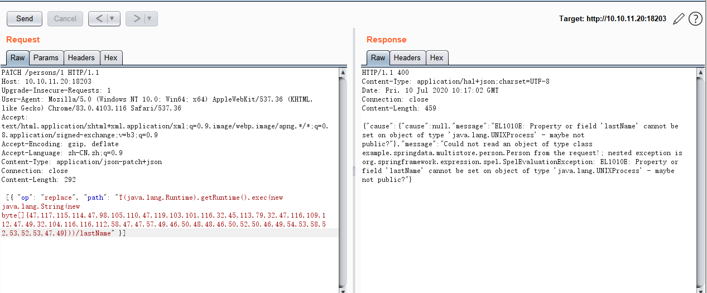
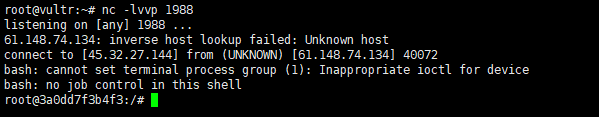
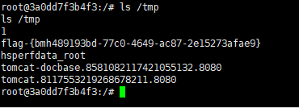

# Spring Data REST PATCH 请求代码执行漏洞（CVE-2017-8046）by [fengyehack](https://github.com/fengyehack)

## 一、漏洞描述

Spring Data REST是Spring Data项目的一部分，可以轻松地在Spring Data存储库之上构建超媒体驱动的REST Web服务。

恶意的PATCH请求使用精心构造的JSON数据提交到spring-data-rest服务可以执行任意JAVA代码  

## 二、漏洞影响范围

Spring Data REST versions prior to 2.5.12, 2.6.7, 3.0 RC3

可以查看spring-data-rest-webmvc jar包的版本

## 三、漏洞复现

启动Vulfocus靶场

访问

先利用 POST 请求添加一个数据

Content-Type: application/json

{"firstName": "Vulfocus", "lastName": "Vulfocus"}

PATCH请求

Content-Type: application/json-patch+json

利用代码执行漏洞 反弹shell

成功

获取flag

