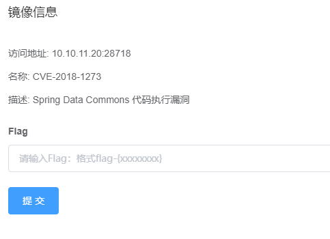
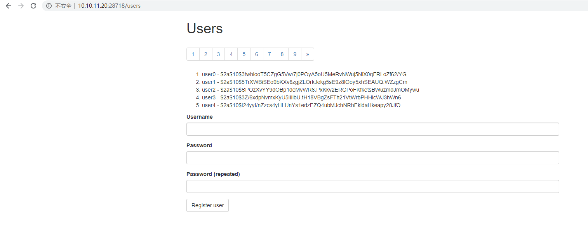
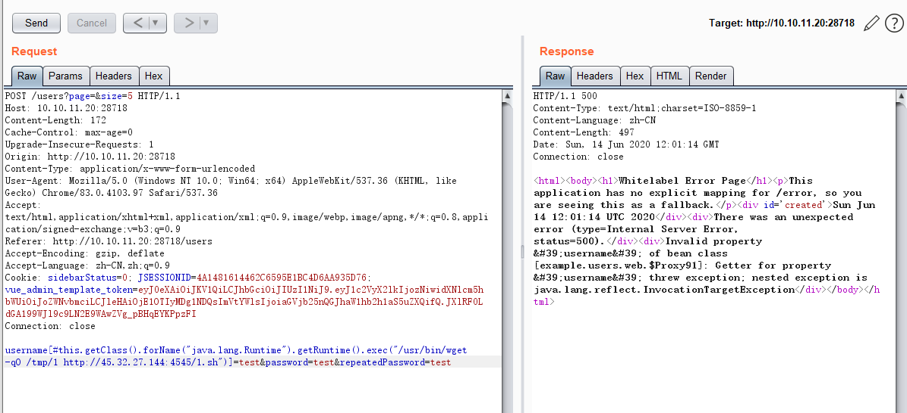
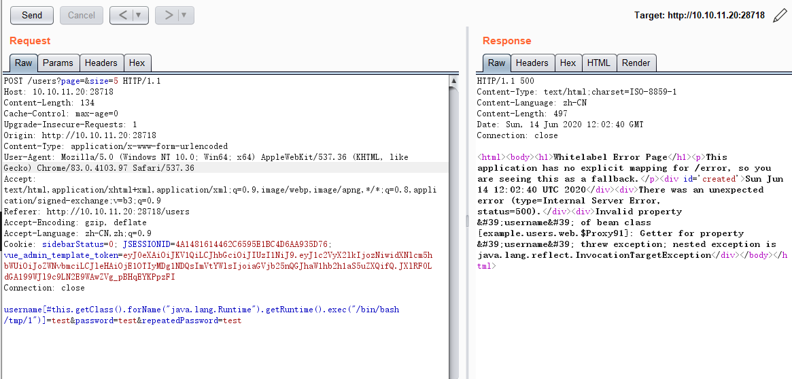
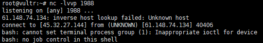
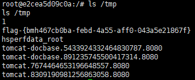

# Spring Data Commons 代码执行漏洞（CVE-2018-1273）by [fengyehack](https://github.com/fengyehack)

## 一、漏洞描述

Spring Data是Spring框架中提供底层数据访问的项目模块，Spring Data Commons是一个共用的基础模块。此模块对特殊属性处理时会使用SpEl表达式，导致攻击者可以通 过构造特殊的URL请求，造成服务端远程代码执行。

## 二、漏洞影响版本

Spring Data Commons 1.13 - 1.13.10(Ingalls SR10)

Spring Data REST 2.6 - 2.6.10 (Ingalls SR10)

Spring Data Commons 2.0 - 2.0.5 (Kay SR5)

Spring Data REST 3.0 - 3.0.5 (Kay SR5)

已不支持的旧版本

## 三、漏洞复现

启动Vulfocus

访问/users

填写信息 点击Register user 然后抓包

利用存在的代码执行漏洞反弹shell：

下载nc命令脚本

再执行该脚本

反弹成功

获取flag

