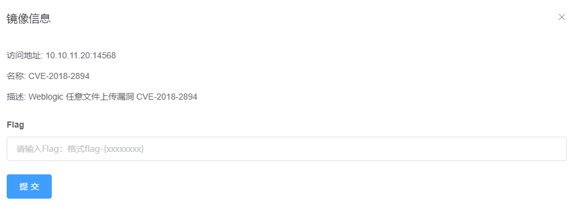
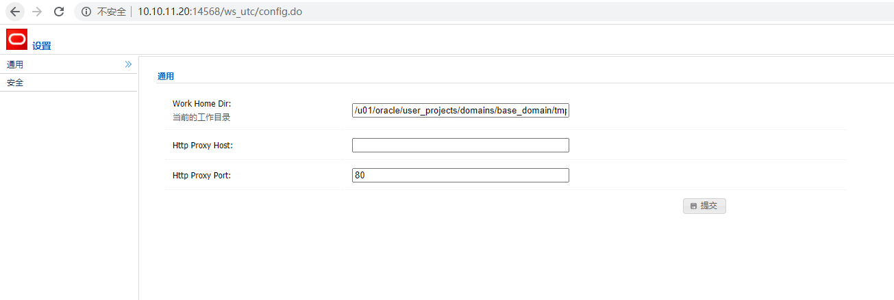
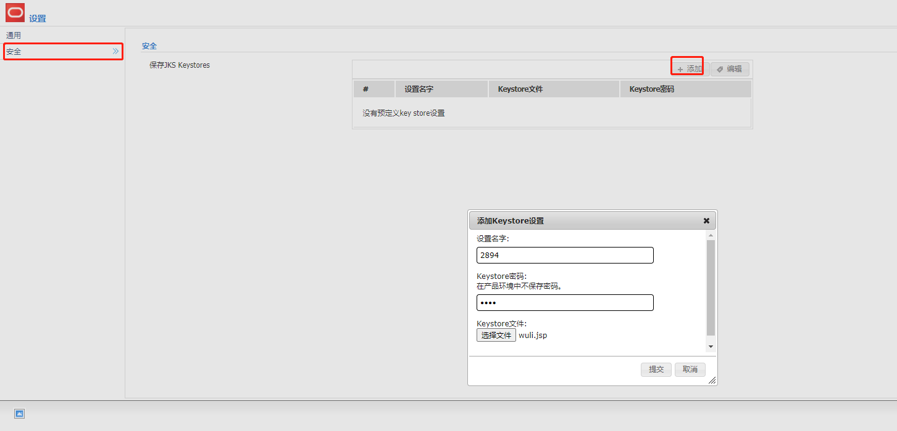
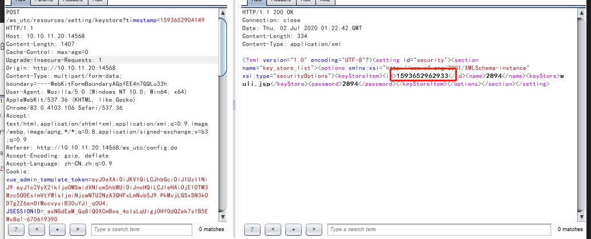
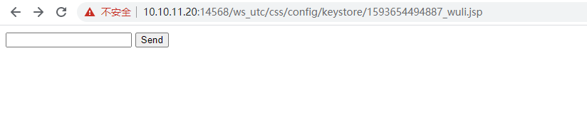
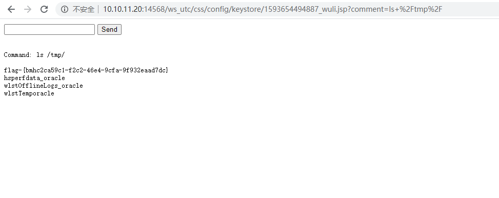

# WebLogic任意文件上传漏洞（CVE-2018-2894）by [wuli888](https://github.com/wuli888)

## 一、漏洞描述

Oracle官方发布了7月份的关键补丁更新CPU（Critical Patch Update）,其中包含一个高危的Weblogic未授权任意文件上传漏洞(CVE-2018-2894)

## 二、影响版本

Oracle WebLogic Server，版本10.3.6.0，12.1.3.0，12.2.1.2，12.2.1.3。
该漏洞的影响模块为web服务测试页，在默认情况下不启用。
受影响的页面为/ws_utc/config.do和/ws_utc/begin.do

## 三、利用流程

1、启动Vulfocus

​

2、访问存在漏洞的页面

`http://10.10.11.20:14568//ws_utc/config.do`

3、将目录设置为ws_utc应用的静态文件css目录，访问这个目录是无需权限的,可以直接进行访问上传的文件

`/u01/oracle/user_projects/domains/base_domain/servers/AdminServer/tmp/_WL_internal/com.oracle.webservices.wls.ws-testclient-app-wls/4mcj4y/war/css`

4、打开安全页面，然后上传webshell，并且获取时间戳

5、访问上传的jsp马

具体格式为： http://your-ip:7001/ws_utc/css/config/keystore/[时间戳]_[文件名]

6、获取flag

