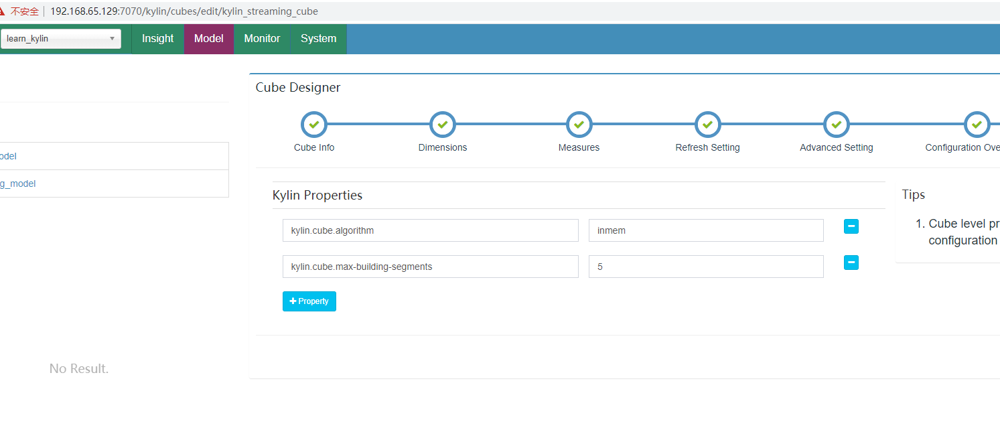
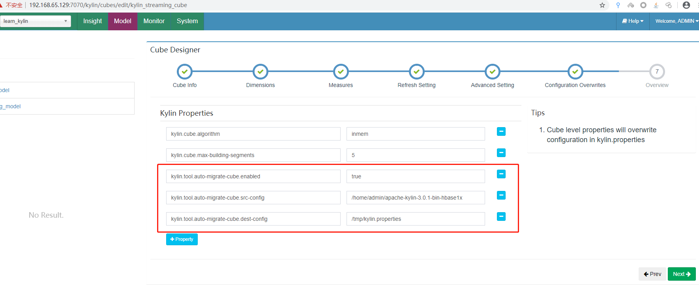
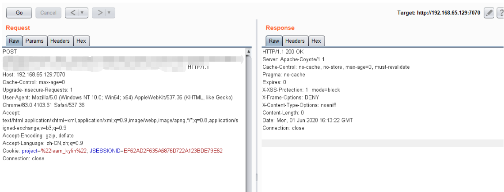
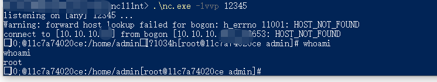

# Apache Kylin 系统远程命令执行漏洞（CVE-2020-1956）by [xiajibaxie](https://github.com/xiajibaxie)

## 一、漏洞描述

Kylin中存在一些 restful API，可以将操作系统命令与用户输入的字符串连接起来，由于未对用户输入内容做合理校验，导致攻击者可以在未经验证的情况下执行任意系统命令。

## 二、影响版本

```
Kylin 2.3.0-2.3.2 
Kylin 2.4.0-2.4.1 
Kylin 2.5.0-2.5.2 
Kylin 2.6.0-2.6.5 
Kylin 3.0.0-alpha 
Kylin 3.0.0-alpha2 
Kylin 3.0.0-beta 
Kylin 3.0.0-3.0.1
```


## 三、利用流程

靶场基本信息

靶场地址：`192.168.65.129:7070`

靶场名称: `CVE-2020-1956`

镜像作者：`r00t4dm`

镜像链接：`https://hub.docker.com/r/vulshare/cve-2020-1956`

漏洞利用条件

```
1、需要登陆。

2、需要开启配置
```

登陆系统后进行对漏洞环境进行配置

配置前



添加配置信息




发送构造好的exp数据包，返回200执行成功




反弹shell




## 四、修复方案

1、目前官方已在最新版本2.6.6与3.0.2中修复了该漏洞，请受影响的用户尽快升级版本进行防护，官方下载链接：http://kylin.apache.org/cn/download/

2、若相关用户暂时无法进行升级操作，可采用以下措施进行临时缓解：将kylin.tool.auto-migrate-cube.enabled 设置为 false，禁用系统命令执行。

**感谢[@r00t4dm](https://github.com/r00t4dm)大佬提供的poc和靶机。**