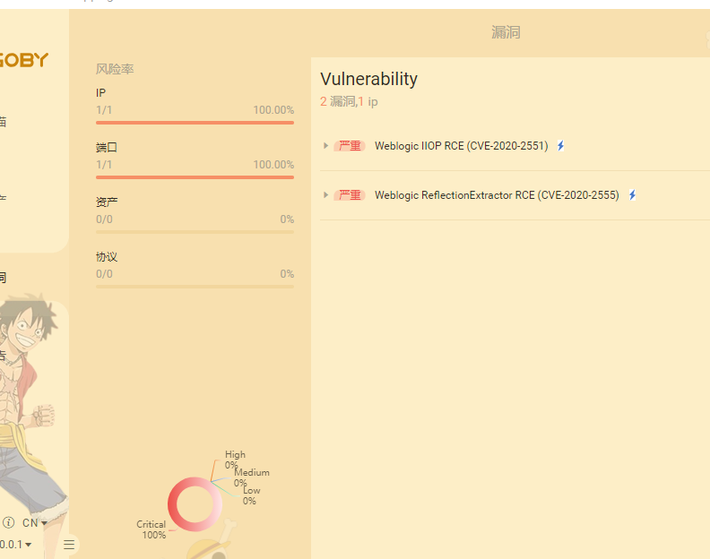
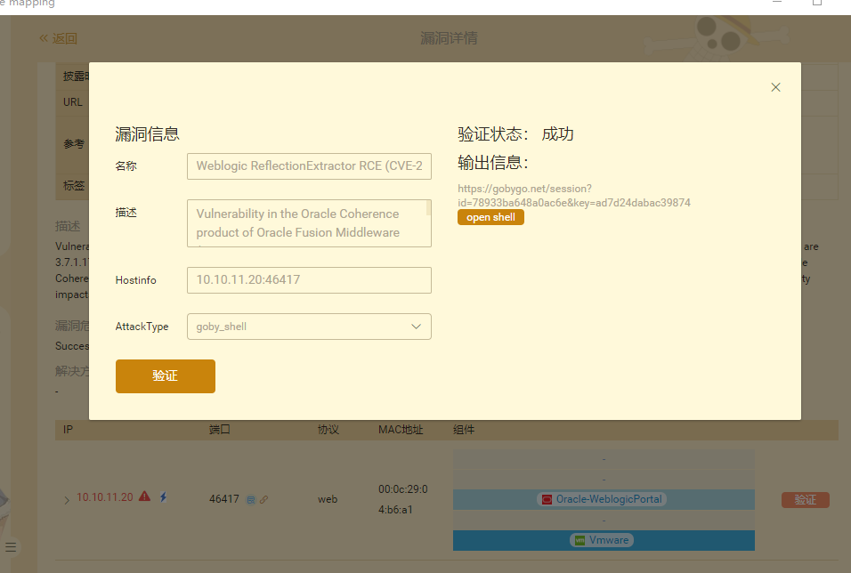
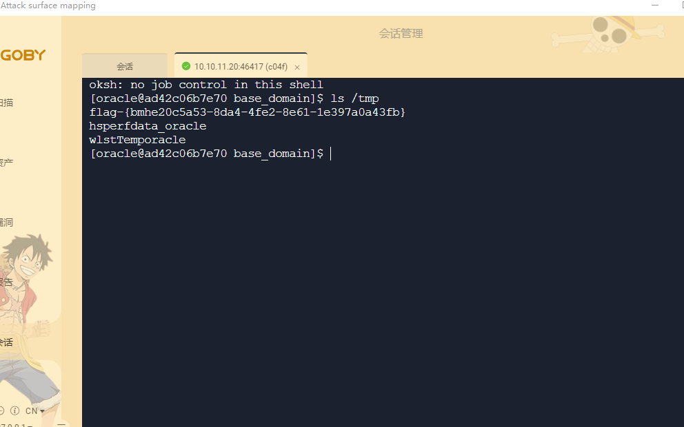

# Weblogic 命令执行漏洞（CVE-2020-2555）by [xiajibaxie](https://github.com/xiajibaxie)

## 一、漏洞描述

该漏洞允许未经身份验证的攻击者通过构造 T3 网络协议请求进行攻击，成功利用该漏洞可实现在目标主机上执行任意代码。

## 二、影响版本

```
Oracle Coherence 3.7.1.17
Oracle Coherence & Weblogic 12.1.3.0.0
Oracle Coherence & Weblogic 12.2.1.3.0
Oracle Coherence & Weblogic 12.2.1.4.0
```

## 三、利用流程

访问地址: `10.10.11.20:46417`

名称: CVE-2020-2555

使用goby扫描发现漏洞



反弹shell成功



执行命令获得flag



通关！

## 四、修复方案

1. 临时解决方案：禁用 weblogic T3 协议。
2. 安装 Oracle 更新补丁，需要登录帐户后下载。