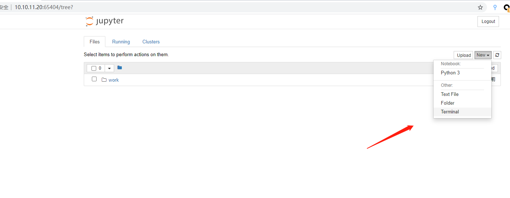
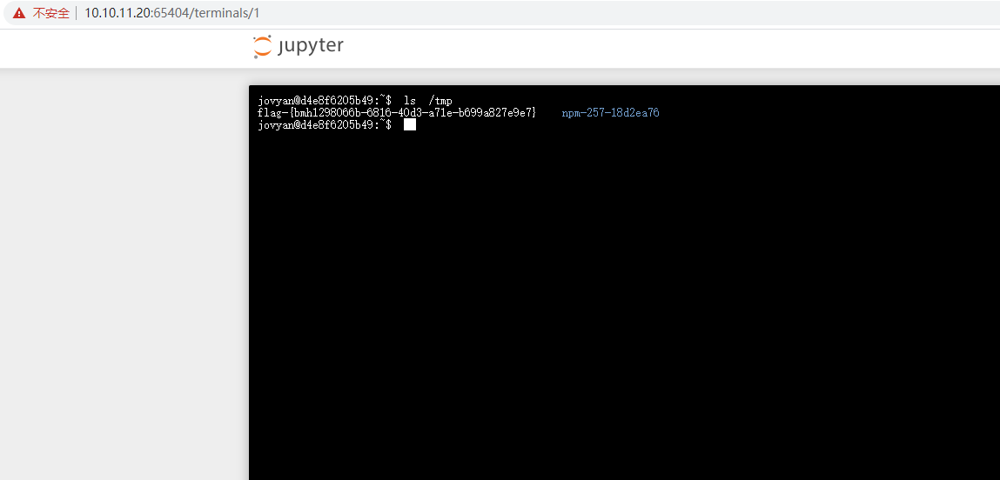

# Jupyter Notebook 未授权访问漏洞 by [xiajibaxie](https://github.com/xiajibaxie)

## 漏洞描述

Jupyter Notebook（此前被称为 IPython notebook）是一个交互式笔记本，支持运行 40 多种编程语言。如果管理员未为Jupyter Notebook配置密码，将导致未授权访问漏洞，游客可在其中创建一个console并执行任意Python代码和命令。

## 利用流程

访问地址： `10.10.11.20:65404`

名称：Jupyter Notebook 未授权访问漏洞

登陆后新建 Terminal 窗口

执行命令查看 flag 

通关！

## 参考

https://www.cnblogs.com/mke2fs/p/12718499.html

