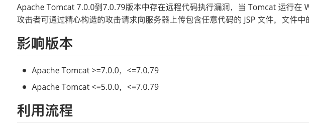

# PHPHCMS 远程代码执行（CVE-2020-2222） by [0nise](https://github.com/0nise)

## 漏洞描述

Apache Tomcat 7.0.0到7.0.79版本中存在远程代码执行漏洞，当 Tomcat 运行在 Windows 主机上，且启用了 HTTP PUT 请求方法时，攻击者可通过精心构造的攻击请求向服务器上传包含任意代码的 JSP 文件，文件中的代码被服务器执行。

## 影响版本

- Apache Tomcat >=7.0.0，<=7.0.79
- Apache Tomcat <=5.0.0，<=7.0.79

## 利用流程

aaaaa

a

## 参考

- https://fofapro.github.io/vulfocus/#/writeup/CVE-2017-12615/CVE-2017-12615
- https://github.com/M2ayill