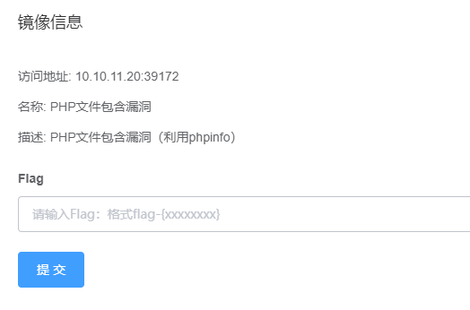
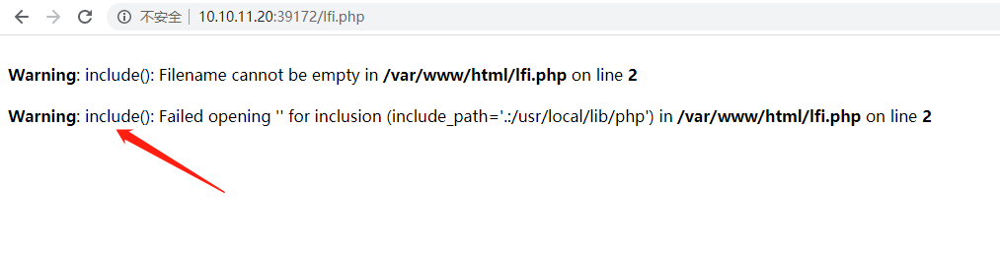
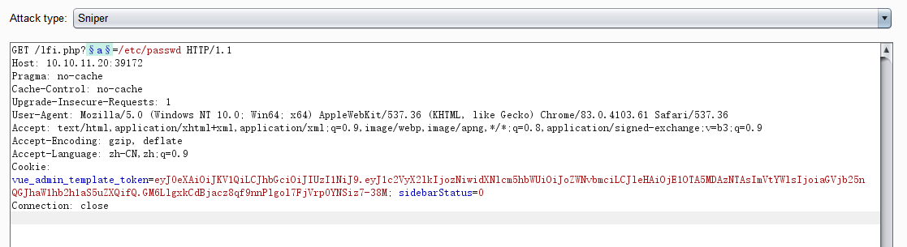
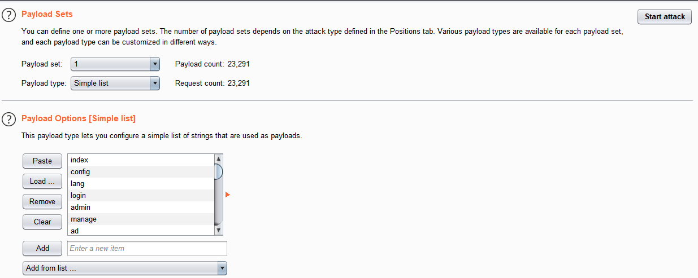
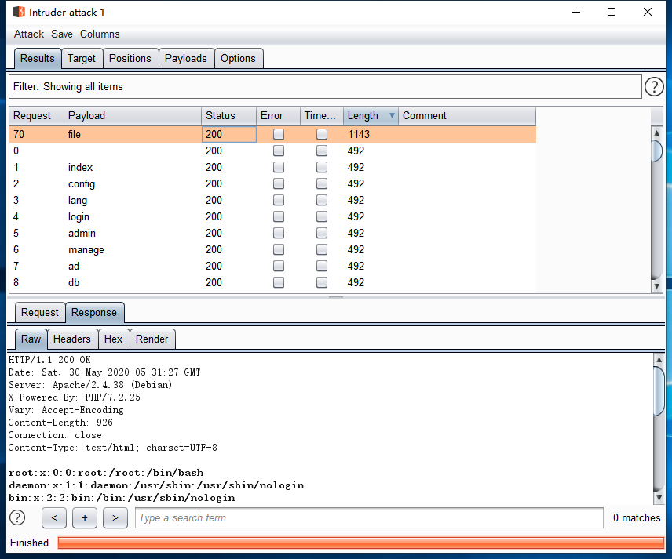
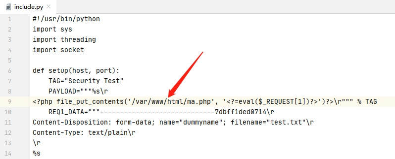
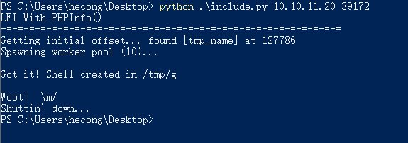
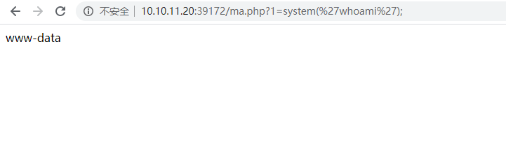
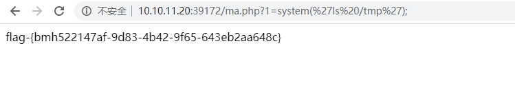

# PHP文件包含漏洞之利用phpinfo by [fengyehack](https://github.com/fengyehack)

## 一、漏洞描述

当遇到PHP文件包含漏洞，如果找不到可以包含的文件，我们可以通过包含临时文件的方法来getshell。因为临时文件名是随机的，如果目标网站上存在phpinfo，则可以通过phpinfo来获取临时文件名，进而进行包含。

## 二、漏洞原理

在给PHP发送POST数据包时，如果数据包里包含文件区块，无论你访问的代码中有没有处理文件上传的逻辑，PHP都会将这个文件保存成一个临时文件（通常是/tmp/php[6个随机字符]），文件名可以在$_FILES变量中找到。这个临时文件，在请求结束后就会被删除。

同时，因为phpinfo页面会将当前请求上下文中所有变量都打印出来，所以我们如果向phpinfo页面发送包含文件区块的数据包，则即可在返回包里找到$_FILES变量的内容，自然也包含临时文件名。

在文件包含漏洞找不到可利用的文件时，即可利用这个方法，找到临时文件名，然后包含之。

但文件包含漏洞和phpinfo页面通常是两个页面，理论上我们需要先发送数据包给phpinfo页面，然后从返回页面中匹配出临时文件名，再将这个文件名发送给文件包含漏洞页面，进行getshell。在第一个请求结束时，临时文件就被删除了，第二个请求自然也就无法进行包含。

这个时候就需要用到条件竞争，具体流程如下：

一、发送包含了webshell的上传数据包给phpinfo页面，这个数据包的header、get等位置需要塞满垃圾数据

二、因为phpinfo页面会将所有数据都打印出来，垃圾数据会将整个phpinfo页面撑得非常大

三、php默认的输出缓冲区大小为4096，可以理解为php每次返回4096个字节给socket连接

四、所以，我们直接操作原生socket，每次读取4096个字节。只要读取到的字符里包含临时文件名，就立即发送第二个数据包

五、此时，第一个数据包的socket连接实际上还没结束，因为php还在继续每次输出4096个字节，所以临时文件此时还没有删除

六、利用这个时间差，第二个数据包，也就是文件包含漏洞的利用，即可成功包含临时文件，最终getshell

## 三、漏洞复现

启动Vulfocus

打开10.10.11.20:39172，返回403。

先使用扫描网站目录和文件的工具

得到/lfi.php和/phpinfo.php

访问lfi.php，从警告错误中得到信息，是linux系统，得到了网站路径，并且使用了include函数未包含文件。

不知道lfi.php文件接受的参数，使用burp加参数字典跑参数

得到参数file。

利用文件包含漏洞加phpinfo，找到网上写好的利用脚本exp.py。

用exp.py脚本来不断的上传数据，利用条件竞争实现包含文件。

成功包含临时文件后，会执行file_put_contents函数，写入一个新的文件/tmp/g，这个文件就会永久留在目标机器上。

我们可以把/tmp/g改成从错误信息中得到路径 /var/www/html/。

用python2执行：python exp.py 10.10.11.20 39172

执行命令whoami

获取Flag

