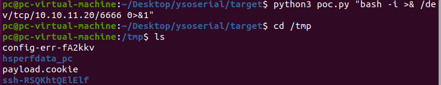
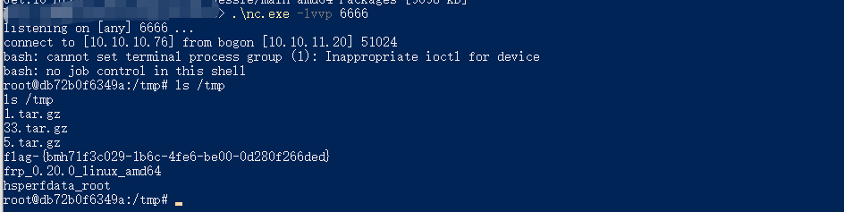

# Shiro RememberMe 1.2.4 反序列化 by [xiajibaxie](https://github.com/xiajibaxie)

## 一、漏洞描述

从官方的 issue 上来看，漏洞的利用点是在 cookie 里的 rememberMe 参数，这个参数的值是 AES 加密再 base64 之后设置在 cookie中 的。在服务端对 rememberMe 的 cookie 值的操作应该是先 base64 解码然后 AES 解密再反序列化，就导致了反序列化 RCE 漏洞。

## 二、影响版本

```
漏洞版本<=1.2.4
```

## 三、利用流程

访问地址: `10.10.11.20:59041`

名称:  shiro 反序列化漏洞

将反弹命令进行编码


利用 python 脚本将 payload.cookie 生成到 /tmp 下




抓取数据包，并将 cookie 添加到数据包中进行发送。


使用 nc 监听端口，反弹 shell 成功。



## 四、修复方案

升级 shiro 到 1.2.5 及以上

