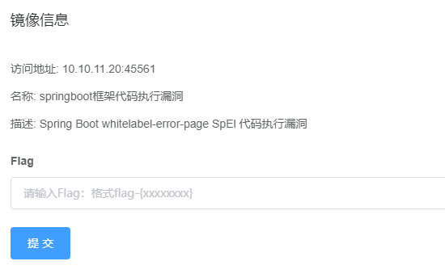
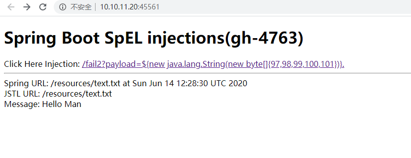
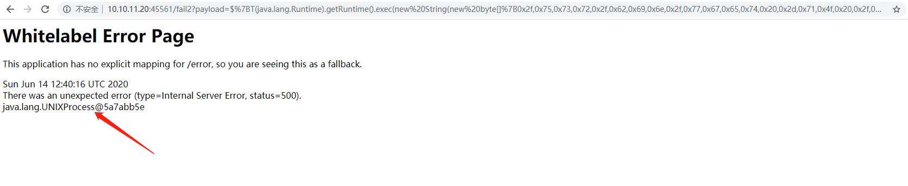
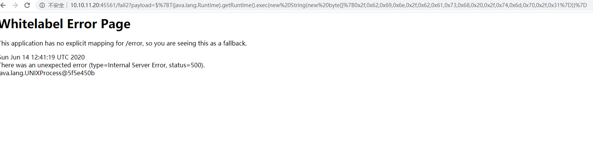
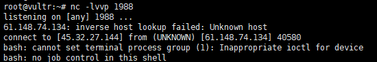
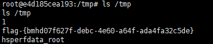

# Spring Boot whitelabel-error-page SpEl 代码执行漏洞 by [fengyehack](https://github.com/fengyehack)

## 一、漏洞描述

Spring是一款轻量级Java开发框架。Spring Boot是Spring 的一个核心子项目，其设计目的是用于简化新Spring应用的初始搭建以及开发过程。 由于SpelView类中的exactMatch参数未严格过滤，Spring Boot framework 对异常处理不当在同时开启whitelabel page，会造成异常请求中注入SPEL执行。当用户采用Spring Boot启动Spring MVC项目后，Spring Boot默认异常模板在处理异常信息时，会递归解析SPEL表达式，可导致SPEL表达式注入并执行。攻击者利用此漏洞，通过SPEL即可在服务器端实现指令注入(执行代码)。

## 二、漏洞影响版本

Spring Boot 1.1-1.3.0的版本

## 三、漏洞复现

启动Vulfocus

点击这个链接，出现了拼接的字符，证明漏洞存在。

直接反弹shell：

出现这个代表代码执行成功

成功拿到shell

获取flag

