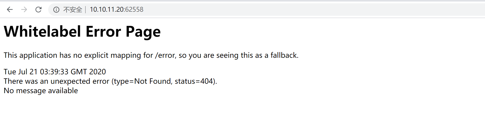
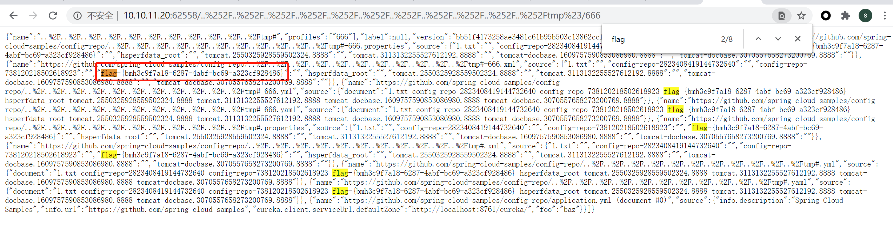

# Spring Cloud Config Server 目录遍历漏洞（CVE-2020-5410） by [Frivolous-scholar](https://github.com/Frivolous-scholar) 

## 概述

Spring Cloud Config，2.2.x 之前的2.2.x 版本，2.1.9之前的2.1.x 版本以及较旧的不受支持的版本允许应用程序通过 spring-cloud-config-server 模块提供任意配置文件。恶意用户或攻击者可以使用特制 URL 发送请求，这可能导致目录遍历攻击。

## 复现

1、首先打开靶场。

2、通过目录遍历拿到 Flag

