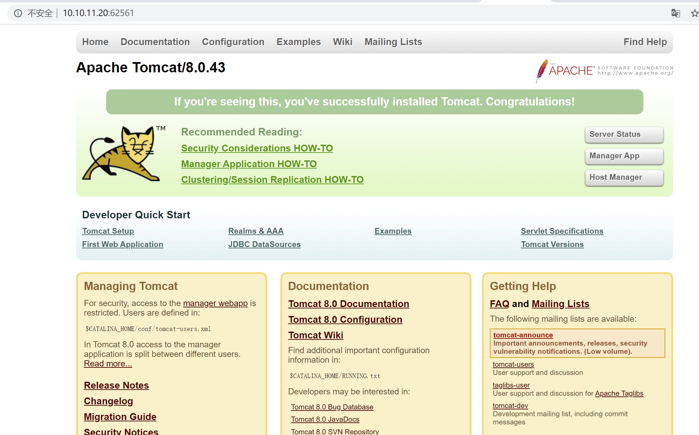
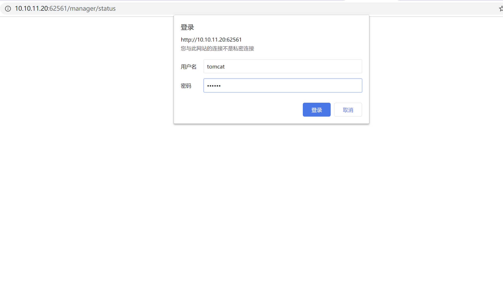
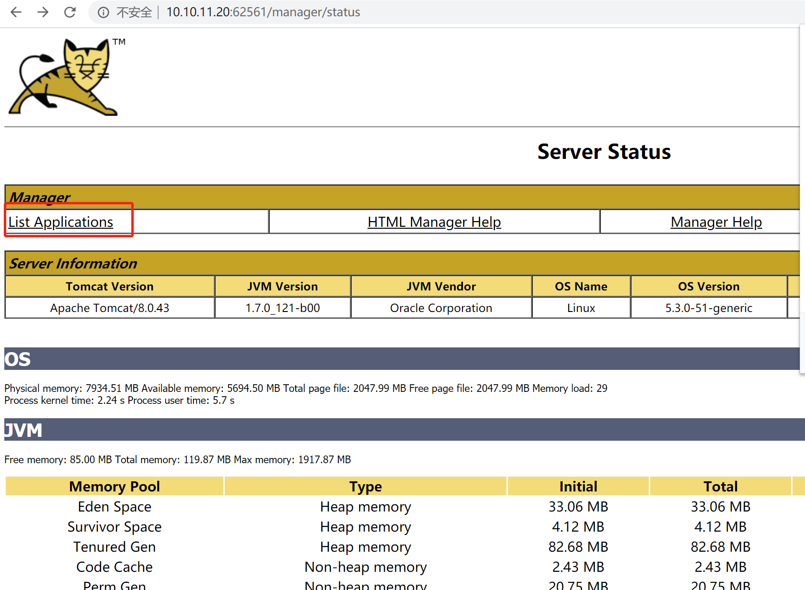
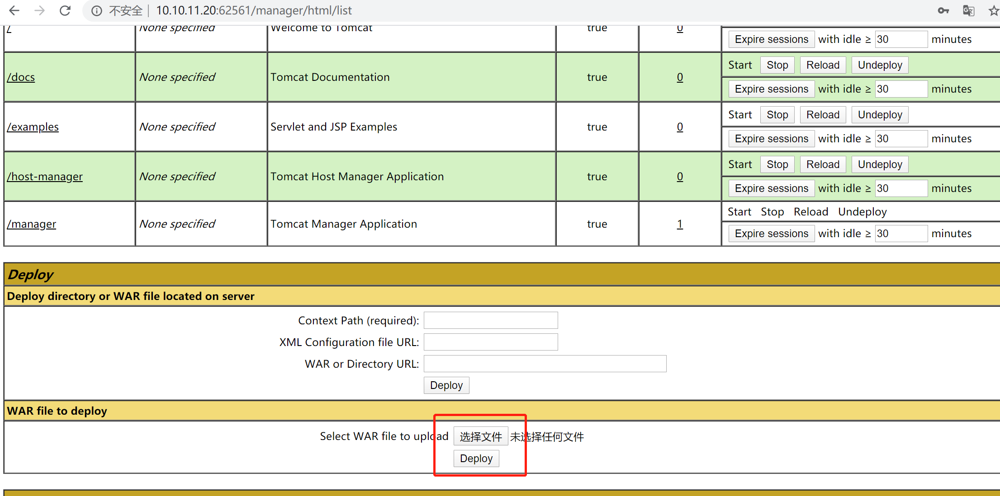
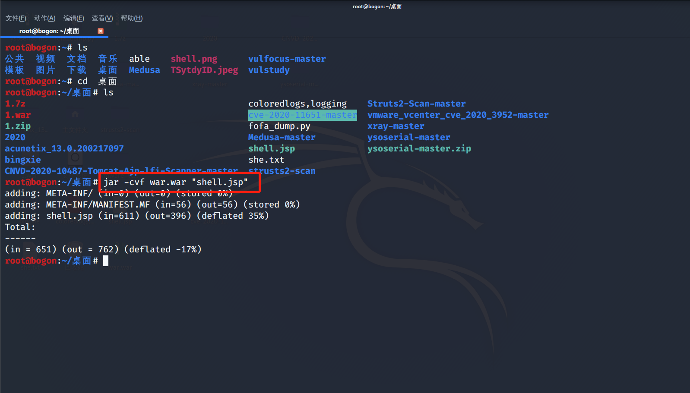
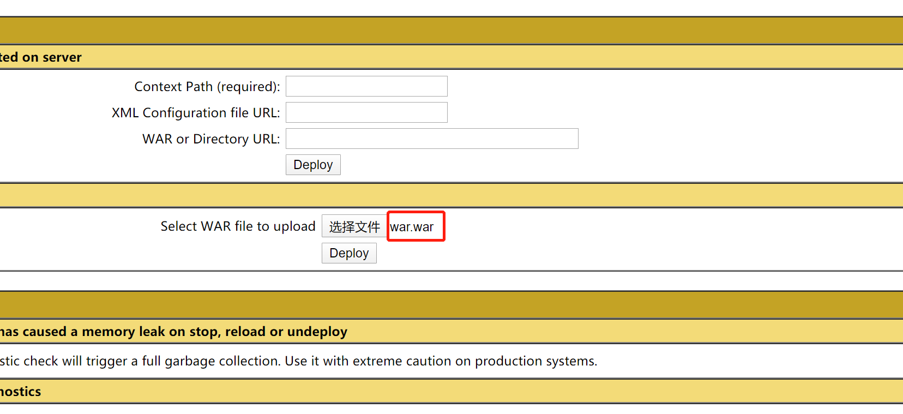
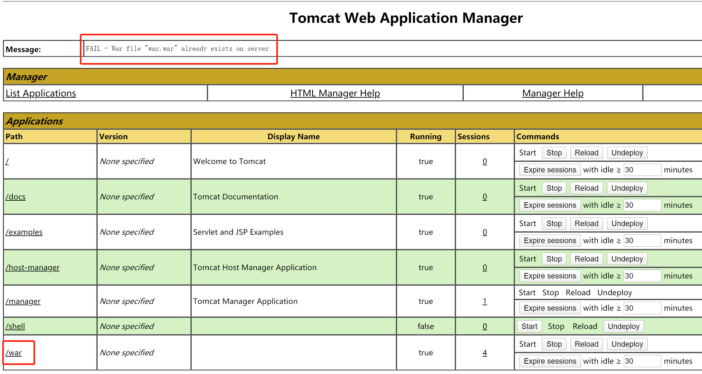
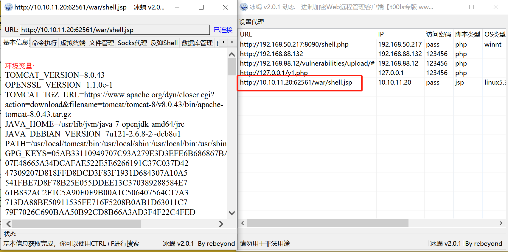
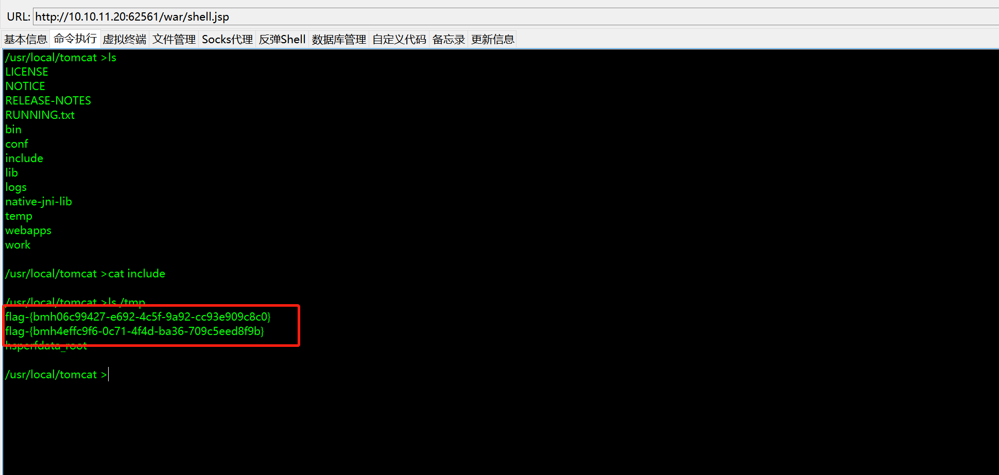

# Tomcat 弱口令 Getshell by [Frivolous-scholar](https://github.com/Frivolous-scholar)

## 漏洞概述 

Apache+Tomcat 是很常用的网站解决方案，Apache 用于提供 web 服务，而 Tomcat 是 Apache 服务器的扩展，用于运行 jsp 页面和 servlet。Tomcat 有一个管理后台，其用户名和密码在 Tomcat 安装目录下的 conf\tomcat-users.xml 文件中配置，不少管理员为了方便，经常采用弱口令。 Tomcat 支持在后台部署 war 包，可以直接将 webshell 部署到 web 目录下，如果 tomcat 后台管理用户存在弱口令，这很容易被利用上传 webshell。

## write up

首先打开靶场环境。

点击登录，弱口令 tomcat:tomcat

点击 List Applications

上传war包。

利用命令把 jsp 的冰蝎码转成 war 包

上传 war 包。

上传成功，部署 war 包之后， war 包会在当前路径下解压。

利用冰蝎连接，访问路径是 /war (war包路径) /XXX.jsp（你的 webshell）。

查看临时文件来获取 Flag 命令`ls /tmp`

