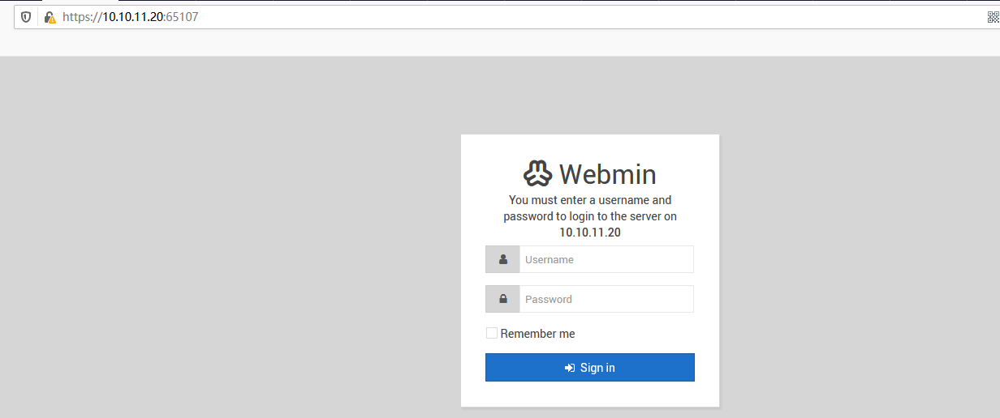
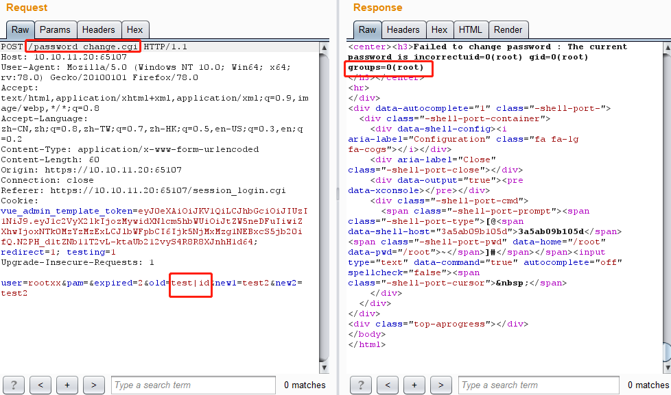

# Webmin 远程命令执行漏洞（CVE-2019-15107）by [scholar](https://github.com/Frivolous-scholar) 

## 概述

Webmin 被爆出1.920版本之前存在一个远程命令执行漏洞（CVE-2019-15107），当用户开 Webmin 密码重置功能后，攻击者利用该漏洞可在易受损系统中执行任意命令，进而获取系统 Shell。由于Webmin 中 Password_Change.cgi 在接收请求的处理过程中，old 参数存在命令注入漏洞，可被攻击者恶意利用。

## 影响版本

Webmin 1.920及以下版本。

## 漏洞复现

1、首先打开靶场。

2、利用 POC 进行验证，发现有回显。

3、直接查看 Flag。

