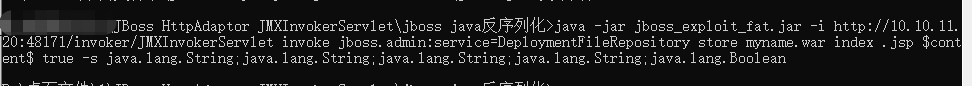
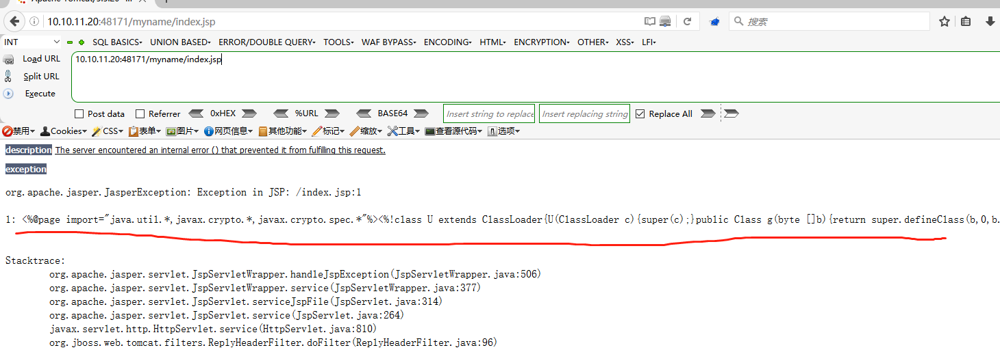
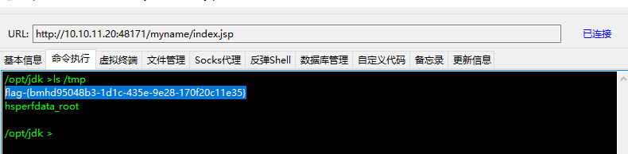

# jboss-JMXInvokerServlet 反序列化 by [xiajibaxie](https://github.com/xiajibaxie)

## 一、漏洞描述

反序列化是指特定语言中将传递的对象序列化数据重新恢复为实例对象的过程，而在这个过程中会执行一系列的字节流解析和对象实例化操作用于恢复之前序列化时的对象。在原博文所提到的那些 Java 应用里都有特定的接口用于传递序列化对象数据，而在反序列化时并没有限制实例化对象的类型，导致可以任意构造应用中已经包含的对象利用反序列化操作进行实例化。

## 二、影响版本

```
JBoss Enterprise Application Platform 6.4.4,5.2.0,4.3.0_CP10
JBoss AS (Wildly) 6 and earlier
JBoss A-MQ 6.2.0
JBoss Fuse 6.2.0
JBoss SOA Platform (SOA-P) 5.3.1
JBoss Data Grid (JDG) 6.5.0
JBoss BRMS (BRMS) 6.1.0
JBoss BPMS (BPMS) 6.1.0
JBoss Data Virtualization (JDV) 6.1.0
JBoss Fuse Service Works (FSW) 6.0.0
JBoss Enterprise Web Server (EWS) 2.1,3.0
```

## 三、利用流程

访问地址: `10.10.11.20:48171`

名称: JMXInvokerServlet 反序列化

描述: jboss-JMXInvokerServlet 反序列化

使用jar包上传一句话木马



访问上传地址发现已上传成功

`10.10.11.20:48171/myname/index.jsp`



使用冰蝎链接执行命令获得flag



通关

## 四、修复方案

**1. 类白名单校验**

在 ObjectInputStream 中 resolveClass 里只是进行了 class 是否能被 load ，自定义 ObjectInputStream , 重载 resolveClass 的方法，对 className 进行白名单校验

```
public final class test extends ObjectInputStream{
    ...
    protected Class<?> resolveClass(ObjectStreamClass desc)
            throws IOException, ClassNotFoundException{
         if(!desc.getName().equals("className")){
            throw new ClassNotFoundException(desc.getName()+" forbidden!");
        }
        returnsuper.resolveClass(desc);
    }
      ...
}
```

**2. 禁止 JVM 执行外部命令 Runtime.exec**

通过扩展 SecurityManager 可以实现:

（By hengyunabc）

```
SecurityManager originalSecurityManager = System.getSecurityManager();
        if (originalSecurityManager == null) {
            // 创建自己的SecurityManager
            SecurityManager sm = new SecurityManager() {
                private void check(Permission perm) {
                    // 禁止exec
                    if (perm instanceof java.io.FilePermission) {
                        String actions = perm.getActions();
                        if (actions != null && actions.contains("execute")) {
                            throw new SecurityException("execute denied!");
                        }
                    }
                    // 禁止设置新的SecurityManager，保护自己
                    if (perm instanceof java.lang.RuntimePermission) {
                        String name = perm.getName();
                        if (name != null && name.contains("setSecurityManager")) {
                            throw new SecurityException("System.setSecurityManager denied!");
                        }
                    }
                }

                @Override
                public void checkPermission(Permission perm) {
                    check(perm);
                }

                @Override
                public void checkPermission(Permission perm, Object context) {
                    check(perm);
                }
            };

            System.setSecurityManager(sm);
        }
```

