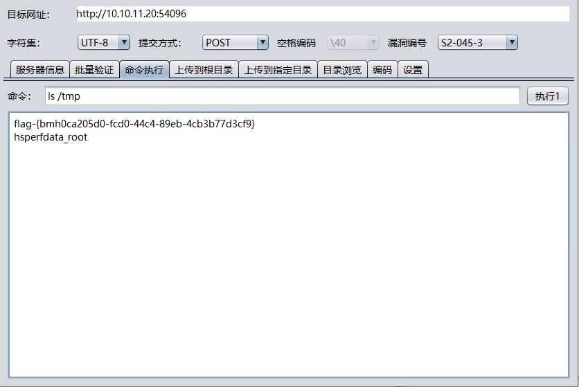

# struts2-052（CVE-2017-9805）by [xiajibaxie](https://github.com/xiajibaxie)

## 漏洞描述

2017年9月5日，Apache Struts 官方发布最新的安全公告称，Apache Struts 2.5.x 的 REST 插件存在远程代码执行高危漏洞，漏洞编号为 CVE-2017-9805（S2-052），攻击者可以通过构造恶意 XML 请求在目标服务器上远程执行任意代码。漏洞的成因是由于使用 XStreamHandler 反序列化 XStream 实例的时候没有执行严格的过滤导致远程代码执行。

## 影响版本

Struts 2.5 - Struts 2.5.12

## 利用流程

访问地址： `10.10.11.20:54096`

名称：struts2-052/cve-2017-9805

使用Struts2全版本漏洞测试工具获取 flag 成功

通关！

## 参考

https://blog.csdn.net/flurry_rain/article/details/82706273

