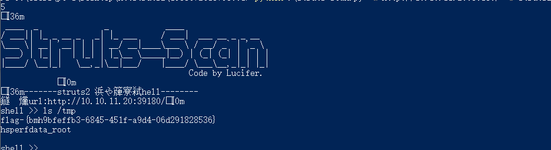

# struts2-053（cve-2017-12611）by [xiajibaxie](https://github.com/xiajibaxie)

## 漏洞描述

继 S2-052 之后，Apache Struts 2 再次被曝存在远程代码执行漏洞，漏洞编号 S2-053 ， CVE 编号 `CVE-2017-1000112` 。当开发人员在 Freemarker 标签中使用错误的构造时，可能会导致远程代码执行漏洞。。

## 影响版本

Struts 2.0.1 - Struts 2.3.33

Struts 2.5 - Struts 2.5.10

## 利用流程

访问地址： `10.10.11.20:39180`

名称：struts2-053/cve-2017-12611

使用Struts2全版本漏洞测试工具获取 flag 成功

通关！

## 参考

https://blog.csdn.net/lijia111111/article/details/78230480

